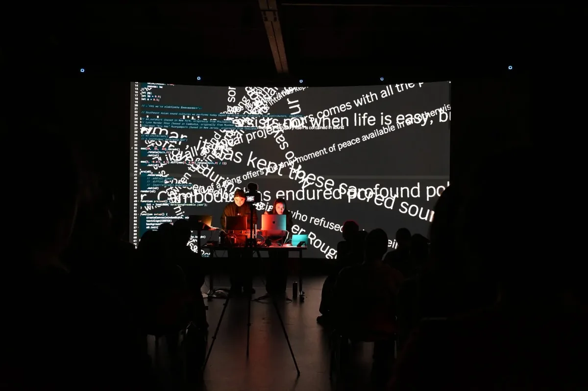
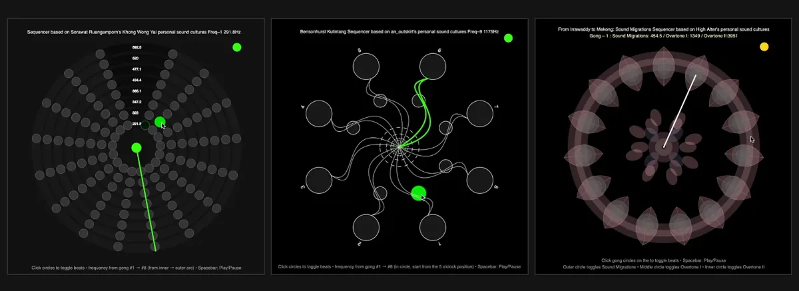
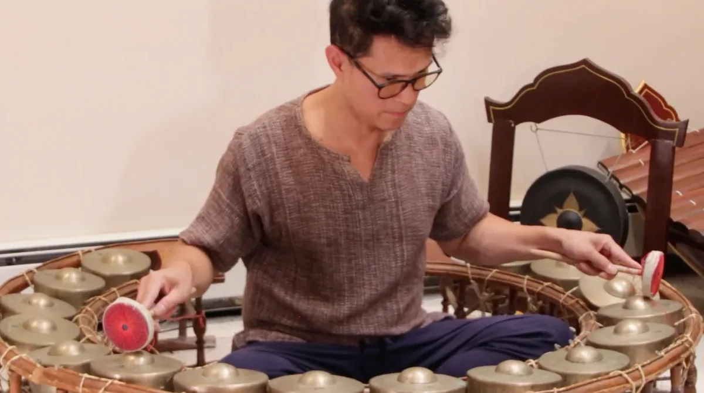
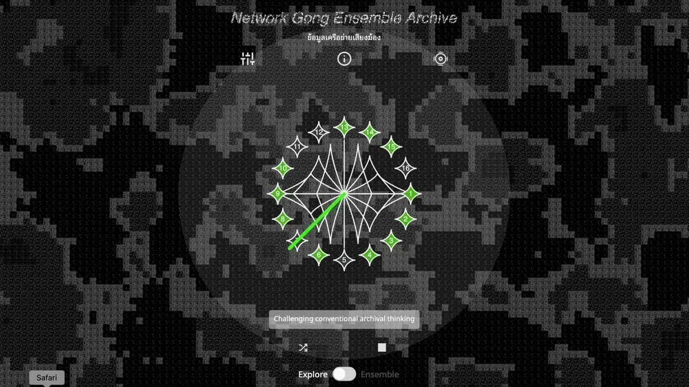

  <iframe src="https://www.youtube.com/embed/qUKK0dlQw5k?feature=oembed" frameborder="0" scrolling="no"></iframe>

#### Fellowship Project: Network Gong Ensemble Archive

-   Artists: [elekhlekha อีเหละเขละขละ](https://www.instagram.com/elekhlekha/)
-   Link: [https://networkgongensemblearchive.online/](https://networkgongensemblearchive.online/)

“We thought people would be shy when we asked them to play their gong,” Keng says, “but once they started, they didn’t want to stop. They were banging on their gongs; they listened to each other and responded to one another’s sounds.” No one wanted to stop and the show lasted much longer than expected.

The concept of the [Network Gong Ensemble Archive (NGEA)](https://networkgongensemblearchive.online/) emerged from a question: could a non-institutional effort create a living archive of Southeast Asian oral histories and musical traditions, especially for marginalized and diasporic communities beyond national state identities? The project responds to the ongoing risk of cultural loss caused by socio-political and environmental displacement across the region. The artists’ vision was to not only create an archive, but also a digital space to nurture the human connection of performance, where the act of making noise together creates spiritual and social bonds without the need for verbal communication. In interpreting this year’s Processing Foundation Fellowship theme, the project explores the tension between data, which is often measurable, quantifiable, and shaped by outsider documentation, and storytelling, which in Southeast Asian oral and aural traditions remains expansive, contextual, and relational. NGEA seeks to hold these together, treating sound and oral history as data without separating them from the cultural contexts that give them meaning. Through the medium of sound archival, this project tells the story of collective resilience.

*elekhlekha อีเหละเขละขละ performs at nodes: I organized by Processing Foundation x Artifice x UAAD with support from NYU Tandon*

The duo behind NGEA is Keng (Kengchakaj Kengkarnka) and Fame (Nitcha Tothong), who together are *elekhlekha อีเหละเขละขละ*, a Thai word that means “chaos” or “nondirection.” The name was chosen because it portrays an ethos that breaks free from dominant systems and the Western music lens. The idea for the project mirrors the distinct talents both Keng and Fame bring to their art. For Keng, who is a jazz pianist and electronics experimentalist, the idea for the project extended out of a line of questioning. After completing his college studies in music in Thailand, he noticed “that my head and my ear were geared towards Western music so much that I heard Thai music as out of tune.” He recalls researching how Thai music is often unfairly judged by Western musical standards and even mistranslated in music theory books. “How can I unlearn that?” Keng asks. For Fame, the project is a meditation on memory. Fame is a creative technologist and interdisciplinary artist who built the online experience of NGEA. Inspired by open source technology as a tool for transparency and democratic access to knowledge, she wanted to make the archive less of a museum-like tomb and more of a living, evolving, and communal space that encourages new iterations.

The Archive is a digital repository of living and breathing sound with particular attention to gong practices shared across the region. It is a digital space that compiles and captures the nuance and embodied sounds that reflect Southeast Asian tradition. When Keng and Fame talk about their collaboration with other musicians for this project, they speak with reverence, holding the heavy yet effervescent weight of ancestral knowledge. While documenting Southeast Asian sounds, Keng reminds us that these sound traditions don’t just differ from ethnic group to ethnic group, but sometimes from village to village. Keng and Fame worked with three sound contributors, who talk about how time and loss has also played a role in the evolving function and nuance of these sounds. Keng reflects on a story that was shared with him by an\_outskirt, a duo from the Philippines. Back in the Phillipines, an\_outskirt had met with a musician who played a traditional flute. However, when they arrived, the musician said he lost his flute. He directed them to come back in an hour, he’ll make a new one. quickly made a new flute and demonstrated its tuning system, as if the sound itself had been pulled from the ground. Measuring the bamboo’s circumference with a blade of grass, he shaped the instrument’s holes directly from the lang that produced it. “Sometimes sounds come from the ground, and what you are hearing is the sound of that day,” says Keng.

The first entries in the Archive bring together a geographically dispersed yet culturally connected group of Southeast Asian musicians. These include:

-   an\_outskirt, currently based in Brooklyn and originally from the Philippines;
-   High Alter (A.k.a.Lynn Nandar Htoo), based in Cambodia with roots in Myanmar;
-   and Sorawat Ruangamporn “Kru Amp,” now in New Jersey and originally from Thailand.

Each artist contributed recordings of their gong instruments and created a hand-drawn digital avatar of their gong; forms that were later translated into audio-visual p5.js sketches. Together, these contributions form the foundation of the interactive Network Gong Ensemble Archive website.

*Screenshots of Kru Amp, an\_outskirt, and High Alter’s p5.js sketches respectively based on their hand-drawn representations of their gongs.*

While sharing their gong sounds, they also shared their songs and the stories behind their instruments. Sarawot uses the Khong Wong Yai (large gong circle) as his main instrument and has played it for over 30 years. “The more I learned, the more I loved it, and I realized that Thai music has a unique charm that only reveals itself through study,” Sarawot remembers. When moving to New York, he had to cut his gong into three parts and ship it overseas. Once it was reassembled, he noticed it sounded slightly different, but he accepted that as part of its new story. He teaches Thai music today and reminisces on how certain songs that were once tied to a specific activity are now repurposed for this new space with new people, forming a hybridity between the old and new. What is born out of that friction is a third thing: something new born from displacement, memory, and adaptation.

*Sorawat Ruangamporn “Kru Amp” based in New Jersey, originally from Thailand performs on the **khong wong yai** (large gong circle), the instrument he has studied for more than 30 years.*

High Altar (Lynn Nandar Htoo) contributed Khmer sound cultures during a tumultuous time in their life. Theirs is a story of personal survival as they fled war-torn Myanmar. They wrote, “Tradition persists not when life is easy, but when it becomes essential. The gong sound might be the only available peace on the most chaotic day.” Keng and Fame reflect on how sounds and songs stem from a place called home, and when forced to move by necessity, music has a healing function. Though High Altar is from Myanmar and Sorawat is from Thailand, the sound they contribute is essentially the same instrument.. Keng believes this is a crucial story to be told. Land disputes and forced displacement are based on “imaginary lines that the colonizers made.” We are all actually more alike than we are different and our sound cultures prove that.

Eleklekha immersed themselves in these sound cultures as they transposed oral histories into digital simulations of sound. The p5.js sketches of each gong are made with care. Fame says, “If you click on the smaller dot you can get an overtone of the two gong sounds together. We intentionally made the two sounds vary slightly in timing so one is hit before the other, reflecting what human gong expressions sound like.” Keng adds, “This is because the overtones are not fully aligned and it creates a beating noise and a sound that you associate with the gongs.”

Once you enter the NGEA site, you can explore sound stories and configure your own gong song. The “Ensemble Mode” feature allows anyone with an iphone or laptop to join a collective, live gong ensemble with other users. First, you are prompted to choose a gong from the library, then to configure your gong song by clicking on the chimes. The song begins looping and projecting around each user’s circle avatar.

*Interface view of the Network Gong Ensemble Archive. Users select gongs and compose looping “gong songs” by activating chimes in the circular interface.*

When someone enters into your projection sphere by moving around the space with their arrow keys, you can hear their gong song intermingling with yours. Participants are encouraged to roam around, intersecting, colliding, and harmonizing with each other in a cacophony of beating chimes and gongs. Can you hear the echoes of your ancestors or, perhaps simply, the sound of the day?

Fame recounts how “open source tools are essential for our communities because they make creative work accessible to people who can’t afford expensive software and gives us the agency to become not just users or consumers, but creators and contributors.” Through the Processing Foundation Fellowship, Keng and Fame learned to see their collaborators as part of a larger ecosystem, and they felt empowered to share knowledge about these sound cultures without having to be “masters” of the work, but rather to share things little by little via long-term relationships. About 300 people have experienced NGEA as of today.

Open source tools are a labor of care, as Fame puts it. Keng says, “We also want to invite a larger community of people who are interested in Southeast Asian sound to this project. Therefore it’s a living document and helps change the perspective of how music can sound.” Their hope is that people continue to contribute and experiment with The Network Gong Ensemble Archive.

The process of making this project has also led to personal transformation for the artists. Keng says that now “everything is in tune.” He can’t pinpoint exactly how, but this project has changed his piano playing. In fact, it’s a “completely different” approach to the sounds he chooses. In December 2025, he performed at the [Asian Art Initiative Festival](https://youtu.be/ipYh7BzoAPg?si=56LeHkyVPaBAe4zM) and the panel noticed how different this performance sounded from the album, that this performance was an evolution. “I finally unlearned my ear,” Keng says, “anything can be in tune now.”

---

The Processing Foundation Fellowship supports artists and creative technologists developing open-source creative tools and practices that expand access to creative technology. Through financial support, mentorship, and community partnerships, fellows create tools, artistic works, and research that contribute to a more open and accessible creative coding ecosystem.

-   Learn more about the Fellowship → [here](https://processingfoundation.org/fellowships)
-   Support programs like this → [here](https://processingfoundation.org/donate)
