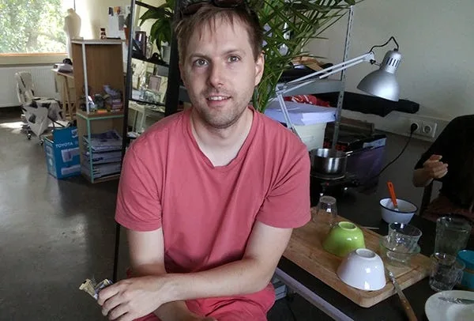
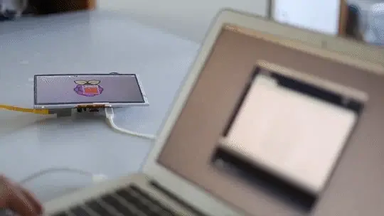
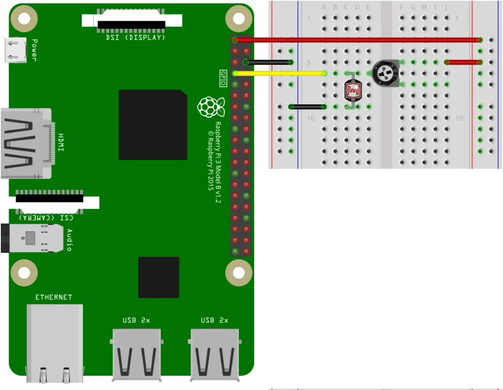
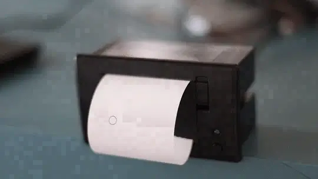
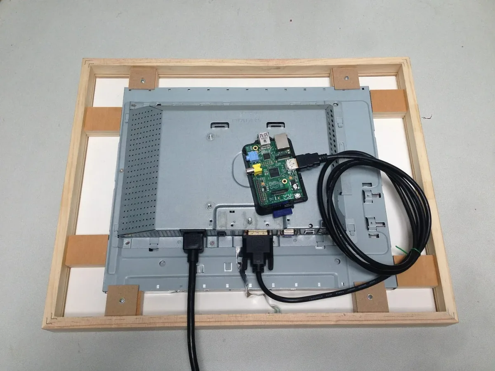

### 2017 Foundation Fellow

#### (in conversation with Johanna Hedva)

---

The 2017 Processing Foundation Fellowships supported an unprecedented seven research projects that expanded the p5.js and Processing softwares and their communities. Fellows developed work ranging from bilingual zines, to accessible coding curriculum to be taught in prisons, to workshops aimed at teaching code to women, non-binary, and femme-identifying folks. Throughout the summer we’ll be posting a series of articles — some written by the fellows, some in conversation with Director of Advocacy, Johanna Hedva — that showcase and document the great work by this year’s cohort.

---

*[Gottfried Haider](http://ghai.xyz/), born 1985 in Vienna, works as an artist, educator, and software tool-maker. He received a degree in Digital Arts at University of Applied Arts Vienna in 2009. After receiving a Fulbright Scholarship in 2010, he pursued a MFA in Design Media Arts at University of California Los Angeles, which he finished in 2013. His artwork has been displayed in various venues and publications internationally. His fellowship was mentored by [Ben Fry](http://benfry.com/).*

**JH**: Hello Gottfried! You have a long history of working in the Processing community. Can you give me a description of what you’ve been working on for this fellowship in 2017?

**GH**: Hello Johanna! I used the fellowship to explore interesting applications for [Processing and the Raspberry Pi,](https://www.raspberrypi.org/learning/introduction-to-processing/) which is a small and inexpensive computer, about the size of a credit card, purposefully designed for use in education. I focused my [fellowship](https://twitter.com/mrgohai/status/889426678509948928) on building the related infrastructure, like libraries, so that users can focus on the more rewarding and open-ended exploration of this platform. (This, and a lot of invisible overall “plumbing.”)

*Programming a Raspberry Pi remotely (using the “UploadToPi” tool).*

*Sketches on the Raspberry Pi computer (left) can directly be influenced by custom sensors (right).*

**JH**: The impact of this work on how open source communities operate is important and vital. Can you walk us through the grand scheme of things of how your fellowship work functions within bigger questions of how to build and sustain open source beyond only the sketchbook window?

**GH**: Sketches on the Raspberry Pi don’t live in isolation, but on top of a fully fledged operating system. This is different than the Arduino platform, where the emphasis can be put entirely on the sketch itself, as there is almost nothing between it and the hardware. But on Single Board Computers one generally operates in the context of a Free Software “Linux” distribution — which is somewhat of an amalgam of the collective labor of thousands and thousands of people. It’s a fascinating project.

*Drawing on a thermal printer (using the “Simple Receipt Printer” library).*

**JH**: I’m very interested in how labor works in open source communities, so this “amalgam of the collective labor of thousands” perks up my ears. What do you think are the implications of both using and providing labor toward a fully fledged open source operating system? Like, how might it affect, say, an artist’s practice, compared to a coder’s practice?

**GH**: It allows for much different types of engagement — apart from the technical. One is quick to discover the importance of social interaction with the communities around specific projects, the importance of learning about their politics (e.g., concerning reciprocality, “gift economy,” and so on), and what drives individuals to spend their evenings and weekends partaking in such a collective effort. Obviously, this world is not without its issues, such as the often, still rather homogeneous nature of those groups. But it’s hard for me to fathom any discussion about software “alternatives” (e.g., to the hegemonic platforms of the big five technology companies) or software “politics,” that would not benefit from a close look at (or participation in) this almost 40-year-old project.

To this end, I believe Processing on ARM Linux to be uniquely fit to encourage users to also look *underneath* and *left* and *right* of their *software sketchbook*, and to productively hook into, and work with, other parts of this giant assemblage.

*A Raspberry Pi computer driving a custom digital display (*Openframe* project).*

**JH**: So, what’s next for you?

**GH**: I’m looking forward to continuing to develop and test those ideas — e.g., as part of Hackers & Designers Summer Academy next week, where we’ll be combining software sketches with papier-mâché shells to “re-build” our smart appliances in an imagined world off the proverbial grid.

I have also been working on a book that discusses the particularities and possibilities of using Processing on low-cost devices such as the Pi, which I hope to wrap up and get out into the world in the not-too-distant future.
