### Three-Layer CS Cake

#### How to Make Sure Every Kid Gets Some Cake

---

*For the sixth year of our annual Fellowship Program, we aimed to better support the new paradigm of remote and online contexts and socially distanced communities. We asked applicants to address at least one of four Priority Areas that, to us, felt especially important for finding ways to feel more connected right now: Accessibility, Internationalization, Continuing Support, and AI Ethics and Open Source. Additionally, we sponsored four Teaching Fellows, who developed teaching materials that will be made available for free, and are oriented toward remote learning within specific communities. We received 126 applications and were able to award six Fellowships, with four Teaching Fellowships. We are excited to note that this is our most international cohort ever, with Fellows based in Australia, Brazil, India, Mexico, Philippines, Switzerland; and in the U.S. in California, Portland, and New York. With this interview, we begin highlighting the work of the four Teaching Fellows. For an archive of our past Fellows* [*click here*](https://processingfoundation.org/fellowships)*, and to read our series of articles on past Fellowships,* [*click here*](https://medium.com/processing-foundation/https-medium-com-tag-pf-fellowships-la/home)*.*

---

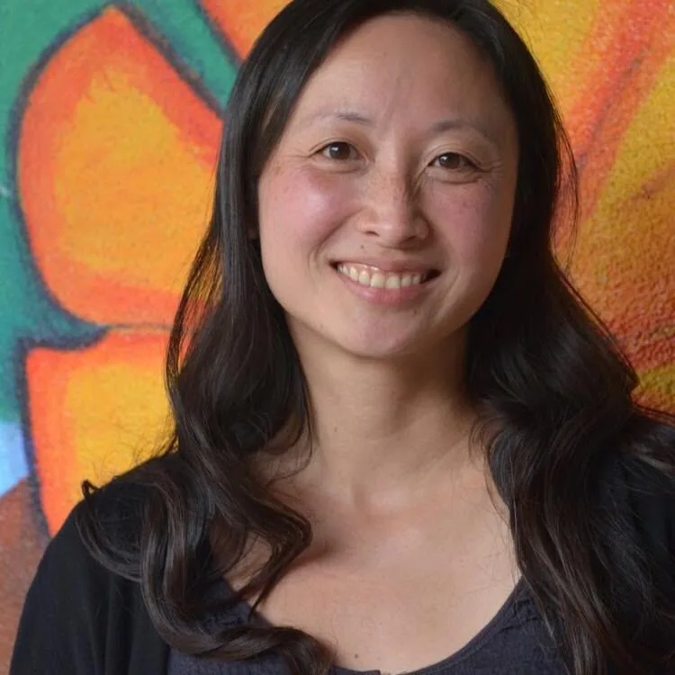

*Angi Chau is an educator, maker, engineer, and creative coder. She is constantly thinking about how to design and create learning spaces that celebrate technology, yet allow everyone, especially those who have traditionally been underrepresented in fields like engineering and CS, to feel a sense of belonging. [A](http://www.angichau.com/)ngi’s Teaching Fellowship project can be viewed here: *The project can be viewed at at* [*http://teach.angichau.com/*](http://teach.angichau.com/) *(Photo credit: Agency by Design Oakland) \[****image description****: Photograph of* Angi, an Asian woman, smiling at the camera. She wears a black top and has long black hair. In the background is a wall painting of a large orange flower.\]*

**Saber Khan: How do you introduce yourself, Angi?**

**Angi Chau**: I am [Angi](https://www.angichau.com/) and I’m located in the San Francisco Bay Area. I have been teaching for about 10 years. Currently I teach at an independent school called [The Nueva School](https://www.nuevaschool.org/), which is located in Hillsborough and San Mateo. We are pre-K through 12 and I am the director of the [Innovation Lab](https://www.nuevaschool.org/about/our-campuses/innovation-labs) program at Nueva, which means we’re in charge of design thinking, engineering, and computer science.

In the classroom, my role right now is that I teach some of the required middle-school computer science classes. These required classes are semester-long and we have been working hard to build a curriculum that is accessible to everyone. It was through designing this curricula that I discovered p5.js as a way to welcome students into the community of coders, even if they’re like “Ah! Computers hate me.”

Outside of my work life, I’m a mom to a six-year-old. I’m a maker and I love to cook. I was very immersed in the maker education world — I still am, I would say — but I diverged a little bit and now focus more on the creative coding side of things.

**Saber Khan: In some ways it’s come full circle — do you want to talk about what your career was before?**

**Angi Chau**: Yeah you’re right, it’s come full circle. I was born in Hong Kong, so I’m an immigrant. My parents moved to the U.S. to establish citizenship, or at least get a green card, when my sister and I were very young, before they wanted to move their kids here. They thought it would be a rough transition if we moved and then had to move back if they weren’t successful in immigrating.

**Baby photo of Angi taken in Hong Kong. \[****image description****: An old black and white photo of an Asian child, with black hair, wearing a dress with a collar.\]**

**Angi Chau**: Once they established their [green cards](https://en.wikipedia.org/wiki/Green_card) — that was my sixth-grade year — my sister and I immigrated from Hong Kong to the U.S. We were in Florida at first. It was a pretty shocking transition — even though we’d studied English in school, it’s very different from speaking day to day. But eventually we adjusted. I always trace back my interest in STEM subjects as potentially a reason for that, because I didn’t understand English, but I understood math.

So I felt like I was very good at math, and it was my safe space. When I went to college I wanted to be a math major. And then I figured out what math majors do, and I was like, “ok turns out that’s not what I want at all!” That’s when I discovered engineering. I studied electrical engineering but more with a focus on computer engineering. That’s when I really started learning how to code and became interested in the idea of teaching people coding and computer science concepts.

The most interesting thing to me is trying to teach people who don’t think they need to learn how to code, more than those who think they already can code. I love beginners, the people who are totally new at it. In my undergrad I did a lot of teaching assistantships and stuff. Eventually I went into the software industry as a consultant, then went back to graduate school and did my PhD in [computational biology](https://en.wikipedia.org/wiki/Computational_biology), which is using coding and computer science to solve problems in biology.

Eventually I landed in the K12 world, and now look at me — I’m teaching coding to beginners, except the beginners are much younger. So yeah, it turns out that after about 20 years doing other stuff, I’ve circled back to teaching people coding again. :)

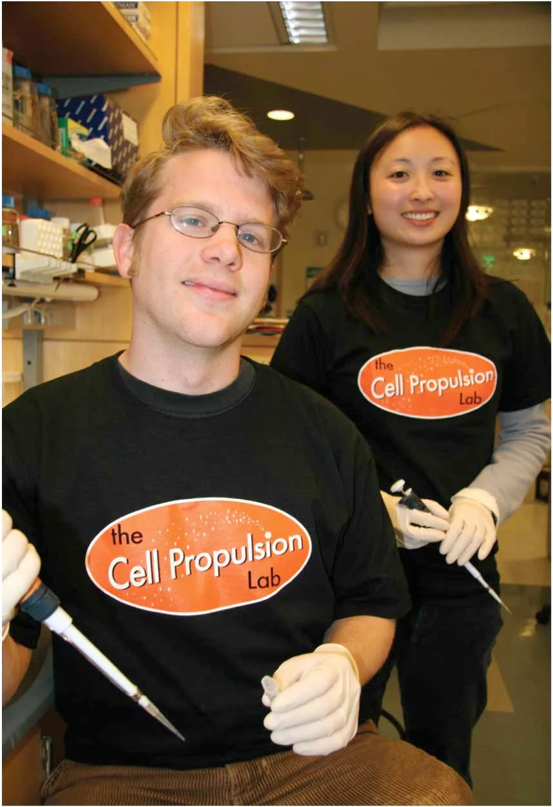

**Photo from graduate school at UCSF, when Angi worked in a synthetic biology lab building computational models and running experiments. \[****image description****: Photograph of Angi standing behind a smiling person wearing glasses. They are both wearing T-shirts that say “the cell propulsion lab.”\]**

**Saber Khan: Do you feel like that interesting journey in and around computers — does it give you something to say about it?**

**Angi Chau**: I was a teaching assistant the spring of my sophomore year in college, and I was totally lost. Everybody had declared majors and I didn’t know what I wanted to do. Turns out I don’t like proving theorems, and I’m terrible at that kind of abstract math. I like art, but you can imagine, for traditional Chinese parents — art major? Not acceptable.

Then I discovered I like applying math. I learned about engineering as a major and saw that it could be so much fun. I started diving deeper into programming and honestly, it was really frustrating for a long time. I feel like the moment when I finally got it — when I understood, when I looked at the code and saw what it did — is what I try to recreate for the students I teach. I know it’s frustrating, I’ve been there. I know it’s like staring at a language that you don’t speak, and somehow it seems like these other people speak it, and they can just type stuff and make stuff happen. So I’ve been there, but then the moment it clicks and suddenly you realize the power you have, it’s really amazing. I want that for lots of kids.

**Saber Khan: Let’s focus on your work with p5.js. How long have you been using it? How do your students use it? Then we can jump to the work you did this summer as a Teaching Fellow.**

**Angi Chau**: This is my fourth year at Nueva. My first year, I taught a little elective called Coding & Art which was the first time I tried out using and teaching with p5.js. I was familiar with Processing; I had tinkered around with it but I’d never taught it.

In my previous school, my role was slightly different — I was the director of the maker space and there was a different computer science teacher. So I wasn’t really in charge of teaching computer science, even though I loved to code. I would teach kids to code using Arduino and things like that. It wasn’t until I landed in my current school and the opportunity opened up for me to teach coding outside of the maker education realm, and then eventually the required classes in computer science, that I really got an excuse to check out p5.js.

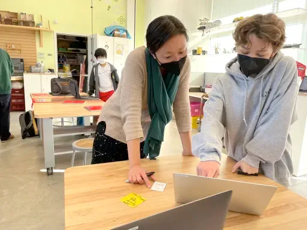

**Working with middle school students in computer science class at Nueva (Photo credit: Jim Morrison). \[****image description****: Photograph of Angi leaning over a laptop with a student who is pointing at the screen. Both wear face masks.\]**

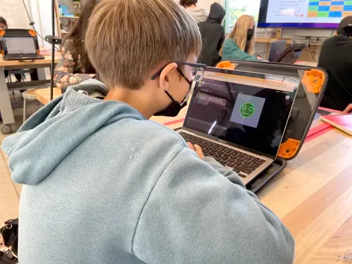

*\[**image description**: Photograph of a student working at a laptop. On the screen is an illustration of a green face with eyes and a mouth, to the left of the screen is the coding window that generated the image.\]*

**Angi Chau**: There are so many reasons I love it. There’s the nitty gritty of not having to install anything to use the [web editor](http://editor.p5js.org/) — kids just have to give an email and put in a password. The interface itself is super clean — there’s a giant play button and not a lot of visual clutter. I honestly think that when you are teaching beginners how to code, you want to avoid having to spend the whole first class (or more!) getting your environment set up — installing this, unzipping that, issuing shell commands to get this thing to the right place, etc etc. It’s a quick way to immediately lose the engagement because kids are thinking “wait if I can’t even understand what’s going on day 1, how can I understand anything else??”

So the low barrier to entry to p5.js is amazing. Also the fact that there’s a [community statement](https://p5js.org/community/) front and center when you open the main website. I show that community statement in every single one of my classes. I explain that this is why we’re using this tool. Sure, the no installation thing is nice but it’s also because this is one of the few technical tools that is designed to be accessible, to be inclusive, to welcome everybody, and not to be elitist about it.

Here are some examples of playful projects from 7th grade creative coding class:

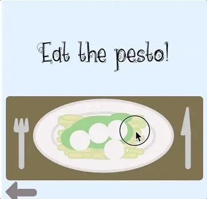

*\[**image description**: Animated gif that shows a screen that says “Pesto Making with Lilli!!!,” then the cursor clicks on an illustration of a plate of pasta. The next screen shows the plate, and the cursor clicks white circles onto the pasta.\]*

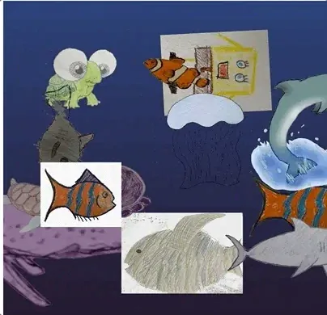

*\[**image description**: An animated gif of images of fish, dolphins, a frog, a jellyfish, and a purple whale moving against a dark blue background.\]*

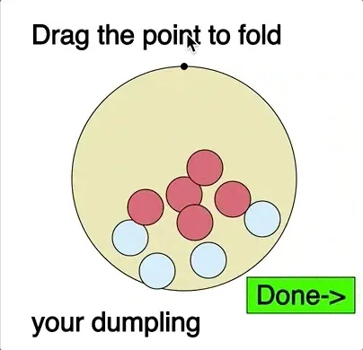

*\[**image description**: An animated gif that shows an animation, with a cursor moving across the screen. The first screen says “Click to add water to your dumpling,” while the cursor drags small circles into a larger one. The text then says, “Click to add filling to your dumpling,” and the cursor drags red circles into the larger one. The screen says, “Click to fold your dumpling,” which the cursor does, then clicks a green button that says Done. The screen changes to show an animation of the dumpling being boiled in water, with text that says, “Click to boil your dumpling,” then “You undecooked \[*sic*\] it. im dissapointed \[sic\]… Start over.”\]*

**Saber Khan: That’s a great answer, and a good summary of what you’ve been doing with p5.js. How was your summer Fellowship with the Processing Foundation? What were you thinking about this summer? What did you end up doing and what did you learn?**

**AC**: I felt so lucky and so honored to be selected as a Teaching Fellow. I’ve been such a big fan girl of the Processing Foundation and p5.js and everybody who’s associated with it for so long. It was really a treat to get to engage with this community over the summer.

The project I proposed was essentially to explore the idea of what I call a starter kit. In addition to my role at Nueva, I also co-organize maker meetups and I have facilitated some workshops at a few different [CC Fests (Creative Coding Fests)](https://ccfest.rocks/). In all of these instances I’ve seen glimmers of what I felt like was a need in some section of the community. I was seeing that there are CS teachers that are like, “Yea, AP CS!” ([AP = Advanced Placement](https://en.wikipedia.org/wiki/Advanced_Placement)) Not that there’s anything wrong with it, but in many cases, these folks are coming into teaching from the tech industry and have done programming as a career. They’re like, “The tech is so fun! Awesome, I know about Java. We could talk about AP tests all day.”

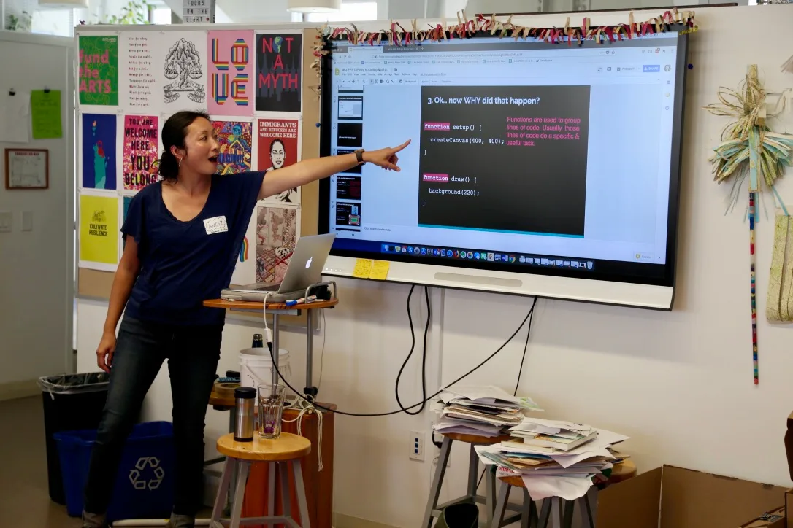

**Working with kids and adults at CCFest San Francisco — Oct 2018 and 2019 (Photos by Ryan Gallagher & Eric Wild). \[****image description****: Photograph of Angi standing by a screen with the projection of a presentation on it. She points at the screen and is speaking. The screen says, “Ok… now WHY did that happen?”\]**

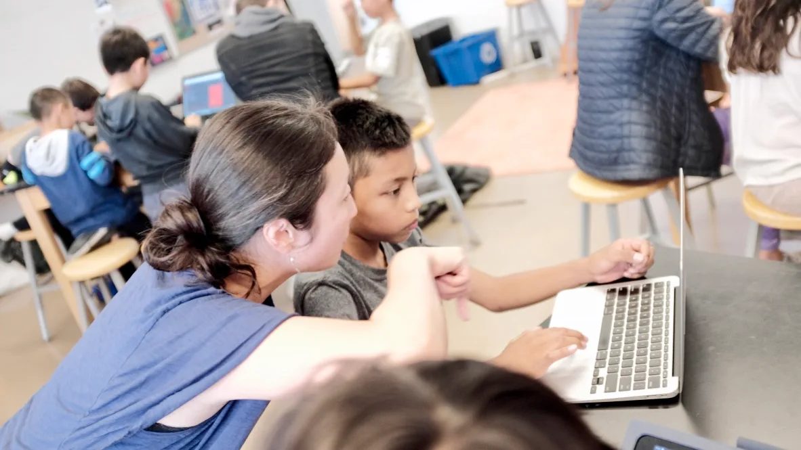

*\[**image description**: Photograph of Angi working with a student in front of a laptop.\]*

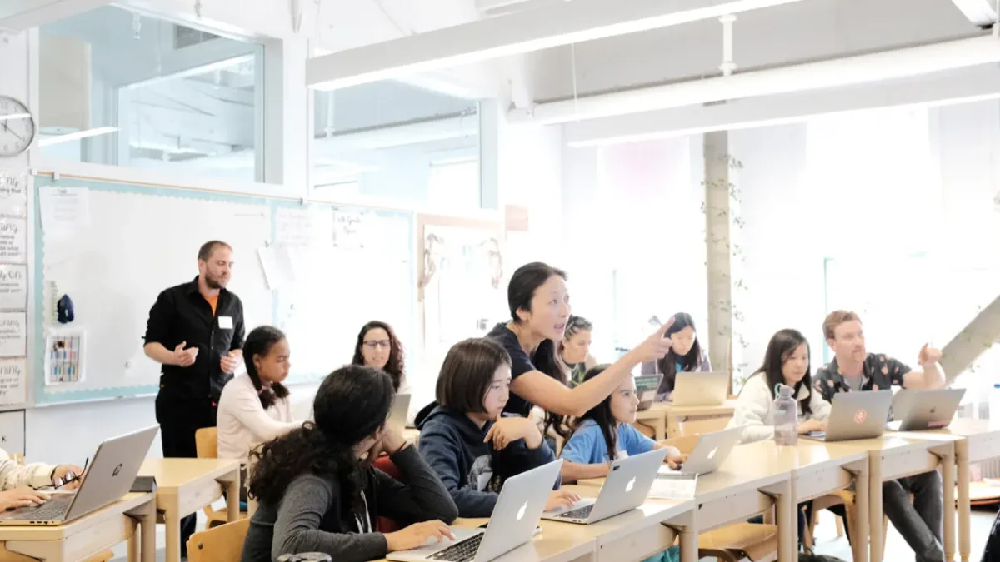

**\[i****mage description****: A photograph of a classroom with twelve people. The students sit at desks with laptops and several people gesture and point while speaking to them. Angi is at the center, pointing to the right to show a student something.\]**

At the same time, I was also meeting a lot of elementary and middle school teachers who have been working with [Scratch](https://scratch.mit.edu/) and doing amazing things. I love Scratch, and the kids here at my school love Scratch. But I felt like there was a middle piece missing. A lot of teachers who are teaching in Scratch are not the same teachers who are teaching those AP CS high school classes.

So this is where I think p5.js is a really nice entrypoint. There are no blocks, but it’s gentle. It doesn’t yell at you too much if you forget semicolons, right? It’s like an interpreter that gives you the benefit of the doubt and then, when it doesn’t understand, it’ll tell you what’s wrong with a cute little flower emoji. It’s a really kind way to enter text-based coding, if an environment can be kind. Plus, there’s so much fun stuff you can do with it so the ceiling, if there’s even one, is really really high. “Low floor, high or no ceiling” — that’s usually the magic combo I look for in my teaching practice.

Anyway, back to the starter kit. There are two parts that I thought would be important for teachers who want to start using p5.js in their classes. They not only need ideas for fun projects to do with their kids, but also resources to get themselves up to speed quickly. For the projects part, even if a teacher is not yet an expert in p5.js, I don’t want them to feel that they have to teach a bunch of “cookie cutter” projects. These projects are where everyone follows the same steps to make the same thing — sure, they can help make sure kids don’t go so “all over the place” that one kid is asking you questions about 3D graphics over here while another is asking you questions about making image filters over there. But these projects don’t really show what programming is. So what I want to explore is if there’s a way to give teachers resources and ideas for open-ended projects that would still allow them to give agency to students, but not feel like things will spiral out of control in the classroom.

For the other part of the kit, I wondered about how to help teachers who may or may not be currently teaching coding get up to speed with text-based coding in p5.js in as accessible and inclusive a way as the library itself? Perhaps they want to teach coding or they’re being asked to teach coding by their administrators, but they’re not coming from a technical background. And if you just search on Google or YouTube for Javascript tutorials, it’s like the Wild West. There are millions of links and you have no idea where to start. Many of them are dudes working in tech espousing how much they know without really thinking through how to teach it. Also, a lot of it is not necessary; you don’t necessarily need to understand what a variable is at the logic gate or computer memory level to use it in your programs! Sometimes I watch these tutorials and I question whether someone’s just showing off how much they know versus really trying to help somebody learn something.

**Saber Khan: Tell me what you were thinking as to what would be useful in that context.**

**Angi Chau**: Doing this Fellowship has given me the space to wonder more. At the start, I was like: I know exactly what we need, we need a starter kit. Here’s a section about what a teacher should watch to learn a particular concept. After that, there would be some ideas for how to motivate students to learn this. And then after that would be some example lessons or project ideas.

So [I started putting that together](http://teach.angichau.com/), and then about midpoint into the Fellowship, we had a meeting and I started asking some of the other Teaching Fellows: What do you all think? What would be useful to teachers? And we had such a great discussion and I loved how honest and constructive everyone was. I think the biggest takeaway from that meeting was that I was trying to create a starter kit to make the world of learning p5.js less overwhelming. But in the process, I might have created a starter kit that itself had become long, lengthy, and overwhelming. Oh no!!

So even though I had put in a bunch of work to create a website for the starter kit, I’m now thinking it’s really more of a prototype that got people talking and giving me feedback. (I do a lot of design thinking stuff at my job too, can you tell? LOL) So now I wonder is it more useful for teachers to focus on playful project ideas that allow for student creativity and agency?

For example, one of the projects I always talk about is called Coding Charades or Pictionary. It’s how I start one of the classes I teach. You have a bucket of little prompts, like “the feeling of being caught in the rain,” or “the feeling of stepping on a Lego.” The prompts can also be super concrete, like “popsicles” or “watermelon.” Then a kid would reach in and draw out a prompt and then not show that to anyone. They have to try to create that on p5.js and I usually even limit the number of lines of code they can write — sort of the analogy to a time limit in Charades and Pictionary. Then we actually play the game as a class. There’s a lot of playfulness in the project but a lot of creativity too. It gets kids to practice basic drawing in p5.js without it being a cookie-cutter project. The bonus dimension I try to include is when I can turn coding into a social act, even though kids for the most part still have to do the actual coding on their own. So here, we get to end the project by playing the game as a class!

So I’m wondering, would a list of these kinds of project ideas be more useful to someone who’s starting out in teaching CS? Honestly, that’s the point I’m still stuck at: What is more useful? Is it a bunch of project ideas? Is it a more guided tour through p5.js? Is it something else altogether that I haven’t even explored yet? Then the school year started, so that’s where I am now.

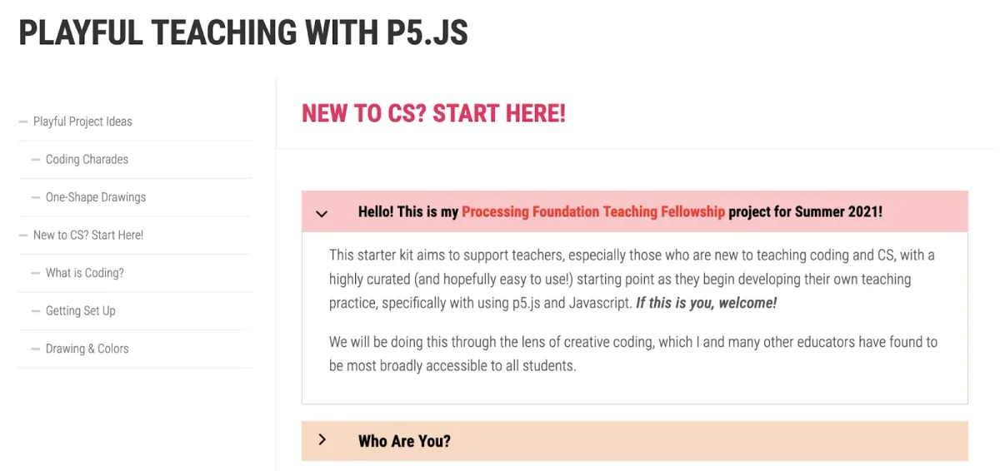

**Screenshots from Angi’s Teaching Fellowship project. The project can be viewed at at* [*http://teach.angichau.com/*](http://teach.angichau.com/)*. \[****image description****: A screenshot with a header that says: “Playful teaching with p5.js.” Beneath that, the screen says: “New to CS? Start Here! Hello! This is my Processing Foundation Teaching Fellowship project for Summer 2021! This starter kit aims to support teachers, especially those who are new to teaching coding and CS, with a highly curated (and hopefully easy to use!) starting point as they begin developing their own teaching practice, specifically with using p5.js and Javascript. If this is you, welcome! We will be doing this through the lens of creative coding, which I and many other educators have found to be most broadly accessible to all students.” The next button says, “Who are you?”\]**

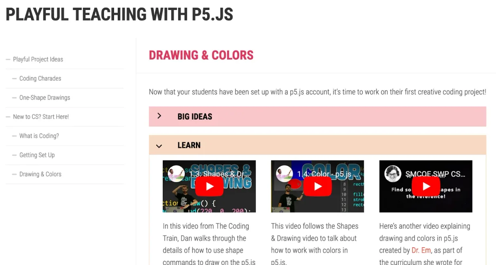

*\[**image description**: A screenshot with the header, “Playful Teaching with p5.js,” shows a menu for “:”Drawing & Colors. Now that your students have been set up with a p5.js account, it’s time to work on their first creative coding project!” Beneath this are two drop-down menus, one that says “Big Ideas,” and one that says “Learn.” Beneath “Learn” are three youtube videos.\]*

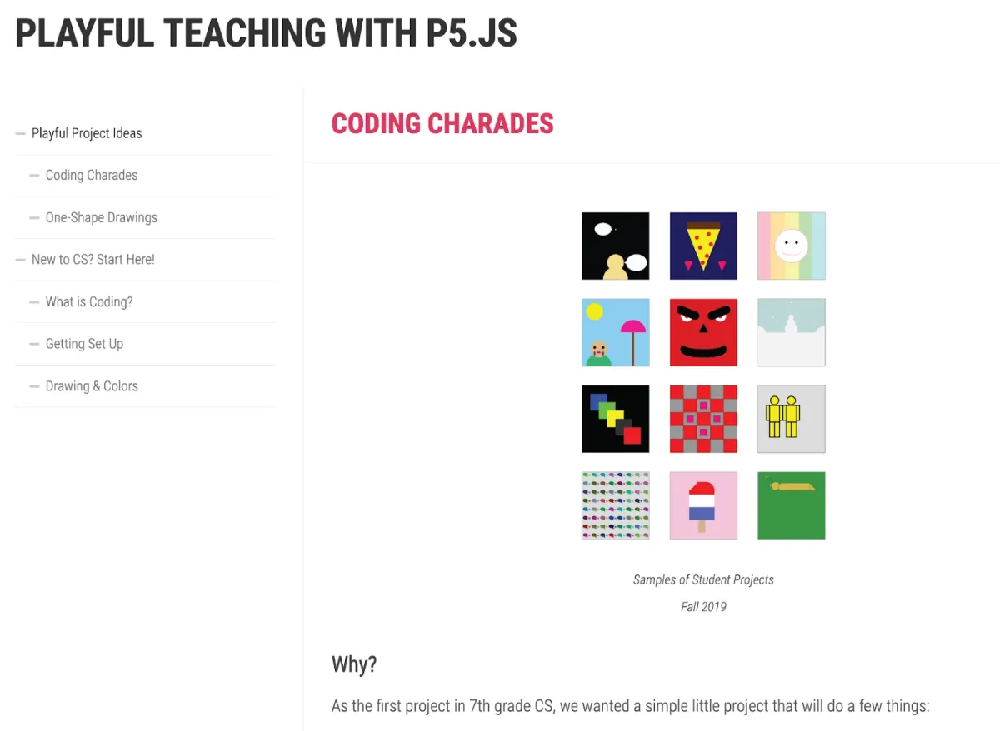

*\[**image description**: A screenshot with the header “Playful Teaching with p5.js,” then “Coding Charades,” below that. There is a grid of 12 squares with computer-generated images, with the caption, “Samples of Student Projects, Fall 2019.” Text beneath that reads: “Why? As the first project in 7th grade CS, we wanted a simple little project that will do a few things:”\]*

**Saber Khan: This is a good point to speculate a little bit on these questions. You’ve done a lot of teacher engagement work already, both as a conference organizer and presenter, what do you think are some approaches to teacher engagement that the community might want to consider?**

**Angi Chau**: I have lots of thoughts, but I don’t know if any of them are fleshed out as actual ideas yet. So we already talked about that I’ve now gone down the path of “maybe this starter kit idea isn’t as useful as I originally thought it might be,” and I’m ok with that. Maybe playful project ideas could be more useful but it’s also hard to know. But ultimately, what is the goal? We want teachers to feel comfortable using p5.js because it’s a great environment that opens up worlds of possibilities, right? Maybe the goal is to encourage teachers themselves to be playful and create fun things with p5.js, and then their teacher instincts will kick in to find ways to bring that back to their own classrooms, in their own way.

So my not-really-fleshed-out idea is inspired by those social media prompt challenges, you know like [#genuary](https://twitter.com/search?q=%23genuary&src=typed_query) or something. Someone posts prompts and folks are invited to create works to respond to the prompts and share them. I’ve seen these types of challenges both in creative coding and more generally in other artistic medium.

So I wonder if there can be an equivalent for the p5.js educator community where I can share a project idea or prompt, and then a bunch of teachers do it and share the results. Or even potentially teachers can teach it and share out some of their students’ works. This would get people actively creating. It would give teachers an excuse or extra motivation to actually DO a project before they ask kids to do it.

But then the flip side of that “wonder” is: would the teachers who are new to p5.js — how would they even come across this hashtag? How much of it is preaching to the choir versus trying to welcome new people to the community? Finding new people and inviting them into the community is the hard part!

**Saber Khan: I’m nodding my head a lot because this is stuff I think about as well, and I sometimes find myself thinking “we could do this but I don’t know if it’s going to fundamentally change the game in the way that we’re looking to do”. I think your impulse is right — doing the thing is really important. The value of any p5.js workshop for a teacher is that they will code. Fewer slides create more space for people to get their hands dirty learning, like we said.**

**Angi Chau**: That willingness to get your hands dirty is exactly what I tell kids — the more times you come across an error, the faster you are at knowing what that error is the next time you see it. It becomes so much less scary when that error comes around again. I think it’s the same for teachers. The first time someone says, “Something’s wrong with my code,” and it might take you like 10 minutes to figure it out. Then “Oh! It’s the curly brace.” The 20th time, you just walk over and say, “It’s probably missing a curly brace.” The more a teacher codes, the more they have seen and built their experience of potential bugs, which then allow them to help their students better.

One thing I’ve been thinking about that could be fun to do is inspired by one of the other Processing Fellows, [Computational Mama](https://friends.computationalmama.xyz/). She does that [Twitch stream](https://www.twitch.tv/computational_mama), “Coding with Friends.” It’s usually her and one of her friends coding together, and they figure out how to do something live. I’ve been super inspired by her work and wonder if it might be interesting to have a teacher version of it, where you get two or three teachers together. And we will all do a project together while chatting about teaching and teaching coding. And we would also share all the bugs we run into on screen and talk about how to deal with them in the classroom.

**Saber Khan: It gets at the problem of watching how many people are participating and gets the presenter doing something, to talk about the value of everyone doing something.**

**Angi Chau**: I’ve actually tried this model out a little while ago because [Maker Ed](https://makered.org/), the non-profit, runs a series called “[Learning in the Making](https://makered.org/learning-in-the-making/).” Aáron Heard, the host, and I did [an episode on p5.js on creative coding](https://www.youtube.com/watch?v=uP2iJlIpfkM&list=PL6-XLLiQK8vG221svKhvUk7xc3h0SZ4fT&index=27), where the two of us are coding together. She hadn’t done much coding before, so we worked on Coding Charades together and it was so fun! It’ll be interesting to see what folks’ responses are to two people talking to each other about coding while also coding together. In the end, I really enjoyed that experience because it’s a lot more natural to be chatting with a friend versus if I’m talking by myself on the screen, then I feel like I have to adopt this “teacher Angi” voice like, “Children, let’s go!” How many people want to sit through that? I know Dan (Shiffman) is able to make it very engaging, but not many people are Dan.

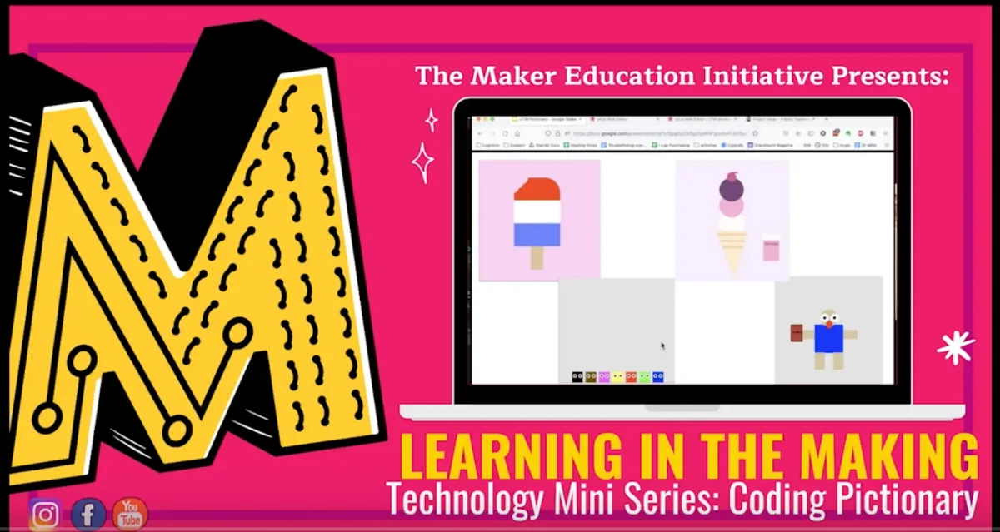

**Stills from “Learning in the Making” episode. \[****image description****: Screenshot of a bright pink background with a large yellow M to the left. Text says: “The Maker Education Initiative Presents: Learning in the Making, Technology Mini Series: Coding Pictionary.” There is an illustration of a laptop with drawings of ice cream on the screen.\]**

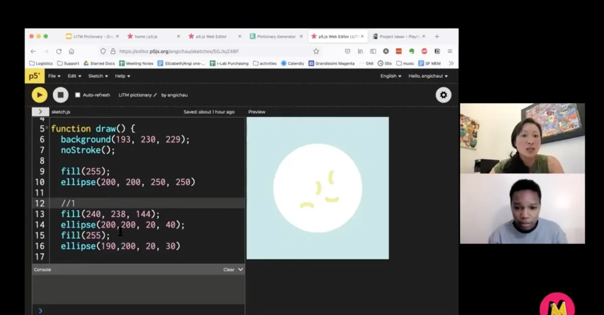

*\[**image description**: Screenshot of a p5.js window of code, producing a drawing of a white circle on a blue background, with little squiggles inside it. To the right are video frames of Angi and a student.\]*

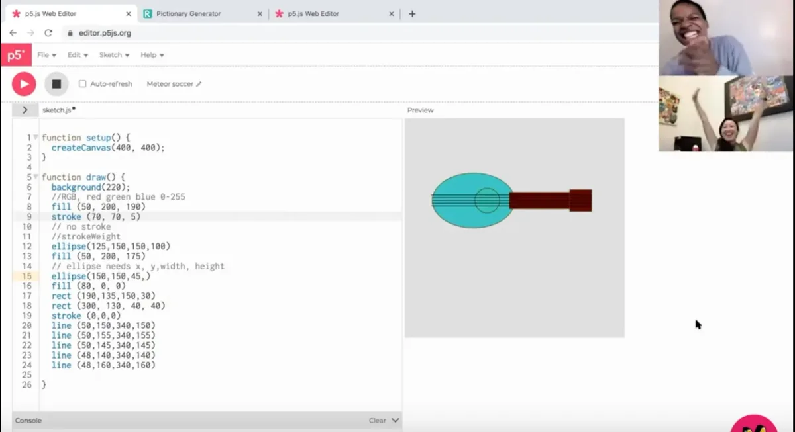

*\[**image description**: Screenshot of a p5.js window of code, producing the illustration of a stringed musical instrument. To the right are video frames of a student and Angi. Both are grinning; Angi has her arms in the air in victory.\]*

**Saber Khan: But the coding thing is so nice because you have the company of the person and you can do something that you think is worthwhile.**

**The last thing to talk about is more generally about teaching, the one area we haven’t covered. K12 already feels so fraught, and since COVID there has been this mask mandate, this push against Critical Race Theory, and things seem to be getting more complicated. I’d love to hear what your perspective is on how things are going. What keeps you up at night about the state of K12 education?**

**Angi Chau**: I absolutely think about it a lot. I have been lucky to work in very well-resourced schools and, in addition to that, I’ve been lucky to work at schools where I’m not fighting for my job. In my school, even when we went remote, it was never a question of: Should we just get rid of these \[subjects\] and focus only on the “core subjects”?

I have it so much better than a lot of teachers out there, so I want to first recognize that. I’ve talked to many people as one of the organizers of the Bay Area maker meetups, and we had one in September over Zoom. What’s top of mind for a lot of people is that maker education was really trending for a while and then COVID hit, and then it became like, wait, you can’t do any of that remotely, so all of you Maker teachers are going to be reassigned to something that’s useful.

I think about how COVID really shone a light on gaps in access. Some schools, like the one I work at, immediately — within a week — went remote because we could get all the kids computers. Most of the kids already have wifi. Those who don’t, we were able to send out hotspots. We had the resources, but that’s certainly not true of most schools in this country. I think about that kind of inequity. Sometimes I say that and people are like, “wait, so are you saying you wish the kids at your school wouldn’t have that?” No, I’m not saying that! I’m saying why can’t every child in the entire country have this?

**Saber Khan: You got All Lives Matter-ed basically.**

**Angi Chau**: Yeah. We should raise the bar of what we expect. I think about that a lot. COVID kept everyone isolated socially, physically, and so many people turned to online communities. I think for adults, in most cases, that’s generally positive, although certainly that’s not always true. There are the fringe groups. There are people who become really polarized. Children also turn to online communities, but they are children and they don’t yet have all of the self-regulation in place, so they end up in places that are not as monitored or supervised as we would like.

Now that they’re back in school, we are seeing some of that come back — being unkind to each other, bullying. They’re like, “It’s fine! There was this Discord and it was hilarious.” But since we don’t see that Discord, we have no idea what’s happening. The kids were just on screen so much and I don’t know that it’s a good thing. I know that’s extra ironic because I’m a computer science teacher. To be fair, I don’t think it’s the screen time that’s the problem — it’s *what* they were doing on screen and the fact that most parents did not have the bandwidth to supervise what their children were doing. And to be clear, that’s not meant to guilt-trip the parents out there — I’m a parent and lived through the impossibility of trying to juggle work and homeschooling.

**Saber Khan: What does your ideal version of K12 CS look like? We’ve danced around the topic, but if you had the power, what would you want to see in a good, accessible tech education in K12?**

**Angi Chau**: That’s a great question. What I would like to see — and this is going to sound a little weird — but I’m going to describe what I talk a lot about at my school, what I call the three-layer cake model. I wish that there was a way for us to make every kid’s CS program a three-layer cake, where we can ensure that every kid will get some amount of cake.

> The first layer is: What are you requiring every student to do? The second layer is: What are you offering for kids who want to do more? The third layer is: What are all the extended opportunities for kids who want to do so much that they would stay after school?

*\[**image description**: An animated gif of a rainbow layer cake being built layer by layer. Each layer is a different color.\]*

For any program, to honor kids at all different interest levels and experience levels, you almost always need to have all three layers of cake. Because if your program doesn’t have some sort of required exposure, then not every kid will get the chance to experience CS. It becomes those who can afford the after-school camps, or those who happen to have parents who do stuff in CS — who are coders — that know to opt into the electives and the extracurriculars.To make it equitable, you have to have that first layer of cake, the required classes. Now, it doesn’t have to be required CS classes because it can also be integrated into other classes. But ultimately, where are we exposing kids to CS, to see that this is a thing that they CAN do, and that it could be something they want to learn more about? How are we making sure every kid has some foundational level of computational literacy, so they can understand all the ways our world is run on the products of computer science?

I will say that, in some ways, that first layer of the cake is also pedagogically the toughest layer to design. It’s much easier to think of programs for the second and the third layer. Robotics for the robotics kids. Arduino for the kids who like blinky lights. Unity programming for kids who love video games. But that first layer — you gotta find something that everybody can engage with. That’s truly where the “low floor, no ceiling” philosophy has to come into play. That’s the layer that I’m most interested in because I want more people to start “eating cake,” basically. LOL.

And this first layer is also where I think p5.js and Processing and all their associated projects have so much power and possibilities. Because it doesn’t have that Silicon Valley vibe about it. I feel like anything that feels too “ Silicon Valley” — a lot of people just automatically opt out of it because they either don’t think they are “techie” or they don’t want to be “techie”.

**Saber Khan: That explains why p5.js is part of that first layer.**

**Angi Chau**: Yup, 100%! p5.js — like we already talked about, hardly any barriers to entry — no installation, no weird terminal commands just to get started. I’ve seen coding classes where, and it’s really not the fault of anybody except the tech itself, but the fact that you have to install Python and then this package, and then you don’t even know what version of Python you are running, and then and then…

**Saber Khan: It’ll be six months trying to get Python installed.**

**Angi Chau**: Totally! So what always ends up happening is that you make the kids spend a whole class following 50 steps of instructions to get their environment up and running. And then when something fails, the teacher has to essentially take over the computer because WE don’t even know what’s happening, and we’re typing cryptic commands into the terminal to figure it out. I mean, think about that as welcome into a community. If I was a kid, I would immediately be like: This is clearly not for me — I can’t even get this thing running. I already am bad at this. Whereas with p5.js, you just log in.

**Saber Khan: Is there anything left that you want to go over before we** **stop?**

**Angi Chau**: I think to end, I do want to say I’m honestly super curious what the community thinks. If any teachers who are not coming from a technical background who are teaching CS or p5.js or whatever it is, if they are reading this and have strong opinions about what would be most useful to them — I would love to hear it!

And I really *am* interested in doing the equivalent of what Computational Mama is doing for teachers, so I hope I will be able to get that going at some point. Thanks, Saber!!
