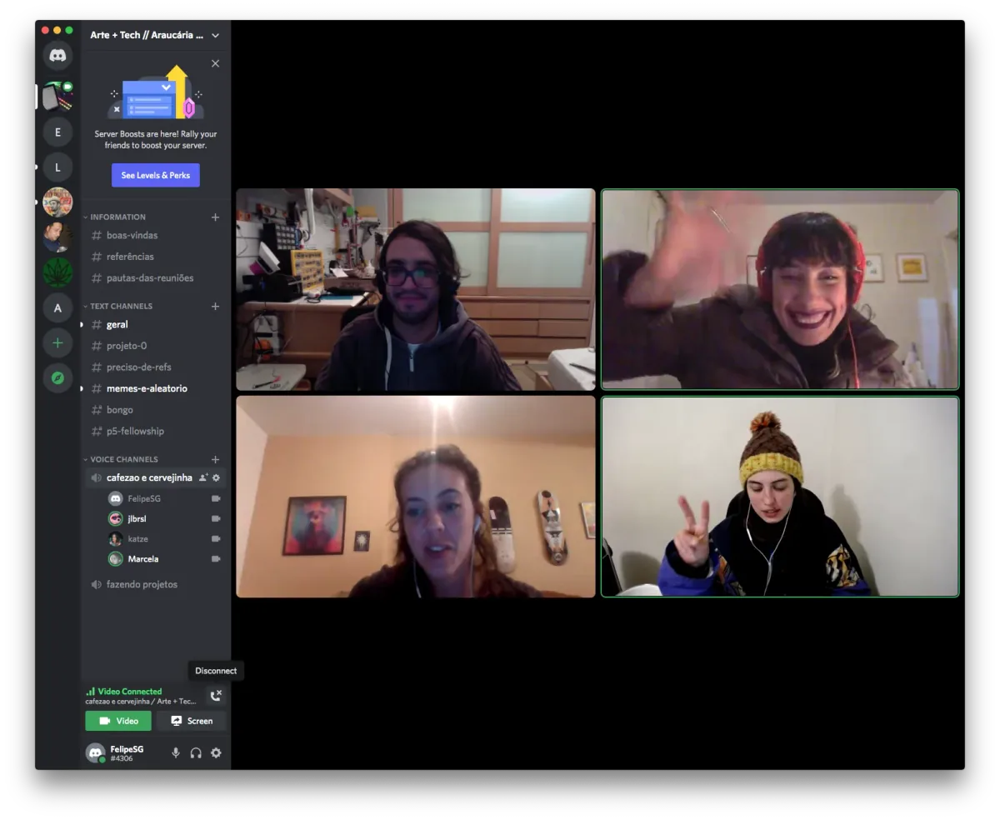
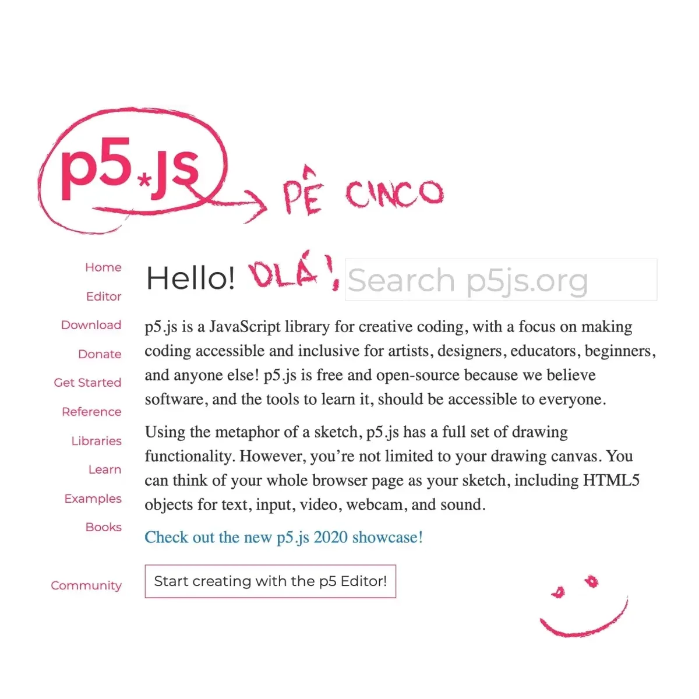
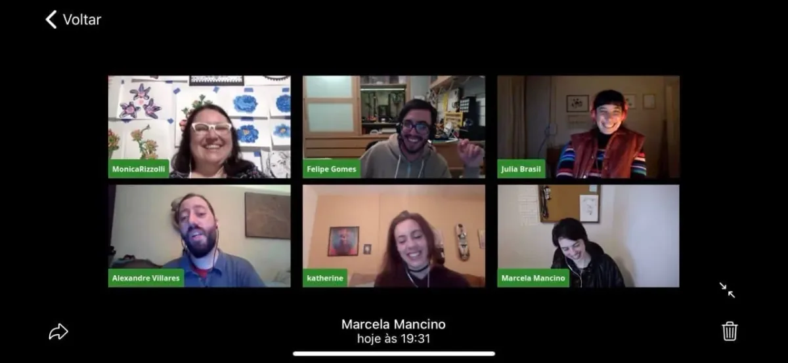

interviewed by Johanna Hedva, Director of Advocacy, Processing Foundation

---

*For the sixth year of our annual Fellowship Program, we aimed to better support the new paradigm of remote and online contexts and socially distanced communities. We asked applicants to address at least one of four Priority Areas that, to us, felt especially important for finding ways to feel more connected right now: Accessibility, Internationalization, Continuing Support, and AI Ethics and Open Source. Additionally, we sponsored four Teaching Fellows, who developed teaching materials that will be made available for free, and are oriented toward remote learning within specific communities. We received 126 applications and were able to award six Fellowships, with four Teaching Fellowships. We are excited to note that this is our most international cohort ever, with Fellows based in Australia, Brazil, India, Mexico, Philippines, Switzerland; and in the U.S. in California, Portland, and New York. Over the next few weeks, we’ll be posting articles written by the fellows, or interviews with them, where they describe their projects in their own words. For an archive of our past Fellows* [click here](https://processingfoundation.org/fellowships)*, and to read our series of articles on past Fellowships,* [click here](https://medium.com/processing-foundation/https-medium-com-tag-pf-fellowships-la/home)*.*

---

*“Our first meeting after the announcement of the 2021 Processing Fellows. We were celebrating!” The Fellowship project of Felipe Santos Gomes, Julia Brasil, Katherine Finn Zander, and Marcela Mancino aimed to translate the p5.js Reference into Portuguese and engage directly with the Brazilian community of open-source and p5.js users. Check out their Instagram page [here](https://www.instagram.com/p5jsbrasil/). \[**Image description**: A screenshot of four livestream videos, showing the four creators behind this project in conversation.\]*

**Johanna Hedva: Hi Felipe, Julia, Katherine, and Marcela! Let’s start with a description of your project. What did you set out to do? What were the intentions for the Fellowship period?**

Hi Johanna! First we’d like to say that we are really happy to be here, and very proud of our work. These two months have been amazing and we’ve learned so much from this experience, so thanks for the opportunity!

Our goal was to translate as much as possible of the Reference of p5.js to Portuguese. That is where we started. We knew we wouldn’t be able to translate all of it, but we knew we had to start so it could be continued by the community. That was also a key point for us — engaging the community, especially the Brazilian community. We wanted to get to know who else was using p5.js here in Brazil, build new connections, and expand existing ones.

We’ve also planned to produce a series of short videos presenting the project and its main features to foster p5.js in the Brazilian community. We intended to make these videos at the end, prioritizing the translation.

**JH: What were you able to accomplish of your initial goals?**

We are really happy with how much we’ve accomplished. In the first week of the Fellowship we set some priorities and established parts of the Reference that we should definitely translate — like some basic functions from the p5.js library, the home page, and the community guidelines. We have completed all of those. So we were able to advance further in the translation of some other parts. So far, we’ve completed 58 percent of all Reference documentation and 89 percent of the main functions.

Concerning community engagement, as soon as we defined our methods and priorities, we created social media profiles on [Twitter](https://twitter.com/p5jsbrasil) and [Instagram](https://www.instagram.com/p5jsbrasil/) to spread the news about the translation. From the beginning, we received lots of messages from people wanting to engage in the translation, and we were invited to talk about the project on “Noite de Processing” — a livestream event produced monthly by [Garoa Hacker Clube](https://garoa.net.br/) (pictured below).

We were totally thrilled with such an amazing response. But it was also a little challenging for us because we had to set up a strategy to allow everyone to participate but still maintain an organized workflow. To make sure we wouldn’t have people working on the same files that we were working on, we invited people to start by translating the examples instead of the Reference itself. We also established some guidelines and a translation glossary to make sure all contributors are using the same terms.

Unfortunately, we were unable to finish the videos, but right now we’re editing short videos with tips that we can post on Instagram, Tiktok, and Twitter. A longer video will be posted on YouTube. We are also thinking about captioning the videos from the Tutorial Creator Showcase because they have really good content, like [Carrie Sijia Wang’s “Three-Minute Creative Coding with p5.js”](https://carriesijiawang.com/3cc/).

*\[**Image description**: An animated gif of the p5.js homepage with some words translated into Portuguese. A smiley face is animated in the bottom corner.\]*

**JH: What was the most difficult issue you encountered in the project? How did you work through it?**

Probably the choice of terms. We had to make some decisions about whether to translate a term or not. Here in Brazil there are so many foreign terms that we’ve incorporated into the language, especially when it comes to tech or programming. There were some words that were better left untranslated. But that creates other issues. We began questioning if that was really the best choice — maybe we were just creating another layer of inaccessibility for those who don’t speak English. On the other hand, if we translated all the terms, we could end up confusing those who have some familiarity with programming languages, or make it incompatible with other existing educational materials.

To deal with the translation of technical terms, we created a translation glossary that is available for all future contributors [in our GitHub repository](https://github.com/araucarialab/p5.js-website/issues/1). This glossary was developed during weekly meetings with our mentor, Claudio Esperança. We would take note of all the terms we weren’t sure how to translate, figure out the best translation (or lack thereof), and then add it to the glossary. We often found the solution to be having both the term in Portuguese and in its original language, to make sure we were covering the technical term used as is, and also communicating what it meant.

We also faced some gender issues in translation, as in Portuguese there are many more declinations than in English. We were careful to try to keep the language as neutral as possible, and when it wasn’t possible, we chose to declinate to the feminine.

Also, we’ve started translating the JSON and YML files through programming IDEs. We noticed that more people would probably like to contribute translations, but the process made it difficult. Kenneth Lim ([a 2018 Processing Foundation Fellow](https://medium.com/processing-foundation/chinese-translation-for-p5-js-and-preparing-a-future-of-more-translations-b56843ea096e)) contacted us to present his project with Pontoon at the end of the Fellowship. We realized that the translation process with Pontoon was much faster, more practical, and more accessible. So we believe that more people would contribute translations on Pontoon.

*Livestream event produced monthly by [Garoa Hacker Clube](https://garoa.net.br/) where we talked about the project. \[**Image description**: A screenshot of six livestreams. In the corners of each person’s image are their names: Monica Rizzoli, Felipe Gomes, Julia Brasil, Alexandre Villares, katherine, and Marcela Mancino.\]*

**JH: What is the future of your project? What do you still want and plan to do?**

There are still many entries and other parts of the website to be translated, as well as the examples. We will continue to encourage people to contribute with translation, and as soon as Pontoon is accessible to everyone, we will promote it on the project’s social networks. With the response that we got, we are sure many more people would love to contribute.

Our glossary will also be available, as well as our translation guidelines, in order to maintain a translation standard. We all have manager accounts on Pontoon and will keep track of any contributions.

As we mentioned, we prioritized the translation, so we didn’t get to post the videos that we wanted to make, but plan on posting them when they are done so we can continue to spread p5.js in our community.

Until now, the people who engaged with the project were mostly people who wanted to help with the translation, which means that they understand the reference in English. Once the website is up with the new translation, that is when the project begins to serve its purpose, which is to make this tool accessible for Portuguese speakers who wouldn’t be able to access it otherwise.

[See videos on Twitch TV here.](https://www.twitch.tv/videos/1100089527?filter=archives&sort=time)

[See Instagram here.](https://www.instagram.com/p/CRrbQAwrNzL/?utm_source=ig_web_copy_link)

---

*Felipe Santos Gomes, Julia Brasil, Katherine Finn Zander, and Marcela Mancino were mentored by* [Claudio Esperança](https://cesperanca.org/)*, who is a Professor at Federal University of Rio de Janeiro (UFRJ) in the Program of Systems Engineering and Computing and the Graduate Program in Design.*
