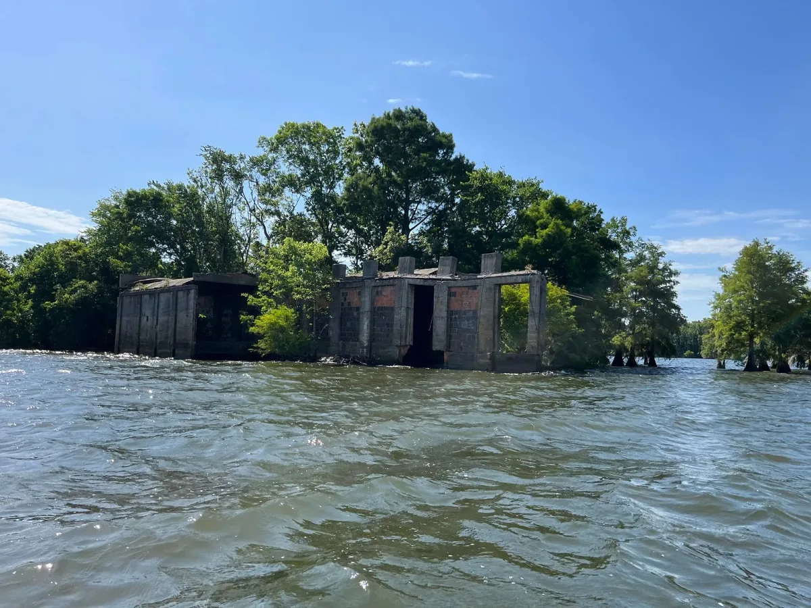
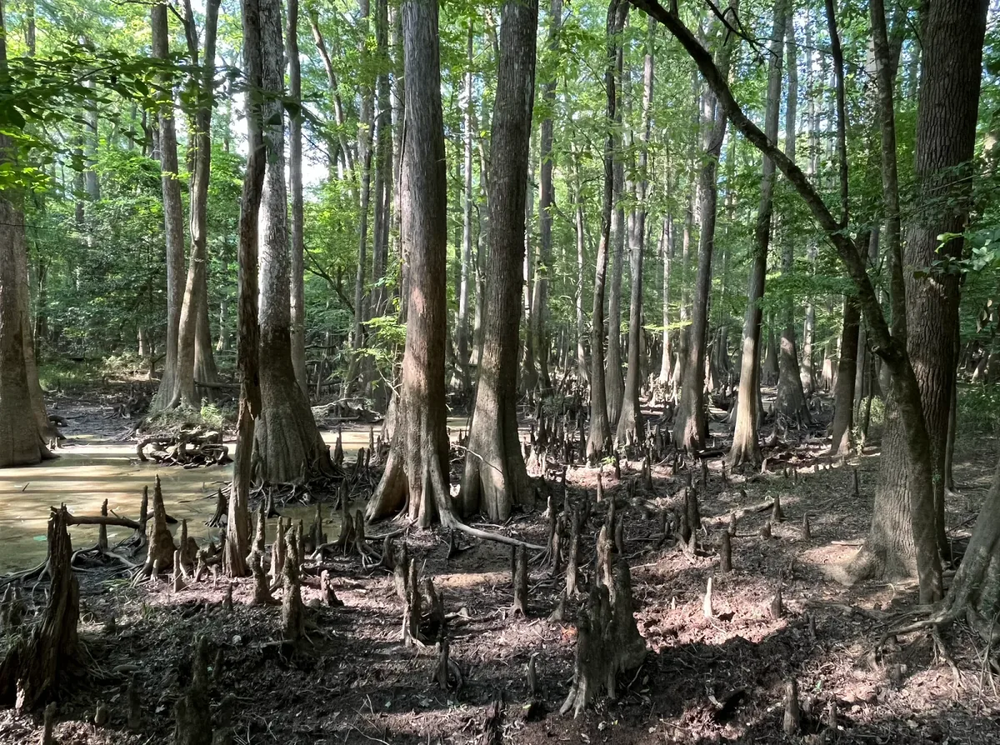
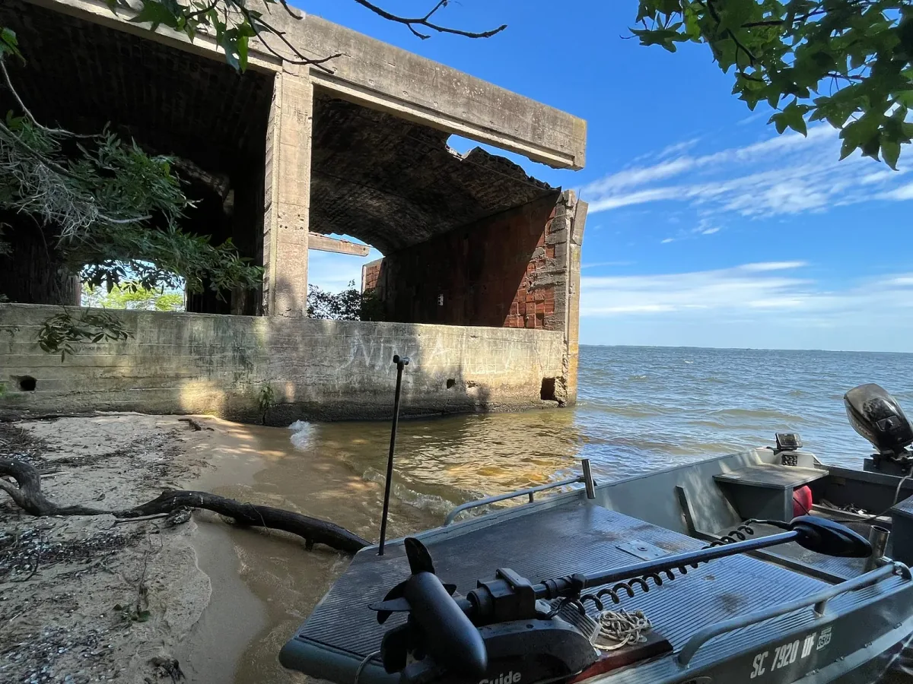

An interview with Morgan P. Vickers, Processing Foundation Fellow 2022. Check out Morgan’s final project at: [https://undrowned.glitch.me/](https://undrowned.glitch.me/)

*An image from Morgan’s fieldwork.*

#### **Please introduce yourself — who are you and where are you located?**

My name is [Morgan P. Vickers](https://morganpvickers.com/). I’m a writer, researcher, community historian, ethnographer, and Ph.D. candidate in the Department of Geography at the University of California, Berkeley.

I am currently located in Oakland, California on the land of Huichin, a portion of the stolen land of the Chochenyo Muwekma Ohlone, the successors of the historic and sovereign Verona Band of Alameda County.

#### **What was your fellowship project?**

This project emerged out of a segment of my dissertation project, which illuminates the 901 families — ⅘ of whom were Black — who were dispossessed and whose homes and ancestral lands were submerged in the making of the New Deal Santee-Cooper Hydroelectric and Navigation Project in central South Carolina.

When I applied to the Processing Fellowship, I proposed building a series of maps in p5 that could be used to “walk through” or “swim through” drowned towns. A portion of this summer was thus spent building out maps in SketchUp, a software traditionally used by architects, landscape designers, planners, and other forward-thinking professionals who are aiming to design spaces of the future. However, I wanted to use these tools to render a speculative past — to imagine what life could have been like in these towns had they never been drowned.

My use of SketchUp was inspired by artist, community scientist, and researcher [Jeffrey Yoo Warren](https://unterbahn.com/), who produced the project ‘[Seeing Providence Chinatown](https://unterbahn.com/chinatown/)’, wherein he utilized SketchUp as a historical tool to digitally reconstruct a disappeared Chinatown neighborhood in Providence, Rhode Island. In this project, Warren introduced a concept called [relational reconstruction](https://www.instagram.com/p/CZxh--Rlz-G/), whereby he reproduces disappeared places in three dimensions in order to “know what it was like to stand there, in a place of belonging, and have a community and an enclave, in such a hostile time and environment… \[and\] honor and know just a little bit about what people’s lives were like.”

Thanks to the financial support of the Processing Foundation, I was able to visit my field site in South Carolina. During that June trip, a University of South Carolina archivist took me and several other scholars and state park employees out on his family boat into Lake Marion, where we visited the semi-submerged former lumber mill town of Ferguson. There, the archivist used the depth-finder of his boat and a historic map to navigate us to a spot in the middle of the lake. After a few moments, the archivist said, “We are eleven feet above the reservoir floor. Right now we are sitting where the roofs of the houses once stood.”

Inspired by this experience, I spent a portion of this summer building a simple reconstruction of Ferguson, South Carolina in SketchUp in order to demonstrate what the town might look like if it still existed today. On my final project site, I provide three iterations of the same model — one that appears “submerged” against a blue backdrop, as if it is now sitting at the bottom of the reservoir; a second in the context of the historical maps of what the town used to look like; and a third one atop current Google Map projections to contextualize the scale of the loss given our current geographies.

I also wanted to contextualize the history of Ferguson in relation to the 3D renderings I produced. One of my mentors, [Anna Garbier](http://www.annagarbier.com/#/), introduced me to a site called [Below the Surface](https://belowthesurface.amsterdam/en/vondsten), which depicts icons of materials excavated in the dredging of the Amstel River in Amsterdam. As one scrolls down the site, they move through a timeline of both the history of the river and the history of human interactions and deposits within the river. Inspired by this formatting, Anna helped me utilize p5 to build a series of before-and-after images that reveal themselves as one scrolls down my website. And my second mentor, [Adrian Jones](https://www.linkedin.com/in/adrianwjones/), helped me utilize [Glitch](http://glitch.com) to turn the interface Anna built into a timeline that reveals more historic and modern photographs and artifacts as one scrolls further down the page and deeper into the history of the town of Ferguson.

While the project began as a cartographic investigation of submerged towns, it evolved to encompass alternative movements through space, including diving deeper beneath the surface of the town of Ferguson to imagine what it might be like to be ‘undrowned.’ I hope this project might be useful for the descendants of the former residents of Ferguson and other towns inundated in the Santee-Cooper Hydroelectric and Navigation Project nearly a century ago. I also hope it could serve as a useful digital humanities and/or public history tool for scholars looking to tell histories in new dimensions (literally!).

#### **What were challenges that you encountered while doing your project?**

I am extraordinarily grateful for and indebted to [Anna](https://annagarbier.com/) from [SOSO](http://sosolimited.com/) and [Adrian](https://looking-glass.space/), who offered ample technical support as I worked through this project. Prior to the fellowship, I had very little coding experience — I took COMP 101 as an undergrad, and it made me cry on a weekly basis! — and knew little about p5. So, needless to say, I was nervous going into the fellowship.

But Adrian and Anna, along with all of the folks at Processing, supported me, my ideas, and my work throughout the whole process. Anna gave me coding lessons, as well as exercises and examples to work through on my own in Github. Adrian and I had several working sessions, where we collaboratively built out my site in Glitch. Both Anna and Adrian are excellent collaborators and technical experts; I spent several early meetings telling them all of my wildest ideas of what this project could look like, and they each spent time doing independent research based on my ideas, breaking down the possibilities of p5, and highlighting the opportunities and limitations of different tools.

In the end, this project is the result of collaborations. I could not have built this site or come to this project on my own, especially not without the support of my mentors and the support of the Processing Foundation.

#### **What are some of the joyful moments that you encountered while doing your project?**

I come from an academic background where so much of my work is done independently — from reading to writing a dissertation to giving presentations. And this feeling of independent scholarship has only been compounded in a Covid-19 era, where so much of my work and life are happening within the same 200 square feet.

But working on this project has reminded me of the deep joys of collaborative work. Of course, some of these collaborations were direct human interactions — building out my project with my mentors; taking a boat tour with a group of historians, archivists, and state park employees; and presenting early iterations of my project. But, even more than meetings and other direct contact with folks, my mentors taught me that so much of creative digital design is learning from and emulating the code and design of other people and projects that you admire.

Thus, one of my favorite parts of working on this project was just exploring all of the other projects built using p5, and also projects built using other coding languages. Exploring sites like [*The New York Times*’ Tulsa Massacre interactive article](https://www.nytimes.com/interactive/2021/05/24/us/tulsa-race-massacre.html), [Favelas 4D](https://senseable.mit.edu/favelas/), [Forensic Architecture](https://forensic-architecture.org/), and more, then looking at the code from the back end helped me imagine the possibilities of my own design work, and allowed me to play around with examples I learned from websites that inspired my own thinking. Such a collaborative spirit not only brought me a lot of joy, but also allowed me to expand my project into a structure that I likely would not have imagined on my own without such exploration.

#### **What are words of wisdom you would have for future fellows?**

Build in time for play, for exploration, and for fun. If you’re anything like me, technical design might be intimidating or frustrating at times. Lean on your mentors and your community, ask for help if and when you need it, and always be open to changes in your project. Let the work, the tools, and the ideas guide you!

[*Morgan P. Vickers*](http://morganpvickers.com) *is a writer, researcher, community historian, historic preservation storyteller, ethnographer, and Ph.D. candidate in the Department of Geography at the University of California, Berkeley. Their present work focuses on drowned towns of the Santee-Cooper Project in South Carolina, wherein 901 mostly Black families were displaced in the name of New Deal “progress.” Thematically, Morgan’s work contemplates Black geographies and placemaking, federal dam and reservoir projects, affect, community memory studies, and questions of belonging.*
