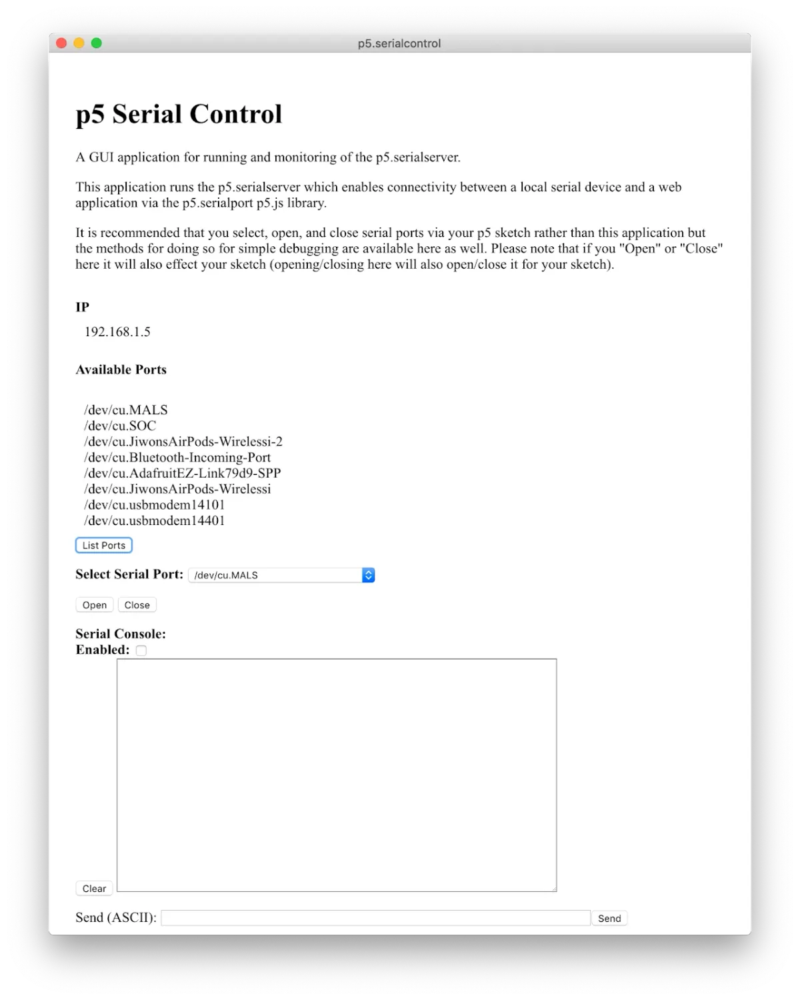
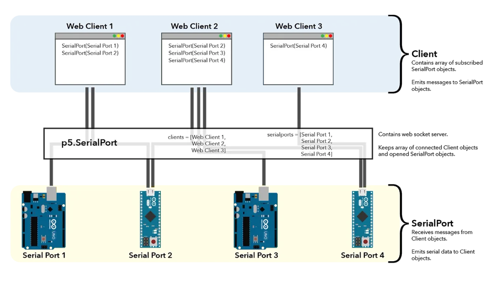
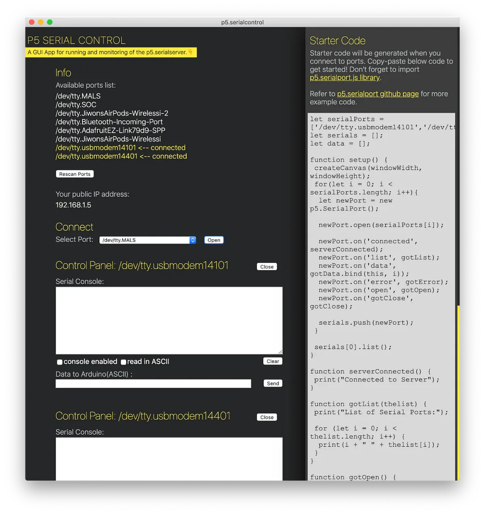

This summer was the Processing Foundation’s eighth year participating in Google Summer of Code, where we work with students on open-source projects that range from software development to community outreach. Over the next few weeks, we’ll be posting articles written by some of the GSoC students, explaining their projects in detail. The series will conclude with a wrap-up post of all the work done by this year’s cohort.

**View of p5.serialcontrol before the Google Summer of Code 2019 update.* [Release Alpha 6](https://github.com/p5-serial/p5.serialcontrol/releases/tag/0.0.6)*. From top to bottom, there is a text introducing the application, IP address, list of available ports, a drop-down menu for port selection, and a window for serial console.**

Originally developed by Shawn Van Every, who was my mentor for this year’s Google Summer of Code, p5.serial is a commonly used library to connect serial devices to p5.js sketches. Despite its wide use, it has not been actively maintained since 2017. I proposed to update and improve p5.serial library for Google Summer of Code 2019. Before deciding on the specifics of the improvements that I wanted to make, I needed to assess what already existed. Although I had been actively using p5.serial library since 2016, I had not studied the code base of the library until the beginning of Google Summer of Code 2019 in May.

#### Assessing what already exists

The p5.serial library is comprised of two parts: [p5.serialport](https://github.com/p5-serial/p5.serialport) and [p5.serialcontrol](https://github.com/p5-serial/p5.serialcontrol).

[p5.serialport](https://github.com/p5-serial/p5.serialport) contains the core functionality of p5.serial library. It runs the websocket server that opens connection from local computer to a website (for instance, a p5 web editor sketch) and vice versa. It is also where the connection of serial devices happens and the event listeners from serial devices and websocket connections are established.

[p5.serialcontrol](https://github.com/p5-serial/p5.serialcontrol) is a desktop application, built using [Electron](https://electronjs.org/), that acts as a console to allow users to see the available serial devices for connection, as well as the ability to open a serial port and read and write serial messages in the serial console window.

The general workflow for someone trying to connect their serial device (for instance, an Arduino) to a p5.js sketch would be to open up p5.serialcontrol application, see that their serial device shows up in the list of Available Ports, then select their desired port in the drop-down list beside “Select Serial Port,” and click “Open” to see their serial port device connect to p5.serialport server. One could also check the “Enabled” option for the “Serial Console” window to see serial data being read in raw bytes. Then, they would create a p5.js sketch and import the [p5.serialport.js library](https://github.com/p5-serial/p5.serialport/blob/master/lib/p5.serialport.js) to connect their serial device and start coding. The p5.serialcontrol application needs to be running, as that is where the server runs, and without it the connection between serial device and p5.js sketch will be broken.

#### Figuring out areas of improvement

The first thing I wanted to do was allow for multiple serial device connections to p5.js sketches. The motivation for this came from my own desire to create projects using multiple serial devices as inputs for web-based visualizations. After studying the original code base of p5.serial library, I realized that a connected serial device was set as a value of a variable (called serialPort). When another serial device was set to connect, it simply replaced the value of the variable. In order to allow multiple serial devices to connect to multiple web clients, the whole structure of the library would need to be re-written to be modular.

I also wanted to allow the freedom of web clients to choose which of the connected serial devices to subscribe / listen to. This meant that each web client would need to individually keep track of the subscribed serial devices, and each serial device would need to know which web clients were connected to it.

**Diagram showing connections between serial devices and web clients. At the top of the diagram, three instances of web clients are shown to have subscribed to different varieties of the four opened serial ports shown at the bottom of the diagram. The p5.SerialPort library is drawn in between the web client instances and connected serial ports as an intermediary, where it also keeps a master list of all connected web clients and serial ports.**

The change in the structure of p5.serialport, which would allow multiple serial device connections, meant that the p5.serialcontrol application would have to be redesigned as well. Wenqi Li, a former resident at [NYU’s ITP department](https://tisch.nyu.edu/itp), had been developing new accessible design for the p5.serialcontrol application, which I thought would be a great starting point for the redesign of the application.

#### The process

With the big goal of wanting to create multiple serial device connection functionality, I met with my mentor Shawn Van Every on a weekly basis. During the initial meetings we met to discuss the list of tasks for the summer as well as to talk through the existing code base. It was also when simple upgrades to npm packages (ws, serialport, and electron modules) were done, repackaged, and released. We also set up a [new p5-serial Github](https://github.com/p5-serial) repository, dedicated only for p5.serial library (previously under Shawn’s personal account), and set up a Github project to trench through the open issues of both the p5.serialcontrol and p5.serialport repositories.

#### The result

**View of latest release of p5.serialcontrol.* [Release Beta 1.1](https://github.com/p5-serial/p5.serialcontrol/releases/tag/0.1.1)*. It shows the application with the new accessible design in a yellow and grayscale color scheme. The application is visually divided into two columns. The left column contains the main tools of the application and shows, from top to bottom, a list of available serial ports with indications of connected ports, IP address, drop-down menu for port selection, and serial console panels for each of the connected serial ports. The right column shows a starter code generated depending on the number of connected serial ports and their names.**

The latest version p5.serialcontrol application was designed to enhance its use as a tool for debugging as well as to help users get started on coding their own p5.js sketches using serial devices for input and output. It is my hope that this will open some new doors for awesome web-based projects. I also hope to continue to contribute to p5.serial library as well as the general open source community.

The total list of contributions made to p5.serial during Google Summer of Code 2019 can be found on [this Github Wiki page](https://github.com/p5-serial/p5.serialport/wiki/GSoC-2019-Work-Production).
