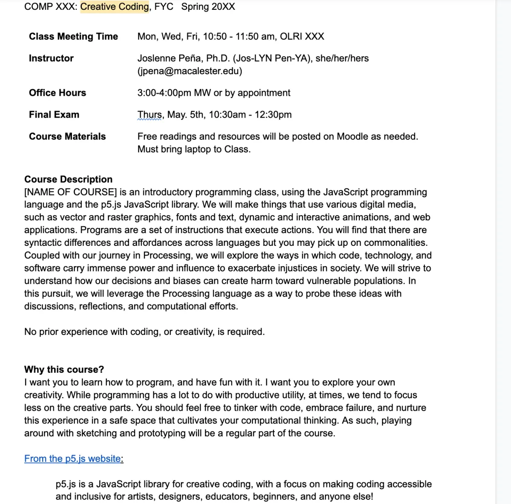
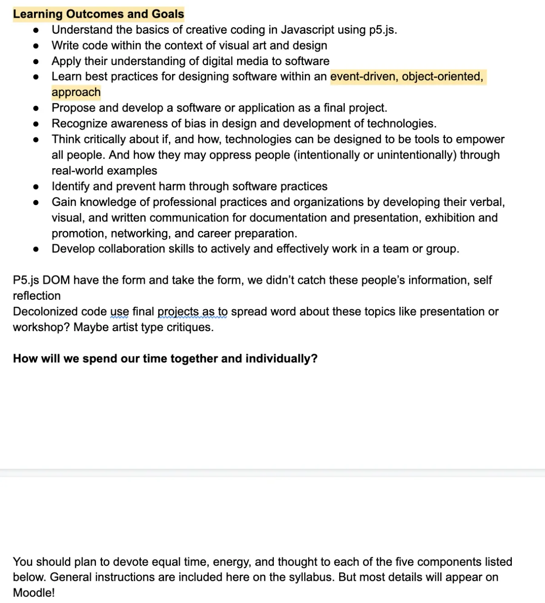

In particular, I think about socially responsible computing practices such as integrating bias, ethics, social justice, and accessibility into computing courses. I truly believe computing courses should weave in discussions, concepts, and ideas about these practices to complement applied programming projects. If we challenge students about their code creations early, we can get them to start engaging in these critical topics that impact us in society.

I joined this year’s Processing Foundation Fellows on a mission to understand how these topics can be successfully woven into a syllabus for a first-year Computer Science course that uses Processing (and more specifically p5.js) as its language. Furthermore, I realized teaching at a liberal arts college where students are eager to learn and use their interdisciplinary knowledge was the perfect backdrop to approach the topic of technology and social implications. Given our location in St. Paul, MN, this was not far from the George Floyd murder and now, more than ever, these conversations have to find their way in computing.

By designing the course in such a way that incorporates discussion and critical thinking, coupled with code implementation and practical applications, my ultimate hope is that students will raise their awareness and be more cautious about technology development, and consider questions around power and ethics.

My main goals with the Syllabus and subsequent course are as follows: (1) I want students to focus on the fun and creative aspects of Processing especially since many students have not encountered Processing or have programming experience (2) I want students to explore the ways in which code and software can promote justice or heighten injustices (3) I want students to know the language to voice their perspectives (4) I want students to understand the power they yield and the harm that can come from their creations.

Since p5.js lends itself well to web development and browser-based creations, I aim to use it as a vehicle to demonstrate how one can create inaccessible designs or code that can contribute (or not) to society. Many students don’t know how to bridge social and technological reasoning, and so the reinforcement of this through code principles and design frameworks can be really helpful. The course will culminate in a final project creation that boasts heavy critical thinking about socially responsible computing practices woven into their artifacts.

There were initial resources I consulted to get a better understanding of how folks approach social responsibility, ethics, and social justice in computing as well as Processing. The Processing Fellows community was a great resource to connect with other teaching-focused fellows on their projects to gather ideas! Similarly, I utilized my departmental colleagues for feedback and thoughts about activities. While my vision was there, the most difficult part was the implementation or the pedagogical ideation to create scaffolded learning opportunities that made sense! I really invested my time in thinking about real-world examples to motivate problems in technology and society while also making sure the Processing was seen as a tool to help fix these issues.

To give a sense of the materials and topics, I will describe two examples of assignments below:

1.  One activity centers the use of creative thinking and speculative design fiction to have students think through the social implications of technology — specifically the ethical, moral consequences of radical tools. Students get to use science fiction media to help think about all aspects of technology because it tends to require a lot of imagination. As opposed to programming, students will create narratives to end in an episodic blurb to capture the essence of the story with extreme technology. Then, students will unpack what they learned by applying those principles to critique actual Processing projects from the Open Processing site.
2.  The second activity focuses on using AI as a way to discern the differences between human-generated Processing code versus AI-generated code. Students have to compare and contrast the implications of a language model in creating readable and passable code, perceivable by humans. While current AI tools are becoming increasingly accurate, the tools get it wrong sometimes. Students will dissect the errors and try to reason why it got it wrong.

Please find the [published google doc here](https://docs.google.com/document/u/1/d/e/2PACX-1vS2Ln4Ix2ikGSLnULNkkVEsnZYsHZALJiOoQJn5PfPh-XgKKTM5A_JKvegQgVIyXag62VPMJPBPLkq9/pub) with all of my curricular ideas for the fellowship!

Below you will find some Syllabus draft images from an early version of the student-facing document that will be eventually used to generate one for the course!

During the Summer, I was able to focus on two-three chapters of material for the syllabus. Moving forward, I aim to continue the development of the Syllabus with a plan to teach a first-year course or special topics elective in my department in Spring 2024 or Fall 2025. This would allow ample time for more curricular development and iteration on the Syllabus.

Using the Processing language to elicit this type of thinking from students seemed like a challenge to me at first! However, the more I dug into the project, I found avenues that allowed me to expand my thoughts around how socially responsible computing is language agnostic. It also made me realize that a student’s creativity is a driving force that can broaden participation in computing (if we make it accessible and approachable). Yet, we should find ways to challenge students to think about being more intentional, meaningful, and careful when we craft software for the world.

*Joslenne Peña, Processing Foundation Teaching Fellow 2022, is a faculty member in Computer Science at Macalester College, a liberal arts college in St. Paul, MN. Her research focuses on how we teach and engage underrepresented groups in computer science education through a variety of design opportunities in the classroom. She teaches a range of courses from Introductory Computer Science, Internet Computing, and Object-oriented Programming. Joslenne holds a B.A. in Multimedia Web Design & Development from the University of Hartford, an M.S. in Information Science & Technology, and a Doctorate in Informatics from Penn State.* [*https://jpena831.github.io/*](https://jpena831.github.io/) *Follow Joslenne on* [*twitter*](https://mobile.twitter.com/jpena831)*. Joslenne’s Teaching Fellowship mentor was* [Kemi Ukadike](https://www.linkedin.com/in/adekemisijuwade/).
