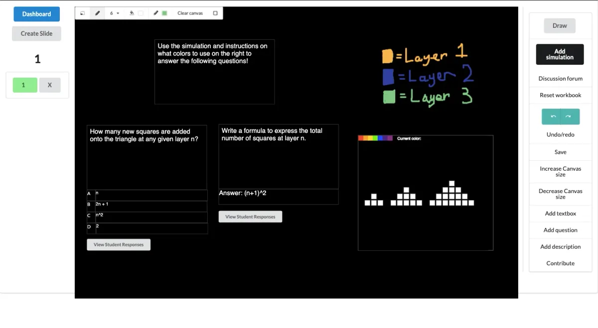
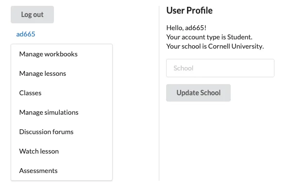
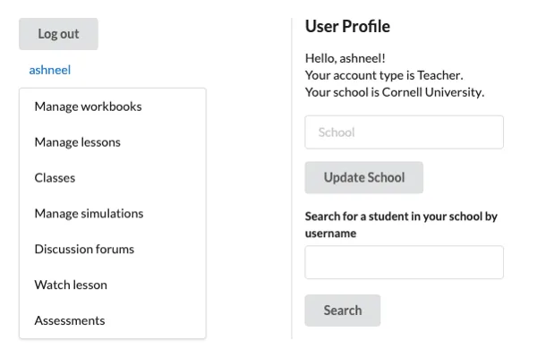
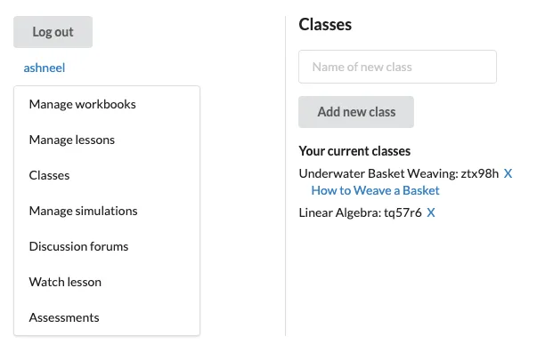
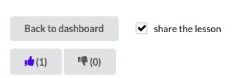
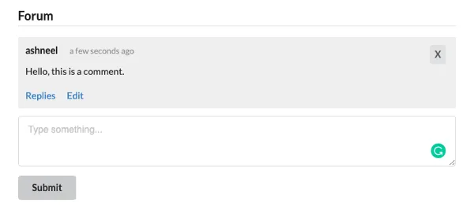
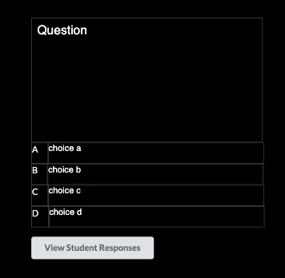

This summer was the Processing Foundation’s eighth year participating in Google Summer of Code, where we work with students on open-source projects that range from software development to community outreach. Over the next few weeks, we’ll be posting articles written by some of the GSoC students, explaining their projects in detail. The series will conclude with a wrap-up post of all the work done by this year’s cohort.

*An example of a workbook area, from the Dynamic Learning app, which visually teaches STEM topics. This workbook includes a textbox, two questions (including multiple choice and short response), and an embedded simulation about patterns of growth.*

Since my first days of elementary school, I noticed a problem with the way that math was being taught. Although the topics we were learning were as simple as 2+2, my peers often struggled to put meaning behind the numbers and times tables and (seemingly) random math knowledge that was being unloaded on them. One day, when I was in fifth grade, my friend sat down with me to ask about a fill-in-the-blank math question, which looked like this: “5 times \_\_ equals 25.” My thought process for this was simple: just divide by 5 on both sides, and there you have it, your answer is 5. Unfortunately, this explanation flew over my friend’s head and I had to take a different approach. In order to help him out, I grabbed a set of circular counters that our class used for an end-of-day game we played. I grouped five of them together and asked him, “How many of these groups do I need to make 25 pieces total?” He stared at me for a second and said something along the lines of, “Well, duh, it’s 5. Why are you asking me such an easy question?”

This was the moment I realized that most people are visual learners. As I grew older, I had an itch in the back of my mind to make math easier to understand for people who learn visually, rather than quantitatively. I realized that programming could be invaluable for this because of how easy and accessible the tools are that can be created with it. In AP Computer Science class, I was introduced to Processing, a language that makes creating visualizations and simulations a breeze. Everything had fallen together at this point: I had discovered the perfect tool that was not only fun and interactive, but helpful in the context of education, especially in STEM fields.

That’s why I was beyond excited when I was given the opportunity to work with the Processing Foundation through this year’s Google Summer of Code program. I worked on Dynamic Learning, a project which was started a year ago by [Jithin K.S.](https://medium.com/processing-foundation/improving-science-and-math-education-using-p5-js-d434beea465c) This project targeted the exact goal I had spent all these years pondering: bringing visualization to STEM education.

Before the summer began, the app contained the following sections:

-   A lesson area, where students can watch slideshows containing videos and related simulations.
-   A lesson plan area, which is now remodeled as a workbook area, where students can watch slideshows with drawings and text.
-   A requests area, where teachers can make requests to developers for specific simulations for their slides.

Throughout the summer, I added a variety of features that make the app suitable to use in a classroom environment. These are the primary features I focused on:

-   Supporting different account types (student, teacher, and standard/developer).
-   Creating profile pages that contain basic information about students so that teachers can manage their students more easily (pictured).

*A user profile for a regular user*

*A user profile for a teacher*

-   GitHub and Google authentication for login so that developers can make accounts more easily, and teachers can use student emails for better management.
-   Allowing for classrooms where teachers can manage a set of students and assign workbooks for them to complete (pictured).

*A classroom from the view of a teacher, where workbooks can be assigned to a class. Currently, this class only has one workbook (“How to Weave a Basket”).*

-   Improving the app’s layout on phones and tablets, which are used by many students nowadays.
-   Adding support for commenting and upvoting/downvoting lessons so teachers can take in feedback (pictured).

*The upvote/downvote system for lessons.*

*A comment section.*

-   Allowing for assessments (currently, multiple choice and short response) within the workbook area, and allowing students to complete workbooks and submit them to teachers (pictured).

*A multiple choice question from the viewpoint of a teacher (students can click answer choices to submit responses).*

While I accomplished all my goals for the summer, many improvements can be made. The sky is the limit! I believe that one day, the app can be integrated in early STEM education around the world, and even transition to being used in higher education. I plan on starting by seeding the app with useful simulations and lesson plans for teachers to use.

I encourage anyone interested in contributing to Dynamic Learning to do so, whether it’s by working on the actual codebase, or by making lessons/workbooks for people to use. The app will continue to grow and hopefully one day soon, it will be used to benefit classrooms around the world.

I would like to give a huge thanks to my mentor, Nick McIntyre, for being incredibly supportive and helpful throughout the course of the summer. I’d also like to thank Jithin for starting work on this app and for responding to my constant emails about various features of it. And, of course, a big shoutout to the Processing Foundation and to Google Summer of Code for giving me this opportunity to begin with.

**If you would like to contact me, my email is ad665@cornell.edu. I’m always open to valuable feedback that can help us make the app better!**
