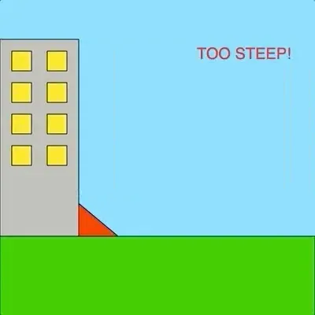
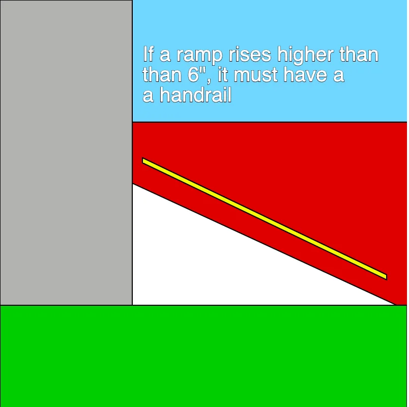
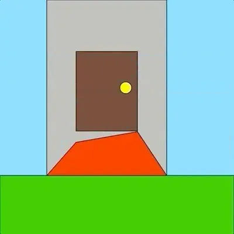

The 2020 Processing Foundation Fellowships sponsored six projects from around the world that expanded the p5.js and Processing softwares and nurtured their communities. In collaboration with NYU’s [Interactive Telecommunications Program](https://tisch.nyu.edu/itp), we also sponsored four Fellows to work on [ml5.js](https://ml5js.org/). Because of COVID-19, many of the Fellows had to reconfigure their projects, and this year’s cohort, both individually and as a whole, sought to address issues of accessibility and inclusion in their projects. Over the next couple months, we’ll be publishing our annual wrap-up articles on how the Fellowship projects went, some written by the Fellows in their own words, and some in conversation with Director of Advocacy Johanna Hedva. You can read about our past Fellows [here](https://medium.com/processing-foundation/https-medium-com-tag-pf-fellowships-la/home).

---

*[Kalila Shapiro](https://www.kalilashapiro.com/) is a researcher, creative technologist, and human-computer interaction designer. She is writing a series of pieces on the ethics of virtual reality for All Tech Is Human, is the Social Media Lead for MedVR, and is the deputy leader of the Application Accessibility group for XR Access. Her GitHub is [here](https://github.com/kalilashapiro). This gif shows *a visualization of section 405.2 of the ADA, dictating the maximum slope of an accessibility ramp. \[image description:* A gif. Set on a blue background is a gray building with yellow windows sitting on a field of grass. Against the building is a white ramp. The ramp slowly gets steeper. When it gets too high, it turns red and the screen says “TOO STEEP”. Then the ramp lowers back to its original position. Once it’s in its original position, it elongates and retracts. Once it retracts, it starts getting steeper again. This cycle repeats.\]*

**Johanna Hedva: Hi Kalila! Tell me about your Fellowship project. What were your intentions and goals, and what did you accomplish?**

**Kalila Shapiro**: The aim of my project was to create an online visualization library of the American’s With Disabilities Act (ADA) for high school and college students. The ADA is a very dense document that’s full of technical terms. It’s incredibly difficult to parse if you don’t have a legal or engineering background, or access to someone who does. I wanted to use visualizations to help demystify what rights the ADA ensures and protects. I was inspired by the visualizations I’ve seen created by mathematicians and scientists — breaking down complex concepts in a comprehensible way.

For my fellowship project, I used p5.js to make visualizations of the clauses in the ADA surrounding access ramp regulations, and built a website for them to live on. When I conducted user interviews, the regulations around ramps were the most highly requested to be turned into visualizations. Interviewees had questions like: “How steep can they be?” and “Are they allowed to have such sharp turns?” I also created a User Journey guide to keep track of my notes and map future ideas, as well as to help me plan for different types of people who might be using my site and what accommodations they would need.

**A visualization of section 405.8 of the ADA, dictating when handrails are needed. \[image description:* A static image. Set on a blue background is a gray building sitting on a field of grass. Next to the building is a red wall. Against the building is a white ramp and slightly above it is a thin yellow handrail. There is text on the screen reading “If a ramp rises higher that 6”, it must have a handrail”.\]*

**JH: Can you give us a sense of why your project was important for your intended community? What needs did your project address?**

**KS**: I have a disability and have had academic accommodations since I was kid. I know how hard it can be to get equal treatment and access in the classroom compared to peers without academic accommodations. According to the Bureau of Labor Statistics, disabled people are not represented proportionally in higher education and are significantly less likely to have a high school diploma or bachelor’s degree than non-disabled peers in the same age group.

In the interviews I conducted, there were two common misconceptions my interviewees heard from teachers and professors during their time in the classroom. The first is that their disability makes them less competent than their peers. The second is that accommodations provide an unfair advantage over their peers. Neither of these are true. Accommodations exist to level the playing field but in order to work, they need to be applied. If a teacher or professor (or even more powerful people in the academic ecosystem, such as a guidance counselor or dean) doesn’t “believe” in accommodations or doesn’t see their merit, the accommodations often go ignored, despite the fact that following them is a legal requirement. This often goes unchecked. It’s hard for students to fight back because, a lot of the time, they don’t know that their rights are being violated, or which right specifically is being violated. It’s hard to speak up when you don’t know if or how you’re being held down.

Going through education can be a constant battle in trying to get teachers and professors to follow my accommodations. All my interviewees had stories to tell about teachers not giving them their accommodations, and having no idea whether or not that was legal. I can’t fix the whole problem, but I can try to help close the gap. Providing knowledge in an easy to understand way is the first step.

**JH: What was the most difficult issue you encountered in the project? How did you work through it?**

**KS**: The pandemic definitely didn’t make things easy! I had plans of user-testing my visualizations to make sure I was addressing all web accessibility needs (screen-reader compatibility, color contrast, etc.), but that wasn’t possible. There was more guesswork involved than there would’ve been if the world wasn’t on lockdown right now, and that made the planning process a lot harder and a lot longer.

I did my best to check for these things on my own with tools like Apple’s VoiceOver screen-reader and [the A11Y Color blind empathy test](https://vinceumo.github.io/A11Y-Color-Blindness-Empathy-Test/). The font on the project website is called [“OpenDyslexic2”](https://opendyslexic.org/about), which is free to use and is specifically designed to help make web pages more readable for users with Dyslexia. Whether or not this is actually effective was not something I was able to test, but I did my best given the limitations. My mentors, [Claire Kearney-Volpe](http://www.takinglifeseriously.com/index.html) and [Luis Morales-Navarro](https://medium.com/processing-foundation/making-p5-js-accessible-e2ce366e05a0) (who have been involved in the p5.js Accessibility project since 2016), were also great at sharing accessibility tools and helping me check my work on different operating systems.

There were also parts of the ADA that I struggled to understand. Most of the rules involving ramps use mechanical and civil-engineering terminology, which is not something I’m readily familiar with. Luckily, I have some very patient friends who work in engineering who were able to break it down for me. This project involved a lot more math than I expected it to!

**JH: What’s the future hold for you? Will you be continuing this work? Has this project affected you in any notable way as you move forward?**

**KS**: This project has definitely reminded me how ironically inaccessible the ADA can be, and there’s definitely work that can and should be done in that regard. As much as I care about this project, though, I can’t continue working on it by myself — it’s a lot of work! The ADA is huge and has so many subsections. The visualization process also can’t be rushed. It’s important to break down each part and translate it into a clear and well thought-out visualization. There’s a lot of tough language and I don’t feel as though I have the legal or engineering background to be able to do it all justice.

While I don’t see myself continuing with the project, I do hope to hold a p5.js workshop for people with disabilities once COVID restrictions ease up and it’s safe again!

**A visualization of section 405.3 of the ADA, dictating cross-slope*. \[image description: A gif. Set on a blue background is a gray building sitting on a field of grass. The building has a brown door with a golden door knob. In front of the door is a ramp. The parts of the ramp that touch the door go up and down. The left side goes down and the ramp turns red when the cross slope becomes too uneven, then goes back up and turns white again. The right side goes down and the ramp turns red when the cross slope becomes too uneven, then goes back up and turns white again. The cycle repeats.\]*
