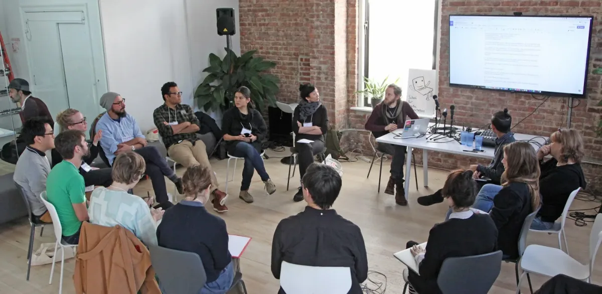
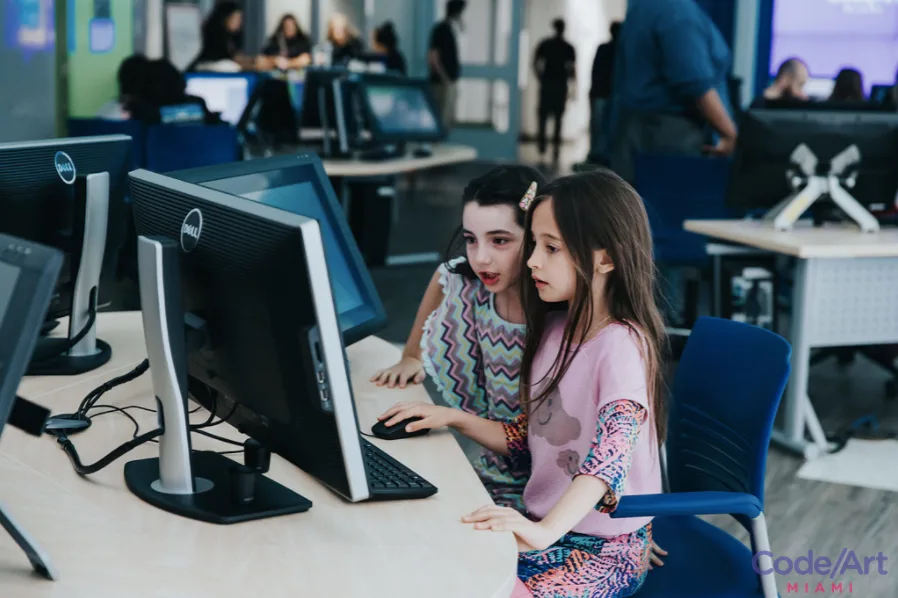
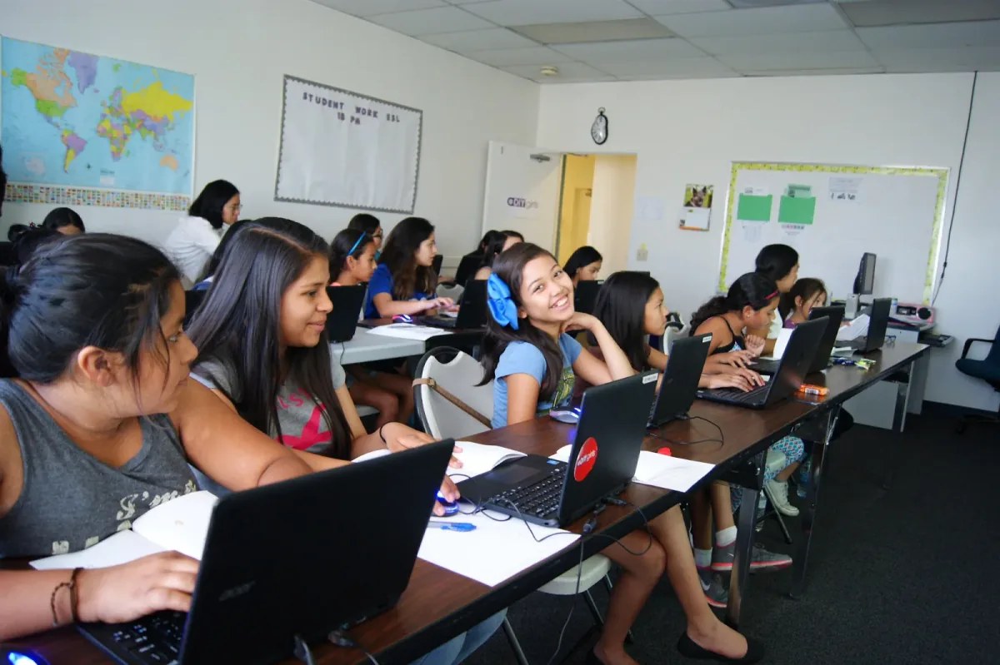
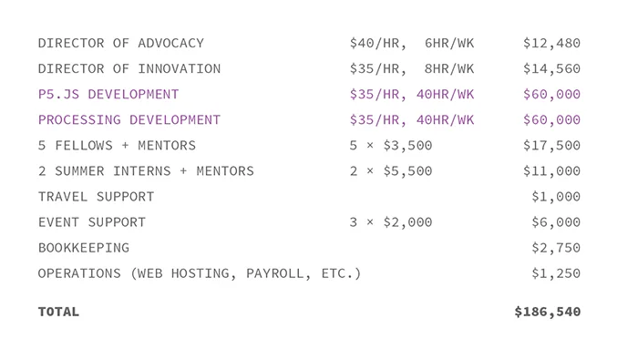
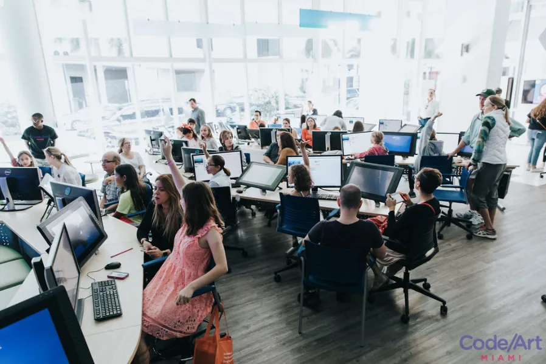
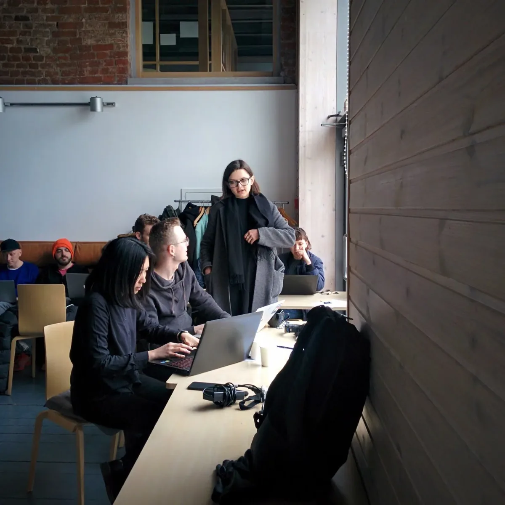
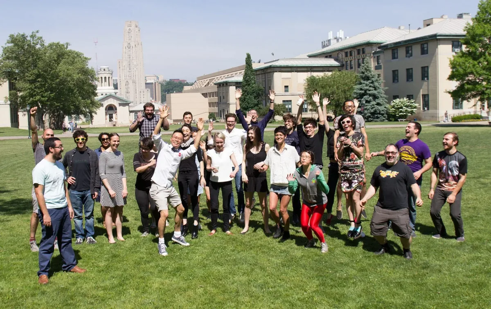

#### [Processing Foundation Membership](https://processingfoundation.org/support)

We work to make technology accessible and to empower people to write code for expressive, communicative, and pragmatic work. We know that the arts can affect technology in positive ways and we know that technology can create new opportunities for the arts. Our software and community prioritizes diversity and inclusivity. They are core values that influence every decision we make.

For the last fifteen years, we have led the development of FLOSS (free, libre, open-source software) platforms. We currently develop Processing, p5.js, Processing.py, and Android for Processing. We founded the Processing Foundation in 2012 to formalize our commitment to building accessible tools and to launch a range of new initiatives to increase our outreach and commitment to community and education.

We believe visual artists and designers should be in control of their own software tools. It’s not enough to rely on corporations to make what we need. The code and systems that we use shape our work and our lives. When companies make platforms that we use, but we have no voice in how they function and what they let us do, we have no freedom to modify and expand them. As makers, we feel it’s essential to have tools that we create ourselves; tools that are shaped by the needs of the communities of creators that use them.

*Learning to Teach, Teaching to Learn conference with SFPC (Image credit: Kira Simon-Kennedy)*

We want you to be a part of this. Our work is almost entirely supported by individual one-time donations from the community. Right now we are outspending what we earn, and we have bigger plans! We want to continue all the work we’re doing and make it more accessible, more inclusive, and more responsive to the community needs.

To create lasting support for these new directions we’re starting a [Membership Program](https://processingfoundation.org/support). A Membership is an annual donation that supports all this work and signifies your belief in it. You can do this as an individual, a studio, an educational institution, or a corporate partner. Your name will be listed on our [members page](https://processingfoundation.org/members) along with all the others that help make this mission possible.

### Diversity and Inclusion in Software

*Processing Foundation Fellow Cassie Tarakajian’s workshop at Code Art Miami (Image credit: Christian Arévalo Photography)*

We’re working to build a sustainable model of software development that enables the participation of those who don’t have the luxury of donating their time. The expectation of free labor in open source software often excludes members of underrepresented groups in technology. This creates a self-reinforcing lack of inclusion and perpetuates the cycle of low diversity in open source. Diversity and inclusivity are core values that influence every decision and guide our community, rather than afterthoughts patched on after the code has been written. We need to be able to hire developers, rather than rely exclusively on donated time.

In addition to enabling participation by paying for time, we have an advocacy program specifically targeted at furthering outreach and access in the arts and technology fields. This includes things like our Fellowship Program which has supported projects such as a [coding comic](http://codingcomic.com/) that teaches coding to historically underserved children of color, a [p5.js Code Editor](http://www.creativeapplications.net/processing/processing-foundation-fellows-2016-open-call-for-2017/#attachment_60447) for the blind and visually impaired, a paper-based curriculum for teaching programming to people in Washington State prisons, and an event series which has included [Open Tech Lab](https://processingfoundation.org/advocacy/open-tech-lab-2016) workshops with the Women’s Center for Creative Work, and a [Biased Data panel](https://processingfoundation.org/advocacy/biased-data-a-panel-discussion-on-intersectionality-and-internet-ethics) with the UCLA voidLab.

This is a project with a purpose. We work to make technology accessible and to empower people to write code that is expressive, communicative, and pragmatic. This viability of our approach is evidenced in the adoption of our software into core curriculum from K-12 programs to universities. Our latest initiatives involve working with the NYC Department of Education, the [Creative Coding Fest](http://ccfest.rocks/) for teachers, and the [Learning to Teach](https://processingfoundation.org/initiatives/learning-to-teach-teaching-to-learn-2016) conference series with the School for Poetic Computation.

*Processing Foundation Fellow DIY Girls run a creative coding program in Los Angeles (Image credit: DIY Girls)*

### Budget

Through the Membership Program, we’re creating a sustainable system that enables us to continue our work with the support of the community. To continue what we are doing, we need to meet our annual budget target. We want to do more in 2017. Our proposed budget for this year is similar to the last few years, but items in purple are additions that we hope to realize through the membership campaign. This change is a dedicated budget for Processing and p5.js developers to continuously maintain and enhance our platforms. We aspire to make participation more accessible to everyone, regardless of financial situation, by paying more people to work on the platforms.

In addition to our Membership Program and donations, we continue to apply for additional funding through grant applications. We were accepted this year into Rails Girls Summer of Code and Google Summer of Code 2017, as we have five prior years.

We also rely on institutions for support that that does not come through the Foundation’s budget. New York University’s ITP program has substantially supported fellowships for graduate students to work on Processing and p5.js. Carnegie Mellon University’s Frank-Ratchye STUDIO for Creative Inquiry funded a p5.js development conference. The University of Denver’s Emergent Digital Practices department supported a Processing 3 development event. We wouldn’t be where we are today without this support.

*Processing Foundation Fellow Cassie Tarakajian’s workshop at Code Art Miami (Image credit: Christian Arévalo Photography)*

*Processing workshop at the Strelka Institute in Moscow (Image credit: Casey Reas)*

### Support

We want to be a community that is truly open; we believe that creative expression and technical literacy should be accessible to everyone — regardless of who you are, where you are, what you do, and what you believe. If you use our software regularly for teaching, personal work, commercial projects, research, or anything else, we’re looking for your support. We hope that you can see our mission extends beyond building software platforms. Through collaboration, we want to change our culture. We want to break artificial boundaries between the arts and technology, between those with access and those without.

### [Join us in this effort!](https://processingfoundation.org/support)

Lauren, Dan, Ben, Casey, Johanna, Rhazes, and Jesse  
The Processing Foundation

*p5.js Contributors Conference at CMU STUDIO for Creative Inquiry in Pittsburgh (Image credit: Taeyoon Choi)*
