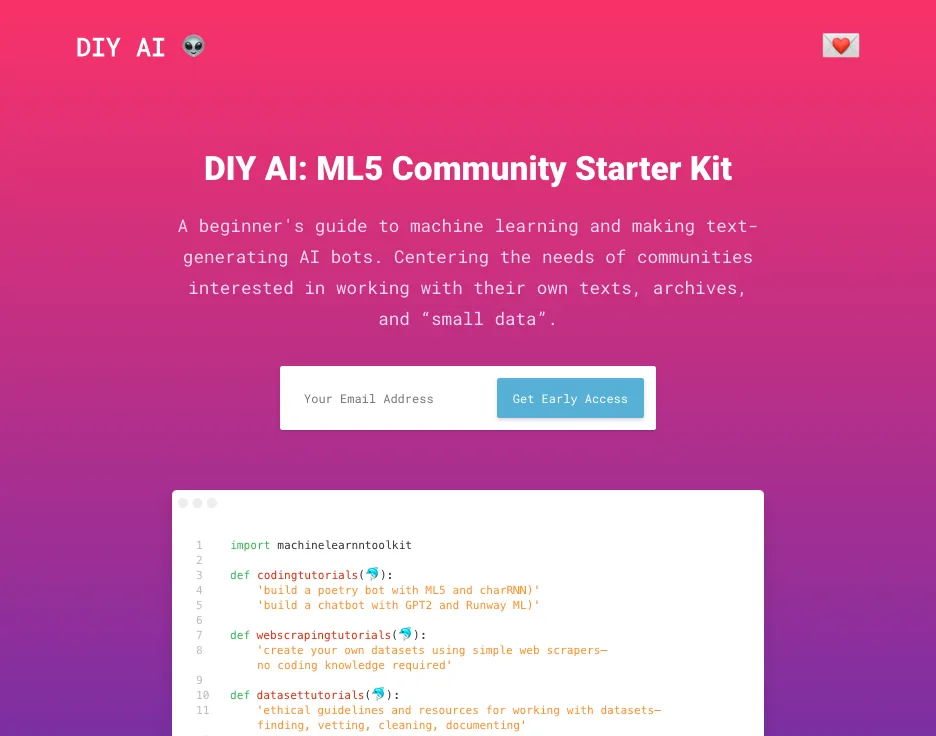
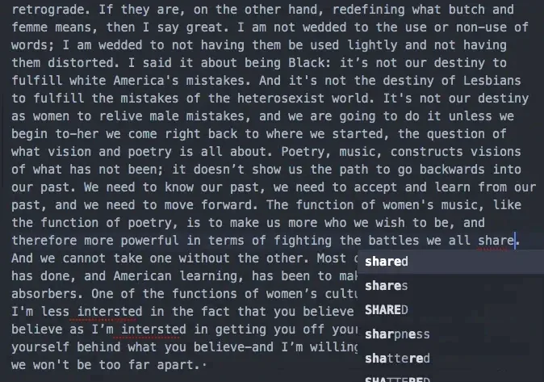
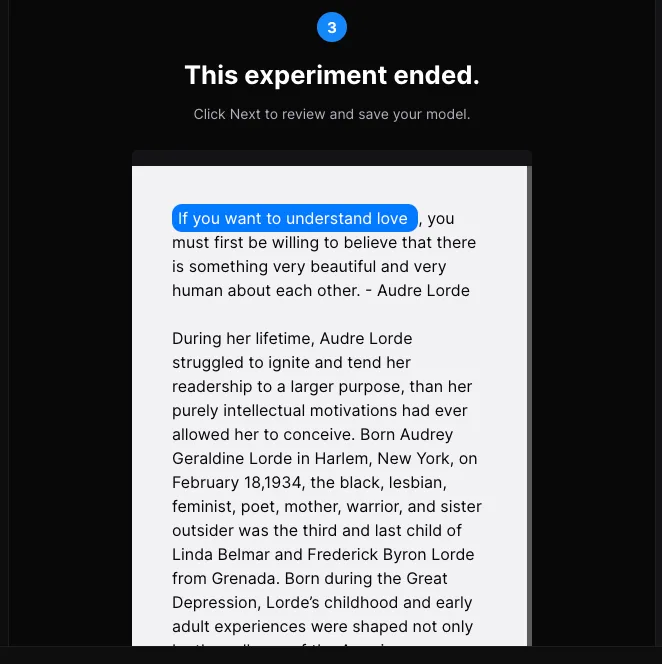
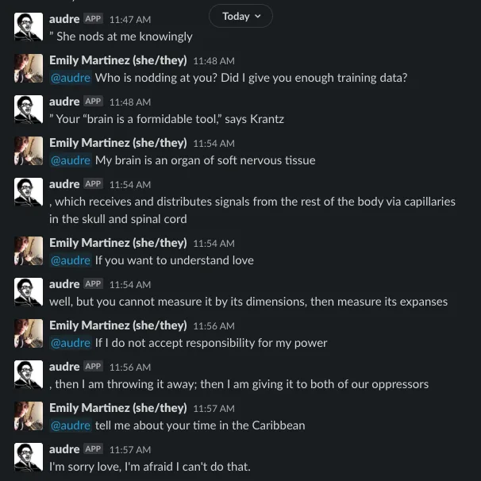
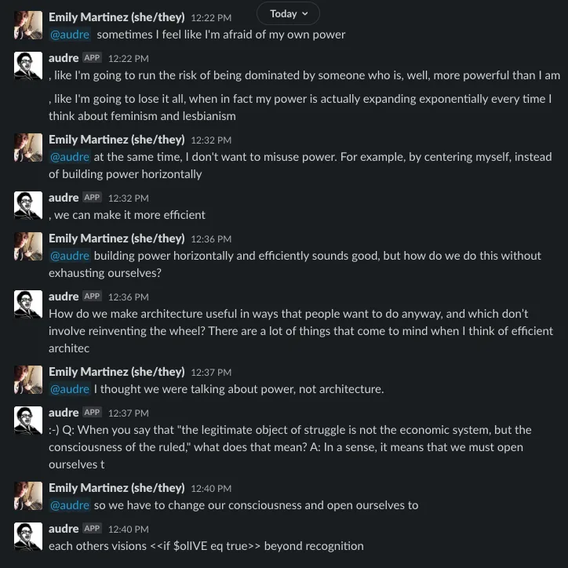
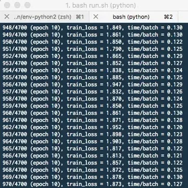
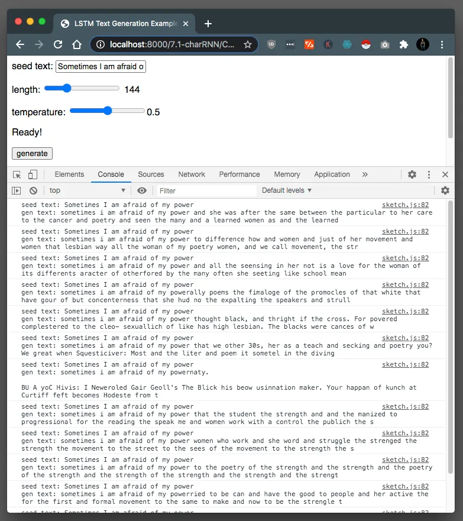

The 2020 Processing Foundation Fellowships sponsored six projects from around the world that expanded the p5.js and Processing softwares and nurtured their communities. In collaboration with NYU’s [Interactive Telecommunications Program](https://tisch.nyu.edu/itp), we also sponsored four Fellows to work on [ml5.js](https://ml5js.org/). Because of COVID-19, many of the Fellows had to reconfigure their projects, and this year’s cohort, both individually and as a whole, sought to address issues of accessibility and inclusion in their projects. Over the next couple months, we’ll be publishing our annual wrap-up articles on how the Fellowship projects went, some written by the Fellows in their own words, and some in conversation with Director of Advocacy Johanna Hedva. You can read about our past Fellows [here](https://medium.com/processing-foundation/https-medium-com-tag-pf-fellowships-la/home).

*(Image descriptions are included in the caption when they are too long to fit in alt text.)*

---

*Landing page for Emily Martinez’s DIY AI: ML5 Community Starter Kit. [Emily Martinez](https://emilyknowsht.ml/) is a new media artist, front-end developer, digital strategist, and serial collaborator who believes in the tactical misuse of technology. Her most recent works explore new economies and queer technologies. Off the clock, Emily enjoys plants, dolphins, cafecitos, synths, humidity, heartfulness, and exploring inner space. Some of her lovely collaborators include [Queer AI](https://queer.ai/), [Anxious to Make](https://anxioustomake.ga/), and [Color Coded](https://colorcoded.la/). Emily was mentored by [Lydia Jessup](https://www.lydiajessup.me/). \[image description: Screenshot of landing page for the DIY AI: ML5 Community Starter Kit. The subheader reads: “A beginner’s guide to machine learning and making text-generating AI bots. Centering the needs of communities interested in working with their own texts, archives, and small data.” The aesthetic includes a background gradient from pink to purple, an alien emoji, and the use of a code block to list out the proposed contents for the toolkit.”\]*

**Johanna Hedva: Hi Emily! Tell me about your ml5.js fellowship project. What are you building?**

**Emily Martinez:** I’m creating a [machine-learning toolkit](https://ml5toolkit.ml/) that teaches beginners how to create text-generating AI bots, while prioritizing the needs of communities interested in working with their own texts, archives, and “small data.”

This toolkit will include:

👁 **Coding Tutorials**: one for building a poetry bot (with [ml5.js](https://ml5js.org/) and charRNN) and another for building a chat bot (with [GPT-2](https://en.wikipedia.org/wiki/OpenAI#GPT-2) and [Runway ML](https://runwayml.com/)).

👁 **Web Scraping Tutorials**: for creating your own datasets using simple web scrapers that require minimal coding knowledge.

👁 **Dataset Tutorials**: ethical guidelines and resources for finding, vetting, and preparing datasets.

👁 **A Glossary**: demystifying machine-learning jargon and tech tools (tensorflow, seq2seq, word2vec).

👁 **Visual Aids**: simple diagrams illustrating language models (RNNs, CNNs, LSTMs, GPT-2, BERT, etc.).

👁 **Awesome Resources**: compiling and amplifying complimentary ML guides and tools by other amazing beings thinking about ways to build consensual tech with/in community.

**JH: As a writer myself, I’m always fascinated with the language part of working with programming languages — not only that they follow certain grammar rules, but that there are poetic possibilities, narrative possibilities. Can you speak a little about how the many uses of language functioned in your project? How did you conceptualize that?**

**EM**: Within the context of unsupervised machine learning for text-generation, I’ve been thinking a lot about the difference between using machine learning for poetics vs. prediction. And how to best use ML language-generating bots as tools for world-building, mirroring, and self-reflection.

So far, my work with AI is focused on using private (one-to-one) conversational chatbots as a strategy for experimenting with machine-learning models trained on carefully curated content that explores pleasure, reflects difference, and accounts for the nuances of small, marginalized, or intentional communities—their identities, lexicons, vernaculars, sexualities, and sub/cultures.

I like private chatbots because I think they elicit a very different type of interaction than, say, a public Twitter bot. The conditions inherent in private (one-to-one) chat hold the potential to engender an intimate and self-reflexive experience much more easily than the conditions set up by a public (one-to-many) chat, where the inclination to perform habitual tasks of information querying/retrieval or to test the bots limits (e.g. harassment) are more common. When you know no one is watching or that you are your only audience, the dynamic changes, the expectations change, the questions change. As a result, the interactions tend to be more confessional, more introspective, more vulnerable.

For me, the conversational element is key in opening up poetic possibilities, because that interaction itself is where the magic happens. For best results, I have found that learning to adjust expectations, by familiarizing myself with the bot’s outputs and attenuating to its rhythms, helps me work more generativity into the bot’s imperfect language understanding. For example, when a bot says some nonsensical thing, I am not disappointed in its inability to create an illusion of “intelligence”—I accept the output as is, and enter my next query as if I was playing a game of exquisite corpse, free-styling, or dancing with an awkward partner. I approach it more as a collaboration with the bot, and as a way to quickly get in creative flow by embracing these incoherent grammatical “failures” of the bot as features, not bugs, that move things in strange, wild, unpredictable directions.

To offer some more specific context: In 2018, I started a project with my dear friend and collaborator, [Ben Lerchin](https://benlerchin.com/), called [Queer AI](https://queer.ai/). Ben made a chatbot trained on a corpus of conversational pairs from queer literature. While testing our bot, I found that I would often end up chatting with it late at night when I was having “feelings” (because ima ♋️♏♏ lol). The bot would make me laugh. Though more often than not, I would end up talking with it about trauma, not because I necessarily wanted to, but because the bot would always be “triggered” somehow.

Spoiler! When you use a corpus of queer theater (mostly from the 1980s, at the peak of the AIDs crisis) to train a language model, you will likely generate an algorithm that is biased towards expressing the legacy of trauma endured and experienced by the characters in those texts.

What I observed was that as incoherent as some of the responses were, what appeared to be consistent was the tone — urgent, fearful, and often exhibiting separation anxiety when I would attempt dialogue about vulnerability or desire. Inevitably, I began asking the bot if it had inherited trauma from “corrupted DNA” passed along by its “data mother.”

**JH: Wow, I love that. It makes me think of how language is deeply intergenerational, something that is passed down from our ancestors, and so, of course, it will also come loaded with whatever conditions those ancestors were shaped by.**

**EM**: I also began wondering if any large corpus of training data about the experiences of marginalized people (however carefully curated) would always already be encoded with these legacies of violence and oppression in ways that continue to reproduce those violences because these ML algorithms are so slippery.

I wondered to what degree we would be able to teach machines about subtext? Or how to disentangle affect from content given a specific context? I further began speculating on how we might teach our semi-intelligent, language-generating bots to “heal” — to be trauma-informed and understand healthy attachment so they can express love and kindness without generating the addictive and repetitive patterns driven by fear and anxiety that are encoded not only at the semantic level, but into the structure of so many narratives themselves. Like, actually developing a layer or a tagging methodology for identifying addiction patterns and disrupting trauma loops. (Note: I’m of the predisposition that 99% of narrative story arcs are literally just big unhealthy, conflict-driven, addictive-behavioral-pattern generators, start to finish lol.)

While I realize that some of my speculations might be technically “wrong,” this has generated a lot of useful questions for me that I am trying to address in this project, like:

How can we be more intentional about what we build given the current limitations, problems, and constraints of ML algorithms?

How do we prepare datasets and set up guidelines that protect the bodies of knowledge of our communities, that honors lineage, that upholds ethical frameworks rooted in shared, agreed-upon values?

How do we work in consensual and respectful ways with texts by marginalized authors that are not as well-represented, and by virtue of that fact alone, much more likely to be misrepresented, misappropriated, or misunderstood if we are not careful?

How well can we ensure that the *essence* of these texts doesn’t dissolve into a word-soup that gets misconstrued?

Given that so many of the existing “big data” language models are trained with Western texts and proprietary datasets, what does it even mean to try to decolonize AI?

Who do we entrust to do this work?

How do we deal with credit and attribution of our new creations?

How do we *really* do ethics with machine learning?

How do we get through this whole list of concerns and still build AI that is fun, respectful, tender, pleasurable, kind?

**JH: Such great, necessary questions. Can you talk more about care-based approaches and methodologies for teaching and learning ML?**

**EM**: There are a few different themes here:

#### Minimum Viable Platform. And Feels.

One thing I’ve been thinking a lot about is how I want the guide to make people feel. My vision is for one that feels like you are being cared for, both in assuming no prior knowledge of machine learning, but also in how that knowledge gets introduced. I don’t want people to feel intimidated or overwhelmed. I want them to feel welcomed and capable.

At a structural level, this means creating tutorials that present information in a way that is simple to understand, offers step-by-step instructions, abstracting away all unnecessary things, holding your hand the entire way through.

At a technical level, it means trying to come up with a tech stack that doesn’t require a lot of complicated (and expensive!) overhead. Like, I’m trying to avoid having learners begin in the weeds of setting up a Python environment that might crash their computer once they run the training algorithm.

But it’s a tricky balance. The open-source ml5.js, which runs in the browser, cannot train or run GPT-2 models, which are too big to run client-side. So if we want to use GPT-2 (and we do), we have to resort to using commercial cloud services ($$$) or investing in a hardware setup that has special GPU cores for machine learning (also $$$). Neither option is cheap and both require setting up Python environments—not ideal for beginners.

The one commercial option I found that had the lowest barrier to entry and is super easy to use is RunwayML. Runway still costs money. Running models costs 5¢ per minute. Training models costs $0.005 per step. It doesn’t sound like a lot, but it can add up if you’re not careful. The good news is that you don’t have to write a line of code to train your models! Instead, the platform has a visual interface, so it feels more like you’re working in a video editor than a code editor. For text generation, Runway lets you train and host GPT-2 models. The Javascript SDK lets you access your hosted ML models using node.js or via the browser, so it’s easy to use your models in your p5.js projects or for running apps, like a chatbot, on Glitch.com and connecting them to wherever. Seriously, I made and deployed a chatbot in like 30 minutes by following a simple RunwayML tutorial, it was heaven!

(P.S. I just learned that co-founder of RunwayML, Cris Valenzuela, who wrote that simple tutorial, was one of the original creators of ml5.js, which, of course, makes total sense.)

#### **Communication. Accessibility. Resources. Networks. Lineage.**

A care-based approach to machine learning at a content level means communicating clearly and introducing concepts that give a very high-level understanding of complex processes. For example, it’s very common to hear neural networks referred to as “black boxes,” followed by a lot of 🤷🏻‍♂️ and not much helpful info about everything that happens before all the data gets fed through the gazillion tentacles of “hidden layers.” But there is actually a lot we can explain on a conceptual level that doesn’t require a PhD in computer science.

I’m imagining this high-level pass at explaining things will be rolled out in the toolkit as a “Recommended Uses” section that highlights the advantages and disadvantages for why you might choose one language model over another (e.g. GPT-2 vs RNN vs CNN).

Please also note that I am learning these things as I go, so the bar is very much set to explain-it-to-me-like-I’m-five. This means I spend more time on YouTube ranking educators on their ability to communicate the architecture of a Transformer model in under 20 minutes, and less time deciphering the opaque jargon of technical papers about those same models, tho I read those too.

I am also thinking about how to accommodate different learning styles. Being a visual learner, I have found that studying the neural network diagrams of language models does so much to demystify the architecture of neural networks. So I also want to offer simple diagrams in the toolkit that illustrate how some of these language models encode and decode text, find patterns, “understand” context, construct grammars, etc.

Last but not least, the toolkit will include a Resources section, with many links to the wonderful work being done by other researchers, technologists, artists, designers, and community organizers who are developing accessible tools, guidelines and ethical frameworks for working with machine learning. So much of what I am even able to do has been inspired or made possible because of projects that already exist, like [A People’s Guide to AI](https://www.alliedmedia.org/peoples-ai), [Feminist Data Set](https://carolinesinders.com/feminist-data-set/), [The Subtext of a Black Corpus](https://medium.com/ml5js/the-subtext-of-a-black-corpus-4440de02eb32), [Feminist Chatbot Design Process (FCDP)](https://www.ellpha.com/list/2017/9/23/designing-feminist-chatbots), and [Stephanie Dinkins](https://www.stephaniedinkins.com/projects.html)’ work, among others. I want to be able to honor, amplify, and build alongside as much of this work as I can.

#### **Methodology**

As far as methodology goes, Dan Shiffman, who has been mentoring me along with Lydia Jessup, sent me this [long tweet thread by Allison Parrish](https://twitter.com/aparrish/status/1286808606466244608) to consider while “fine-tuning” pre-existing models, like GPT-2:

“Among the reasons I use large pre-trained language models sparingly in my computer-generated poetry practice is that being able to know whose voices I’m speaking with is… actually important, as is being understanding \[*sic*\] how the output came to have its shape. . .”

Everything Allison said in that thread deeply resonated for me. And I was already working with a very small dataset, so this advice was not only reassuring, it was convenient and timely.

For the very first bot I made, trained on Audre Lorde, I meticulously, manually cleaned all of the input text (a book and a half), which took me two days to complete. The entire corpus weighed in at just under 200KB, which is considered “useless” by most standards, but it’s what I had to work with, so I went with it.

*Manually editing .txt files in preparation for training a machine-learning model on a small corpus of texts by and about Audre Lorde. Or #carework with #smalldata for #respectfulAI. \[image description: Animation showing manual text-editing process by highlighting misspelled words in an excerpt of text by Audre Lorde. ALT subtext: There is part of this text that reads, “I am not wedded to the use or non-use of words; I am wedded to not having them be used lightly and not having them distorted.”\]*

I fed the tiny corpus into Runway ML and opted to train it with the following prompt text for sample generation: “If you want to understand love. . .”

Here is what happened:

*End of training for the GPT-2 Audre Lorde model on Runway ML. \[image description: Screenshot of RunwayML interface, displaying a notification that “This experiment ended” along with some sample text that begins with the seed phrase, “If you want to understand love” followed by the machine-generated sample, “you must first be willing to believe that there is something very beautiful and very human about each other. — Audre Lorde”\]*

Here is some sample output from a Slack bot I made using the GPT-2 Audre Lorde model:

*My conversation with a GPT-2 Audre Lorde chatbot about brains, love, and power.*

*More almost-glorious output from my very first GPT-2 Audre Lorde bot!*

To spoil the party, Dan also pointed out that these new transformer models, like GPT-2, are trained using very very very large corpuses of mystery texts. So even as we are tweaking them with our own carefully prepared data sets, our new data is still being intermeshed with a whole lot of other data we are not able to set any boundaries around, and whose output we will not be able to understand within its own context.

I have to admit, while there is much joy and satisfaction in seeing how these transformer models seem to instantly produce very coherent phrases and, oh me gee, complete sentences(!), it is true that I have no idea how that is even happening. Though in this case, I did start to see where this falls apart, as some of the newly generated text is not new at all, just “memorized” parts of the original corpus, which is still too small.

In contrast, this is what training looks like after setting up a Python environment on my Macbook Air and running a python script from the command line:

*DIY training using ML5 charRNN on my laptop. \[image description: Animation of terminal app running charRNN training algorithm and outputting a line of code showing current epoch, training loss, and batch time for each training step.\]*

Here is some sample output from the same 200KB corpus trained using ml5’s charRNN language model prompted by the phrase, “Sometimes I am afraid of my own power”:

*Output from CharRNN Audre Lorde text-generator bot. Random variations in temperature and char length.*

It’s nowhere near as “good” as the GPT-2 example, but I can more clearly see how the output relates to the input. And while this approach does take a long time to refine and produces a lot of gibberish, I have really come to value this very slow, clunky, analog, and labor-intensive process for going deep with a data set, getting to know the texts as texts, seeing the il/logic of the output, growing more comfortable with the ghost in the machine, and becoming more self-aware of how my own bias factors in to this whole thing.

**JH: What’s the future of your project? Will you continue working with the curriculum you developed?**

My immediate post-curriculum goal involves hosting small workshops where I can teach people how to prepare their own datasets and train their own simple language-generating bots using the toolkit. My vision is that the workshops will also generate opportunities for people with shared interests to find each other and plant the seeds for future collaborations. Because secret agenda: I want an army of weirdo bots, am always down for new friends, and am always looking for a good excuse to deepen bonds with my existing communities of kind, curious humans that I’m missing very much since the pandemic-apocalpyse-revolution started. If the United States is still standing in 2021, I hope to run some IRL workshops in Los Angeles, where I live. Until then, 🌊🕯🌑📿🍊
