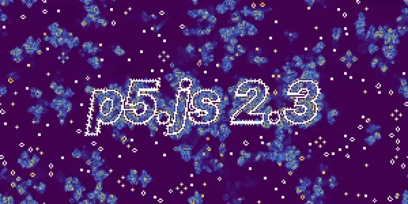

<!--  -->

This includes refactors to p5.Vector based on the recently-added Decorators API, as well as new features for p5.strands, our beginner-friendly approach to shader programming. We’ve also continued development on the experimental [WebGPU renderer](https://medium.com/@ProcessingOrg/p5-js-2-1-and-2-2-expanding-graphics-avenues-with-p5-strands-improvements-and-webgpu-9771d40c8b1d).

This release includes work from dozens of current contributors, stewards, and testers — including new contributors to p5.strands. Welcome, and thanks for all your amazing diligence and creativity!

### Vectors

If you use physics simulations, creating a vector now requires specifying whether it lives in 2D or 3D. Instead of `createVector()`, use `createVector(0,0)` for 2D or `createVector(0,0,0)` for 3D.

Previously, in p5.js all vectors were 3D vectors. Now v2 supports vectors of any dimension so blank vectors need to state their size explicitly.

### Updates on shader support

Shaders are programs that run on your graphics card to create visual effects. p5.js 2.0 introduced p5.strands, the shader programming API, making it easier to program visuals using the GPU.

Release 2.3 refactors and simplifies the p5.strands code making it easier to maintain and contribute to — thanks to [@davepagurek](https://github.com/davepagurek) and [@LalitNarayanYadav](https://github.com/LalitNarayanYadav).

Thanks to [@davepagurek](https://github.com/davepagurek) and [@aashu2006](https://github.com/aashu2006), the experimental WebGPU renderer how also supports **compute shaders** — programs that use the GPU for general-purpose calculations. This [Game of Life sketch](https://editor.p5js.org/ksen0/sketches/yqIwIPxnz) runs simulations in the GPU using this feature.

This minor release includes new p5.strands API additions from the growing p5.strands contributor community:

-   Filter shaders now supported in 2D sketches — thanks to [@LalitNarayanYadav](https://github.com/LalitNarayanYadav)
-   You can now use familiar p5.js functions like random(), map(), lerp(), and instanceID() directly inside shader code — thanks to [@perminder-17](https://github.com/perminder-17), [@Nixxx19](https://github.com/Nixxx19), and [@aashu2006](https://github.com/aashu2006)
-   Shader materials can be written easier using only finalColor hook — thanks to [@YuktiNandwana](https://github.com/YuktiNandwana)
-   More helpful error messages — thanks to [@kushal1061](https://github.com/kushal1061)
-   Corrected TypeScript typing, thanks to [@Kathrina-dev](https://github.com/Kathrina-dev)

### Improvements in Workflow

We’re working on two improvements that make p5.js faster and easier to contribute.

-   **Easier testing for contributors** — When someone submits a code contribution, a bot now automatically generates a testable version of p5.js with those changes included. This makes it faster and easier for the community to review and test new features before we release them.
-   **A customizable build —** Right now, when you use p5.js, you load the entire library. We’re building a tool that lets you create a custom version of the library with only the features your project needs. A smaller library means faster load times and more efficient sketches.

While this tool is still in testing, you can [join the discussion](https://github.com/processing/p5.js/issues/8003).

### Bug fixes and stability

Several crashes and freezes have been fixed, including one that freezes the browser when working with complex shapes, and another that occurs when loading 3D models with mixed materials.

### Documentation improvements

This release also includes documentation fixes including typo corrections, clearer explanations of vectors, new examples for noise and random functions, and better guidance for accessibility in p5.js projects.

### Acknowledging Contributors and Stewards of p5.js

p5.js is built and maintained by a global community of contributors and stewards. Over its 10+ year lifespan, more than 800 people have contributed to p5.js, tracked using the [all-contributors specification](https://github.com/all-contributors/allcontributors.org).

Thank you to the contributors who make p5.js possible! The contributors who worked on the 2.3.0 release include:

[@davepagurek](https://github.com/davepagurek), [@LalitNarayanYadav](https://github.com/LalitNarayanYadav), [@aashu2006](https://github.com/aashu2006), [@perminder-17](https://github.com/perminder-17), [@Nixxx19](https://github.com/Nixxx19), [@limzykenneth](https://github.com/limzykenneth), [@ksen0](https://github.com/ksen0), [@VANSH3104](https://github.com/VANSH3104), [@dhowe](https://github.com/dhowe), [@nbogie](https://github.com/nbogie), [@Xavrir](https://github.com/Xavrir), [@menacingly-coded](https://github.com/menacingly-coded), [@harshiltewari2004](https://github.com/harshiltewari2004), [@reshma045](https://github.com/reshma045), [@Anshumancanrock](https://github.com/Anshumancanrock), and [@mitre88](https://github.com/mitre88).

A special welcome to those making their first contribution to p5.js:

[@Xavrir](https://github.com/Xavrir), [@YuktiNandwana](https://github.com/YuktiNandwana), [@Kathrina-dev](https://github.com/Kathrina-dev), [@mitre88](https://github.com/mitre88), [@kushal1061](https://github.com/kushal1061), and [@SOUMITRO-SAHA.](https://github.com/SOUMITRO-SAHA)

### Support Us

Our software gets to stay **free and open-source** thanks to generous donors like you. If p5.js has brightened your day in any way, [will you consider making a monthly contribution](https://p5js.org/donate/)?

**100% of your donations go towards** [p5.js software development](https://processingfoundation.org/dev/)**, and recurring donations help us plan.** Thanks to the donations we’ve received in 2025, we were able to work with p5.js contributors to support the software you use.
