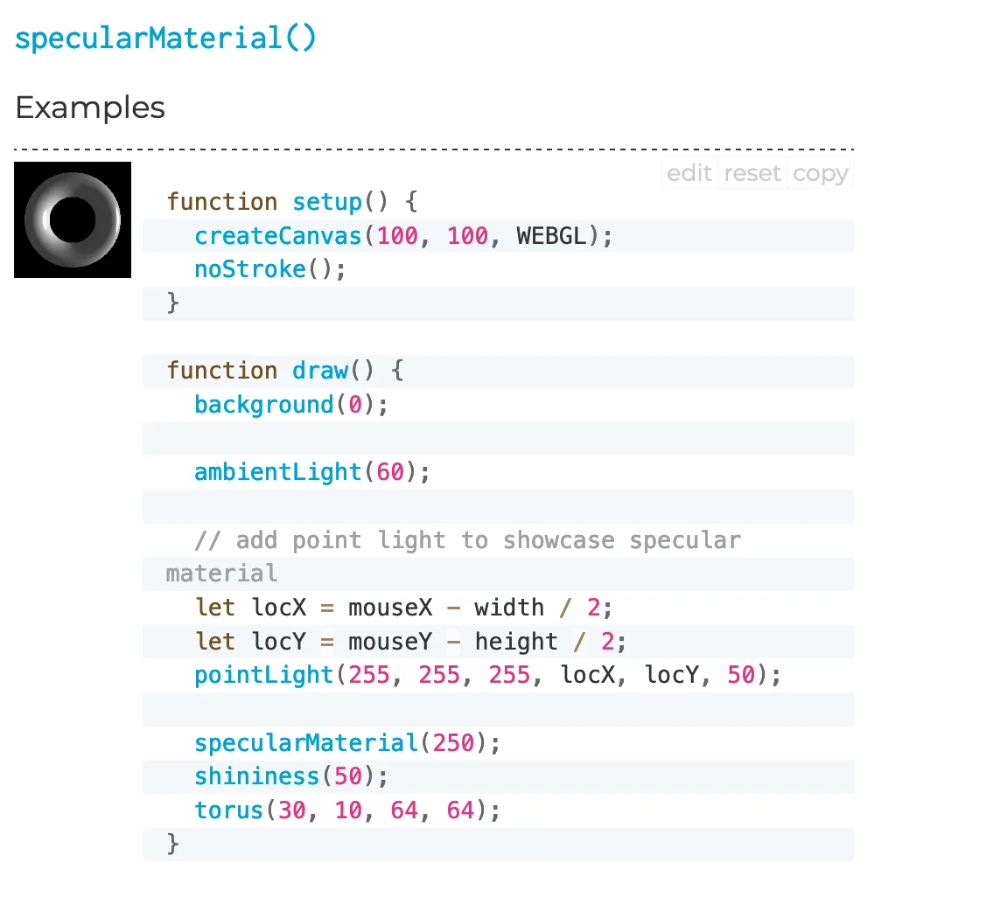
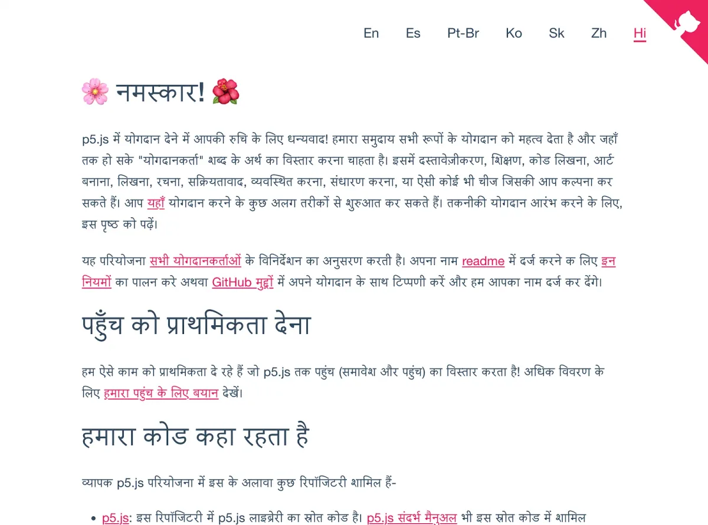
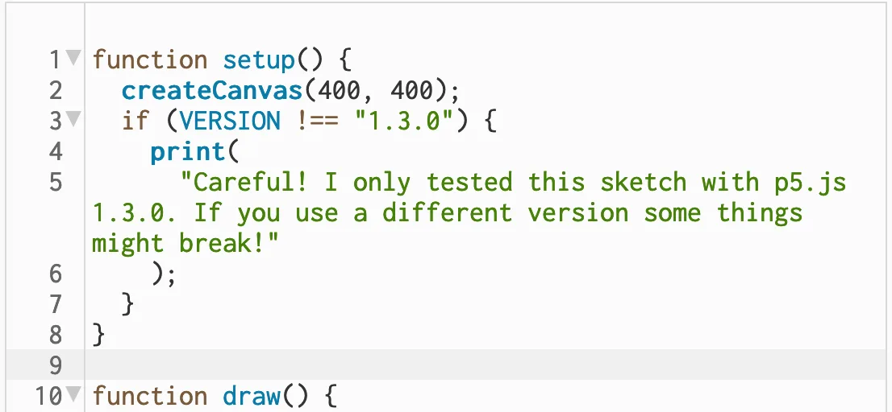
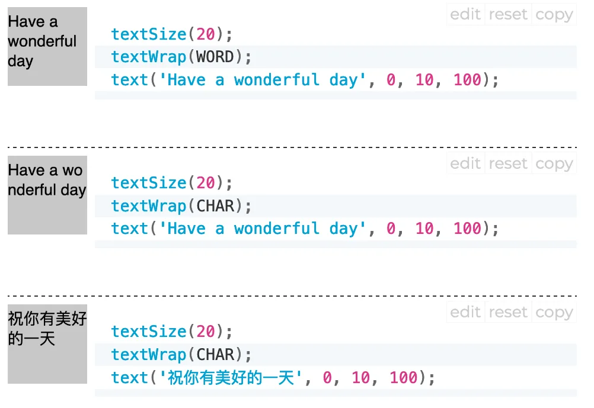
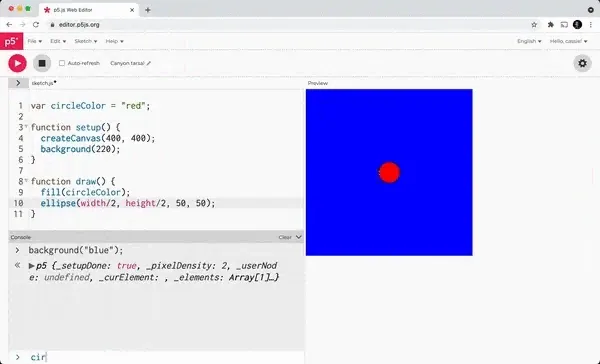
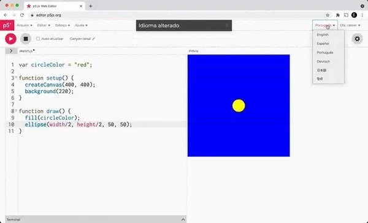
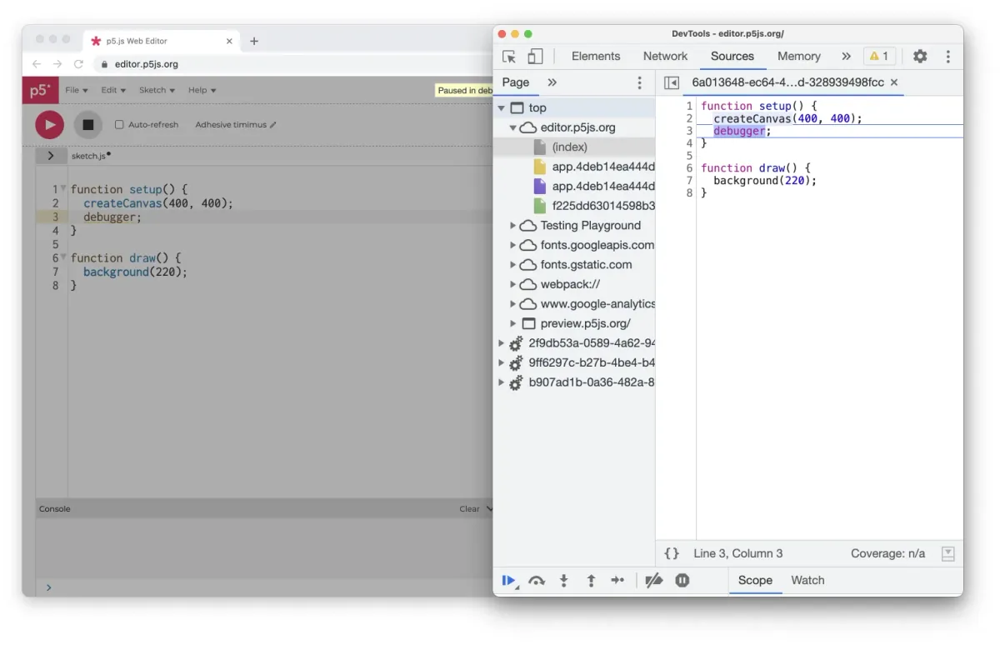
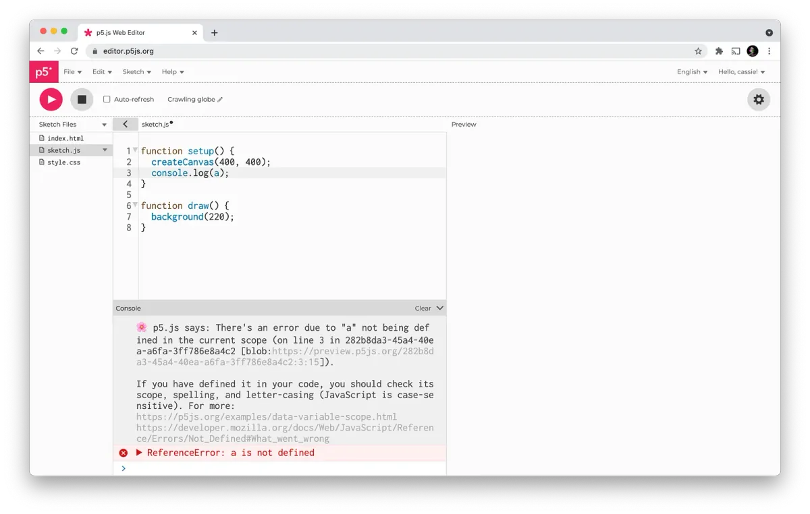
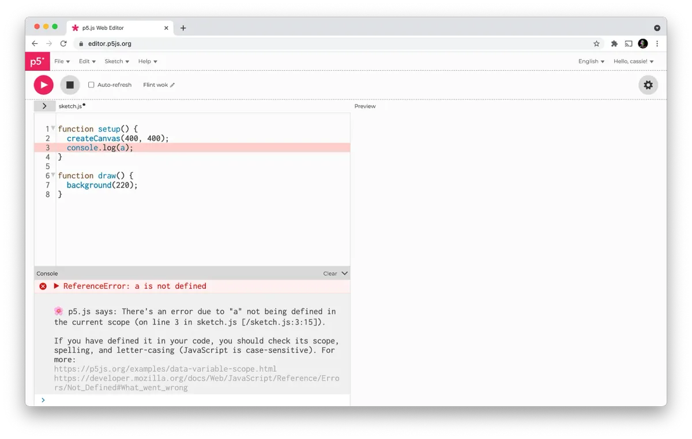
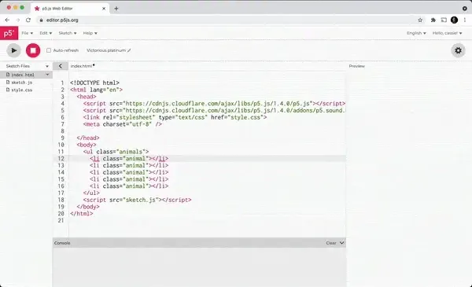

We also just created a [Discord server](https://discord.gg/SHQ8dH25r9) as a new
place to gather. With the 1.4.0 release of p5.js and the 2.0.2 release of the
p5.js Editor, there are many new features and bug fixes we wanted to show off.
Let’s dive into what’s new!

### p5.js v1.4.0

For most of the past year p5.js has been in maintenance mode, but things are
picking up again. In our last few releases, we’ve made some important bug fixes
to our text and GIF functionalities, while continuing our focus on
internationalization with more translations of our contributor docs.

### Documentation Updates

#### Updated documentation for 3D graphics functions

We have updated reference descriptions and code samples for many of our WebGL
commands, including
[createCamera()](https://p5js.org/reference/#/p5/createCamera),
[frustum()](https://p5js.org/reference/#/p5/frustum), and
[specularMaterial()](https://p5js.org/reference/#/p5/specularMaterial). Our 3D
geometry functions are also now in a clearer category in our reference, making
them easier to find. Thank you [@JetStarBlues](https://github.com/jetstarblues)
for your work on this and Stalgia Grigg
([@stalgiag](https://github.com/stalgiag)) for helping review these changes.
Check it out in the p5.js [reference](https://p5js.org/reference/#group-Shape)!

**Reference page for p5.js’s specularMaterial() function. \[image description: A
screenshot of the code and small rendering of an example p5.js sketch that
demonstrates the usage of the specularMaterial() function. The screenshot is
mainly the code, and in the upper left corner the sketch renders to a small
shaded torus, and the lighting changes as a user moves their mouse over the
sketch.\]**

The Hindi version of our contributor docs has expanded greatly, making it easier
for Hindi-speaking contributors to learn how they can get involved in p5.js, as
well as get a sense of what we value. You can see all of our contributor docs in
Hindi on the p5.js
[Contributor Docs site](https://p5js.org/contributor-docs/#/hi/). Thank you
Rahul Mohata ([@Rahulm2310](https://github.com/Rahulm2310)), Kunal Kumar Verma
([@KKVANONYMOUS](https://github.com/KKVANONYMOUS)), and Rajiv Singh
([@iamrajiv](https://github.com/iamrajiv)) for all your work on this
documentation!

**Landing page for the Hindi p5.js contributor docs site. \[image description: A
screenshot of the homepage of the p5.js contributor docs website. The text is in
Hindi, rendered black on a white background. In the upper-right-hand corner are
links to the other translations of the contributor docs site: English, Spanish,
Brazilian Portuguese, Korean, Slovak, Simplified Chinese.\]**

### Code Changes

#### Fixed GIF flickering bug

In version 1.4.0, we fixed an issue where animated GIFs would flicker when
played in p5.js. You can read more about how new GIF frame disposal logic fixed
this bug in the [pull request](https://github.com/processing/p5.js/pull/5178);
it’s an interesting look into the inner workings of animated GIFs. Thank you
Dave Pagurek ([@davepagurek](https://github.com/davepagurek)) for fixing this
bug!

#### Get version of p5.js library running within a sketch

When you share a p5.js sketch with a friend, you don’t always know if the
version of p5.js they run it with will have the features you used. In version
1.4.0, we [added the](https://github.com/processing/p5.js/pull/5107)
functionality to write code in a p5 sketch that checks what version of p5 is
running. This is a
[long-requested feature](https://github.com/processing/p5.js/issues/2525), and
it’s useful for a few different scenarios. For example, if you’re sharing
example code, which you know only works with one version of p5.js, you could add
logic that shows a message if the example is run with a different version of
p5.js than what you tested.

_See an [example sketch](https://editor.p5js.org/outofambit/sketches/OJGL8kb3m)
with this code in the p5.js editor. \[image description: A screenshot of example
code using VERSION variable to check which version of p5.js is running: if
(VERSION !== “1.3.0”) {print(“Careful!! I only tested this sketch with p5.js
1.3.0. If you use a different version some things might break!”);}\]_

You could also write different logic for different versions of p5.js and use if
statements, like the one above, to use only the logic for the currently running
version of p5.js. Thank you Naoto HIÉDA ([@micuat](https://github.com/micuat))
for working on this, and thanks to Akshay Padte
([@akshay-99](https://github.com/akshay-99)), Greg E
([@grege2](https://github.com/grege2)), and many others who helped shape this
functionality.

#### Text wrap by character

In version 1.4.0 of p5.js, we
[added a textWrap() command](https://github.com/processing/p5.js/pull/5146),
which sets how text displayed with text() wraps. In earlier versions of p5.js,
text drawn with text() that overflowed the width of its text box would wrap by
word. You can now specify wrapping by word or by character with textWrap(). This
enables a greater variety of text layout, but it’s also critical for properly
displaying text written in character-based languages (such as Chinese). There’s
a ton of great documentation for this too, which you can check out in
[our reference](https://p5js.org/reference/#/p5/textWrap). Thank you Kathryn
Isabelle Lawrence ([@lawreka](https://github.com/lawreka)), Fenil Gandhi
([@fenilgandhi](https://github.com/fenilgandhi)), and Daniel Howe
([@dhowe](https://github.com/dhowe)) for working on this important
functionality!

**textWrap(WORD) wraps text at word endings, and textWrap(CHAR) wraps text at
character endings, which is especially important for character-based languages
like Chinese. \[image description: A screenshot of three short p5.js sketches in
a column, each with their rendering on the left and code on the right. Each
example shows a different way to wrap text using the textWrap() function when
the text is rendered using the text() function.\]**

#### p5.js-sound maintenance updates

In version
[0.3.12](https://github.com/processing/p5.js-sound/releases/tag/0.3.12) of p5.js
sound, we ported core parts of the sound library to use a part of the web audio
API called
[Audio Worklet](https://developer.mozilla.org/en-US/docs/Web/API/AudioWorklet).
While this doesn’t directly change how you use the p5.js sound library, it is
the kind of crucial maintenance work that keeps our sound functionalities
working in p5.js in modern (and future) browsers. Using the Audio Worklet API
also provides better performance for playing sound in the browser. You can read
more about this change in Oren Shoham’s ([@oshoam](https://github.com/oshoham))
Google Summer of Code
[wrap-up post](https://github.com/processing/p5.js/blob/main/contributor_docs/project_wrapups/orenshoham_gsoc_2019.md).
Thank you to Oren and Jason Sigal
([@therewasaguy](https://github.com/therewasaguy)), the maintainer of the p5.js
sound library!

### p5.js Editor v2.0.2

The latest version of the p5.js Editor brings new translations, as well as
features to make writing and debugging your code easier. You can use all of the
latest features of the p5.js Editor right now when creating a new sketch! To
update older sketches, you will need to update the p5.js version to 1.4.0 in
your index.html file. To see everything that’s new, you can check the
[release notes](https://github.com/processing/p5.js-web-editor/releases) on
GitHub.

### Interactive Console

In previous versions of the p5.js Editor, you could see text output from your
sketches via the built-in console. You can now execute code in the context of
your sketch via an input at the bottom of the console. This allows you to do fun
stuff like call p5.js functions or change the value of a variable while your
sketch is running. This project was started by Liang Tang
([@shinytang6](https://github.com/shinytang6)), and finished by Cassie
Tarakajian ([@catarak](https://github.com/catarak)).

_The interactive console allows users to change variables and call p5.js
functions while a sketch is running. \[image description: An animated gif of the
p5.js Editor. The code for a p5.js sketch is visible on the left, and the
rendering of the sketch is on the right, which is a red circle in the middle of
a gray canvas. Under the code is a console, in which the user enters code that
changes the sketch on the right, while it is running.\]_

### Translations

Omar Verduga ([@oruburos](https://github.com/oruburos)) added a Spanish
translation for a
[GSoC project last summer](https://medium.com/processing-foundation/internationalization-and-spanish-localization-for-p5-js-web-editor-6140ade3f7df),
which created a framework to add other translations of the web editor interface.
A Japanese translation was added in v1.2.0 by Koji Kanao
([@koji](https://github.com/koji)), a Hindi translation was added in v1.3.0 by
Rishabh Taparia ([@rt1301](https://github.com/rt1301)) and Abhishek Kumar
([@abhieshekumar](https://github.com/abhieshekumar)), a Portuguese translation
was added in v1.4.0 by Felipe Sánchez
([@byfelipesanchez](https://github.com/byfelipesanchez)), and German was added
in v2.0.2 by Tom-Lucas Säger ([@tlsaeger](https://github.com/tlsaeger)).

_The p5.js Editor now includes translations in Japanese, Hindi, Portuguese, and
German. \[image description: An animated gif of the p5.js Editor. A user changes
the language dropdown in the upper-right of the screen to many different
languages: Hindi, Portuguese, and German.\]_

#### Errors and Debugging

In order to fix a few security issues, v2.0.2 makes some infrastructural changes
to the way that sketches are rendered. In many ways, there is no impact to the
experience of using the web editor, but it does lay the foundation for many new
features. Some of these are included in v2.0.2: improved debugging, friendly
errors improvements, and highlighting runtime errors. This also enables
[collaborative real-time sketch editing](https://github.com/processing/p5.js-web-editor/issues/1337),
and
[rendering a sketch in a pop-out window](https://github.com/processing/p5.js-web-editor/issues/1651).

#### Debug statements

In previous versions of the web editor,
[debugger statements were hard and confusing to use](https://github.com/processing/p5.js-web-editor/issues/1853).
Now it’s much easier to debug your sketch using the browser developer
tools — you can add a debugger statement in your code, open the browser
developer tools, and then, when you run your sketch, you can use the browser
developer tools to step through your sketch and inspect variables.

_It is now much easier to debug p5.js sketches running in the editor using
debugger statements. \[image description: A screenshot of the p5.js Editor with
the default sketch and one added breakpoint is on the left, and the Chrome
Developer Tools are on the right. The execution of the p5.js Editor is paused,
and the developer tools have highlighted the debugger statement in the code that
has caused the sketch to stop running.\]_

#### Runtime Errors and p5.js Friendly Errors

Integration with the p5.js friendly errors system has also been improved. In
previous versions, the p5.js friendly errors would output unhelpful information
about the location of the errors, with a different file name and line number
from the files in your sketch.

_Previously, p5.js friendly errors printed out an erroneous file name when
running in the p5.js Editor, but now, they output the correct file name. \[image
description: A screenshot of the p5.js Editor. A p5.js sketch is throwing an
error, and the p5.js Editor console is open displaying an error message. The
file name included in the error message is incorrect, as it is a string of
hexadecimal numbers.\]_

When using p5.js version 1.4.0 and in a sketch (which is the default version),
the friendly errors will now point to the correct file and line number (as in
the image below). Also, when your code has an error, the line on which the error
occurred is now highlighted, and the console will automatically open.

_\[image description: A screenshot of the p5.js Editor. A p5.js sketch is
throwing an error, and the p5.js Editor console is open displaying an error
message. The file name included in the error message is now correctly listed as
‘sketch.js’.\]_

To integrate this feature with older sketches, you will need to change the p5.js
and p5.sound.js version in the index.html file to 1.4.0 or above.

### Safari + p5.js 1.4.0

[There was an issue in the newest Safari in which sketches wouldn’t run](https://github.com/processing/p5.js-web-editor/issues/1870).
Now sketches with the latest p5.js and p5.sound.js render in Safari.

### Emmet

[Emmet](https://emmet.io/) is integrated with the p5.js Editor! You can trigger
Emmet autocomplete by hitting Tab after the Emmet snippet in HTML/CSS files.
This was added by Neelesh Singh
([@neelesh7singh](https://github.com/neelesh7singh)) and Cassie Tarakajian
([@catarak](https://github.com/catarak)) .

_Users can now use Emmet abbreviations in HTML and CSS, which Tab complete into
more verbose HTML and CSS. \[image description: A gif of the p5.js Editor,
showing code being typed into the index.html file. As a user types in the Emmet
snippet “ul.animals>li.animal\*5”, the user is able to hit the Tab key and use
Emmet to generate the more verbose HTML, with seven different examples.\]_

#### Google Summer of Code

Our
[2021 Google Summer of Code participants](https://medium.com/processing-foundation/announcing-google-summer-of-code-2021-our-10th-year-e097ee93433e?ltclid=)
are currently wrapping up their projects from this summer. We’ll share summaries
of their work soon.

p5.js is supported by a community of contributors and by the Processing
Foundation. Thank you for being part of our community!
