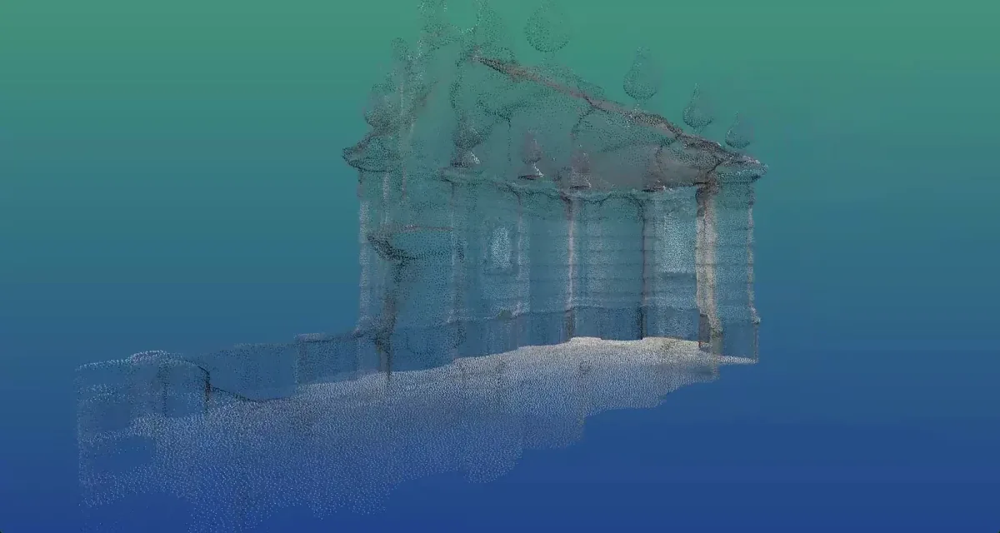
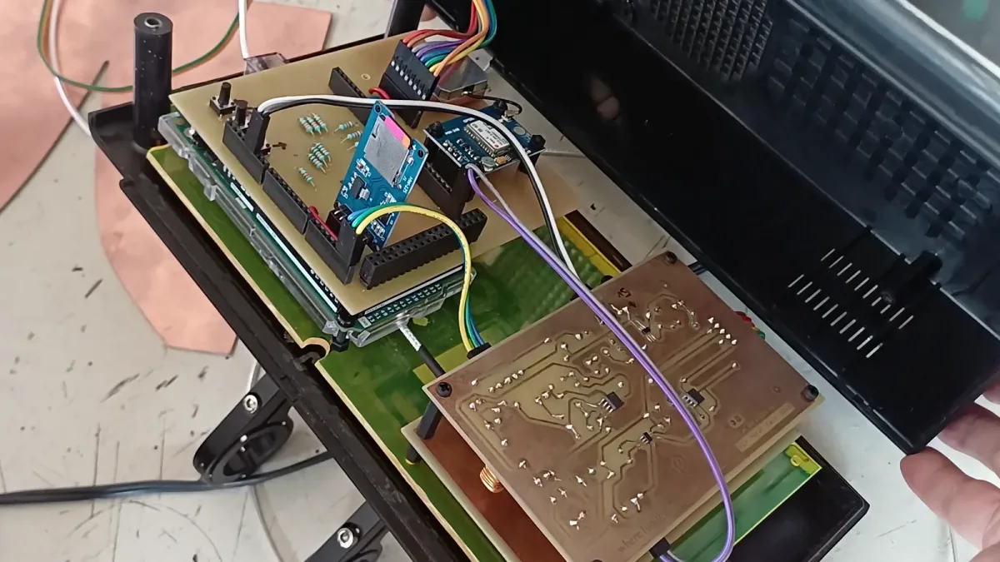
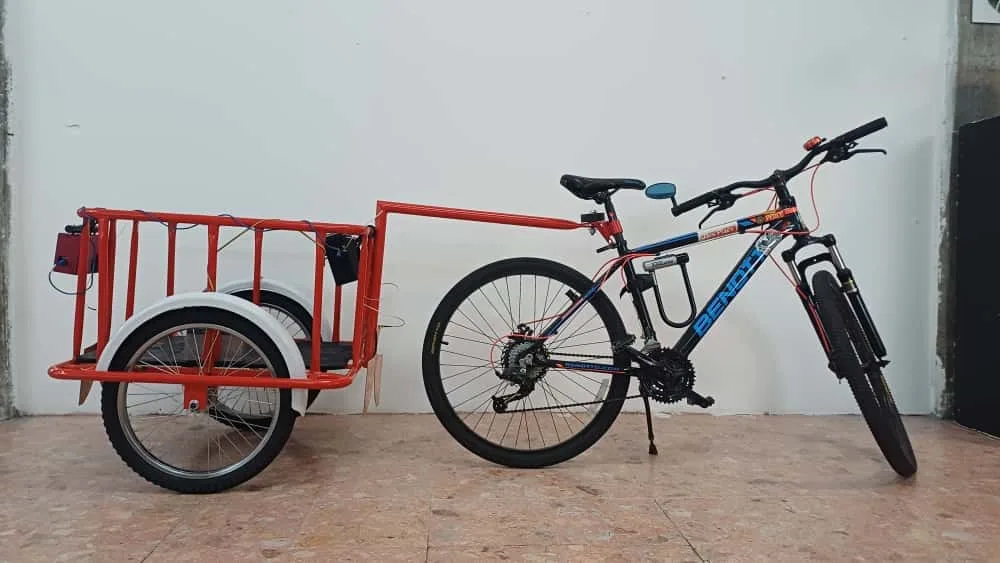
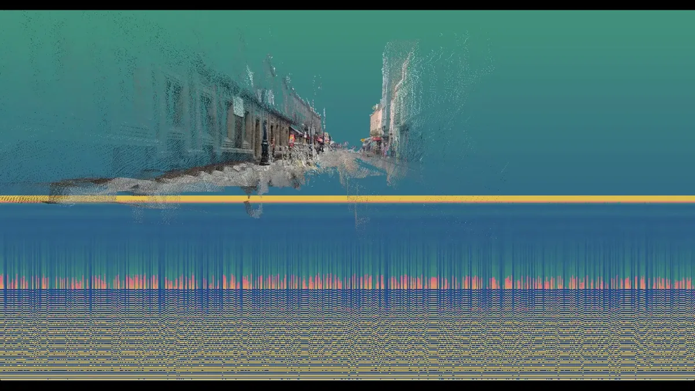
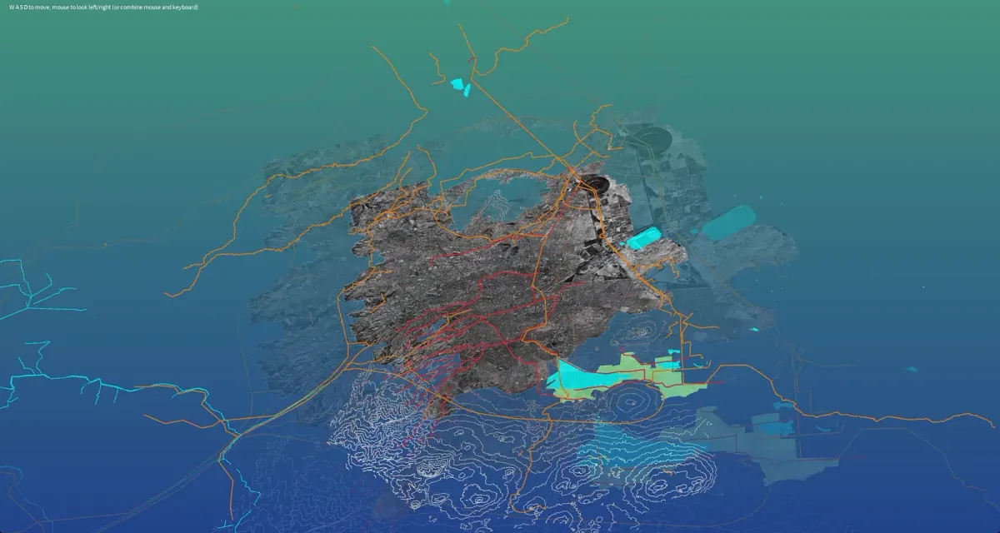

  <iframe src="https://www.youtube.com/embed/L0ydRLrd44E?feature=oembed" frameborder="0" scrolling="no"></iframe>

#### **Fellowship Project: Where has the Lake Gone?**

-   Artists: [Leonardo Aranda](https://www.instagram.com/medialabmx)
-   Links: [GitHub Repository](https://github.com/leonardoaranda1981/wherehasthelakegone)

“\[Mexico City’s designers\] have been building infrastructure to get rid of the water for 300 years and now we are building new infrastructure to try to bring water back into the city,” says media artist Leonardo Aranda.

Leonardo Aranda, director of the DIY creative space Medialabmx, developed the artistic research project *Where Has the Lake Gone?* during his 2025 Processing Foundation Fellowship. Through experimental cartography and open-source technology, the project investigates Mexico City from the perspective of its disappearing lakes, revealing how centuries of urban infrastructure have buried, redirected, and erased the waterways that once defined the region.

At the heart of Leonardo’s research is the concept of “slow violence.” Drawing from the work of Rob Nixon, Aranda describes this as a form of violence that occurs gradually and almost invisibly over time. In Mexico City, this slow violence is the 500-year history of draining the five-lake system upon which the city was originally built. While pre-Hispanic systems were based on coexistence with water, the colonial era introduced a tendency to control and eliminate nature, leading to the modern paradox of a city built on a lake that now suffers from both constant droughts and seasonal flooding.

*A 3D point-cloud rendering of an aqueduct ventilation tower. Using spatial data and experimental cartographic methods, Leonardo Aranda visualizes fragments of Mexico City’s buried water infrastructure, revealing traces of the hydraulic systems that once shaped the valley.*

Through his research in the National Archive of Water, Leonardo began to realize that the city’s history is “hidden in plain sight” within its modern layout. This shift in perspective allowed him to identify specific structures within bustling streets or common areas that the public often ignores.

Small towers scattered across neighborhoods, structures he had played around as a child, turned out to be aqueduct breathing towers, built to ventilate the colonial water system. In Chapultepec Park, the strange circular fields where people gather to play soccer are not merely decorative; they are the massive underground water tanks that help supply the entire city.

Even the city’s streets hold traces of its submerged past. Certain roads curve into organic Y-shaped patterns that seem oddly irregular in the rigid urban grid … until you realize they follow the paths of ancient rivers and canals. Architectural details offer similar clues. The elevated staircases on centuries-old churches begin to make sense when imagined from a different perspective: once, boats could pass directly beneath them. What appears today as an ordinary cityscape is, in fact, a layered map of waterways that once defined the valley.

To investigate what lies beneath the modern asphalt, Leonardo built a DIY Ground Penetration Radar (GPR) sensor. This device functions like an ultrasound, sending radio signals into the ground to create images of subsurface reflections.

*The DIY Ground Penetration Radar (GPR) sensor. Using open-source electronics, custom circuitry, and Arduino-based components, the device sends radio signals into the ground to detect buried structures beneath Mexico City’s streets.*

But using scientific equipment in the middle of Mexico City presents its own challenges. Instead of arriving with conspicuous instruments, Leonardo mounted the sensor onto a bicycle disguised as a traditional tamale cart. Moving slowly through traffic and public plazas, he could scan the ground while blending into the everyday rhythms of the streets.

The method turned research into a kind of urban dérive. Riding through neighborhoods, Leonardo traced the invisible infrastructure beneath the city: the remnants of canals, buried waterways, and forgotten engineering systems that once shaped the valley’s relationship with water. The project became what he calls an “embodied investigation,” a speculative walk through history where his curiosity paired with his DIY spirit worked together to reveal the city’s submerged past.

*A bicycle-mounted cart modeled after a traditional tamale vendor’s setup. The design allowed the ground-penetration radar sensor to move through Mexico City’s streets discreetly, blending into everyday urban life while scanning the ground below.*

The project *Where has the Lake Gone* is deeply rooted in open-source philosophy, which Leonardo views as an ethical necessity for “opening the blackboxed” systems of urban infrastructure. “For me it was important that I would use this idea of how openness has to go all the way through the whole process and the methodologies of the project. It is not only something that you use \[as\] a way of interrogating the system but something that has to be also applied to the process and the tools that you use,” he explains. He recycled code and circuits from the community and plans to keep his own [GitHub repository,](https://github.com/leonardoaranda1981/wherehasthelakegone) including Arduino and Processing code and circuit schemes, publicly available for others to reproduce.

Technically, Leonardo moved away from traditional digital cartography software to create a custom 3D environment in Processing. His process included:

-   Data Translation: He used standard shapefiles to extract geographic coordinates, which were then stored in P-shaped objects for efficient rendering.
-   Coordinate Mapping: Leonardo developed custom functions to translate real-world geographic coordinates into the 3D coordinate system within Processing.
-   Historical Sedimentation: The resulting visualization represents the city as a “stack of infrastructure layers” using different depth values to visually map the city’s historical evolution over time.

*Visualization generated from ground-penetration radar data showing a street scene layered with subsurface signal readings. The image combines spatial mapping and sensor output to reveal hidden structures and infrastructure beneath the city’s surface.*

Ultimately, Leonardo views the project not as a finished artwork but as the beginning of a methodology intended to empower artists, activists, and communities organizing around water. By opening the tools, code, and circuitry behind the project, he hopes others will build upon it, using creative technology to question the infrastructures that shape everyday life.

“There is a colonial tendency to try to control nature. This project asks how we might restore our coexistence with water,” says Leonardo. What began as a historical excavation becomes something more speculative: a way of imagining different futures for the city. By revealing the hidden waterways beneath streets and plazas, the project reminds us that Mexico City is still, in many ways, a lakebed. The water has not disappeared; it has only been buried. His final goal is to move past 500 years of environmental control and interrogate the systems that define modern life, eventually allowing the city to coexist with water once again.

*A layered cartographic visualization combining geographic data, infrastructure networks, and historical water systems. The map reveals how present-day streets and urban structures overlay the valley’s former lakes, rivers, and canals.*

---

The Processing Foundation Fellowship supports artists and creative technologists developing open-source creative tools and practices that expand access to creative technology. Through financial support, mentorship, and community partnerships, fellows create tools, artistic works, and research that contribute to a more open and accessible creative coding ecosystem.

-   Learn more about the Fellowship → [here](https://processingfoundation.org/fellowships)
-   Support programs like this → [here](https://processingfoundation.org/donate)
