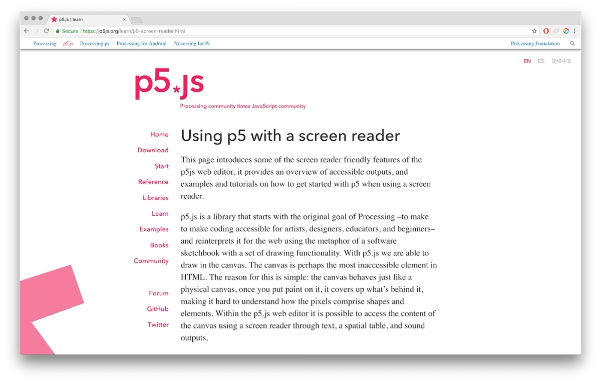
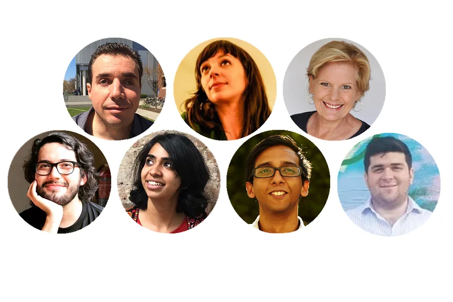
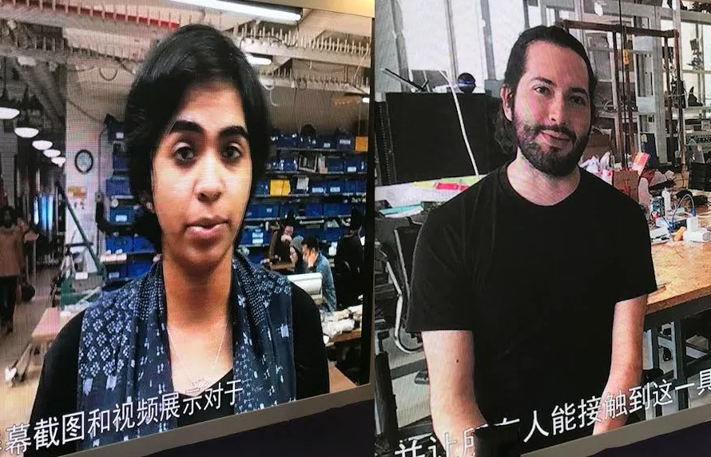

2018 Processing Foundation Fellows

---

*The 2018 Processing Foundation Fellowships sponsored* [eight projects](https://medium.com/processing-foundation/introducing-the-2018-processing-foundation-fellows-a16ae4e87f80) *from around the world that expanded the p5.js and Processing softwares and their communities. Fellows developed work ranging from Chinese translation of the p5.js website, to workshops that teach smartphone coding in Ghana. During the coming weeks, we’ll post articles written by the fellows and interviews with them, in conversation with Director of Advocacy Johanna Hedva, that showcase and document the great work by this year’s cohort.*

---

*During their fellowship Mathura and Luis developed a library and learning resources for using p5 with screen readers. \[image description: Screenshot of a tutorial on Using p5 with a screen reader available on p5js.org\]*

**Johanna Hedva: Can you give us a summary of what you set out to do with your fellowship?**

**Mathura Govindarajan and Luis Morales-Navarro**: We have been working on the p5 accessibility project since 2016, when [Claire Kearney-Volpe](http://www.takinglifeseriously.com/about.html) did her Processing Foundation fellowship. Prior to our fellowship this year, we worked on adding and improving the accessibility features of the p5 web editor. This led to us creating a library that could be used to make any p5.js sketch more accessible to screen readers inside and outside the editor.

Our first goal for the fellowship was to finalize the p5.accessibility library and conduct robust testing. Through the past few months we have also added more features to the library, worked on its structure, and pushed it to Processing’s github.

Another goal was to increase the visibility of the library and its impact in the p5 community. We recently added the p5.accessibility library to the p5.js website, created a tutorial on how to use [p5 with a screen reader](https://p5js.org/learn/p5-screen-reader.html), and included details about accessibility in the “[Getting Started with p5](https://p5js.org/get-started/)” tutorial. During the fellowship we’ve been able to gather interest from developers in the p5 community, and we are grateful to those who have contributed to the library. We also wanted to develop and improve resources and tutorials to ensure that the current resources on the p5 website are accessible and have content related to accessibility.

Throughout the spring we worked with Claire Kearney-Volpe’s students at NYU Tandon School of Engineering to conduct user tests that could help us find best practices for creating learning materials for screen reader users. Our goal was to be able to apply these best practices to the learning resources that already exist on the p5.js website.

*p5.accessibility collaborators: Antonio Guimaraes, Claire Kearney-Volpe, Elizabeth G Betts, Luis Morales-Navarro, Mathura M Govindarajan, Mithru Vigneshwara, Yossi Spira. \[image description: Photos of p5.accessibility collaborators Antonio Guimaraes, Claire Kearney-Volpe, Elizabeth G Betts, Luis Morales-Navarro, Mathura M Govindarajan, Mithru Vigneshwara, Yossi Spira.\]*

**JH: This work is so important and speaks to greater issues of “universal design.” Can you explain this for those who aren’t familiar with the concept, and how it informed your fellowship?**

**MG & LMN**: Universal design aims to make technology accessible to all by developing software and content that can be accessed in variety of ways by a diverse group of users, which includes people with disabilities and older people. Through the fellowship we’ve learned that universal design works best when it is part of a project since its inception. When working with p5 learning resources, we learned that a reactive response is not ideal. To go back and make accessibility part of a tool is not as effective as thinking about inclusive design from the beginning of the life cycle of a tool or project.

This is why we think that, moving forward, engaging the p5 community must be a priority to ensure that universal design is part of the planning and making process in the development of tools, libraries, and technology, as well as in the making of tutorials and learning resources.

**JH: Speaking of building in a universal design intent from the inception, can you share some of the resources you used as conceptual frameworks for this work? I’m curious to know what kind of scholarship, theory, and/or other projects informed your process and acted as instigators and inspiration. Was an element of your project finding a new way that hadn’t been established before?**

**MG & LMN**: There are many articles that talk about inclusive design methodologies. [Richard E. Ladner](https://www.cs.washington.edu/people/faculty/ladner) has published articles, both theoretical and experimental, on the process of designing inclusive computer technologies (you can see a full list of his publications [here](https://www.cs.washington.edu/people/faculty/ladner/publications)). His work on “designing for user empowerment” calls for a strong engagement of user communities in the process of designing (Ladner, “Design for User Empowerment”). He builds on Universal Design, Ability-based Design (Jacob et al., “Ability-Based Design”), and Human-Centered Design (Gould and Lewis, “Designing for Usability”) to propose a participatory approach that promotes self-determination and technical expertise.

A good example of having a universal design intent from inception is [weScheme/bootstrap](https://www.wescheme.org/openEditor), a web-based programming environment for learning math (Yoo, “WeScheme”). We had the opportunity of meeting a few times with [Sina Bahram](http://www.sinabahram.com/), a blind computer scientist who was involved in the process of making weScheme/bootstrap. By speaking with him we got to learn more about how to make programming accessible, and got his opinion on the challenges we were and are facing with our project. Sina introduced us to Emmanuel Schanzer, the main developer of weScheme/bootstrap, and we were able to get insight on how they worked together in the development of their programming environment.

Throughout the project we’ve also had the support of [Josh Miele](https://www.ski.org/users/joshua-miele), a blind scientist, designer, and educator. His knowledge on accessibility and technology for people who are blind and visually impaired has had great impact in the development of the p5.accessibility project. Josh introduced us to Andreas Stefik’s work on the importance of auditory representation and multi-sensory curriculum (Stefik et al., “On the Design of an Educational Infrastructure for the Blind and Visually Impaired in Computer Science”). These ideas influenced how we conceived the sound output of the library and how we’ve used physical objects to introduce concepts and to work on projects during workshops and user-testing sessions.

Since we started working on this project we knew that majority of our work had to do with adapting existing resources, tools, and outputs and making them accessible. Throughout this process our community of collaborators has grown, and we’ve been able to develop learning materials from scratch on how to use p5 with screen readers. We’ve realized that the Processing and p5 communities are always developing new tools and learning resources, and so, moving forward, we think it’s a good idea to have the goal, as a community, of making any and all new resources and tools accessible from their inception.

*Mathura and Luis shared their work in Shanghai through a video presentation. \[image description: Screen photos of a video where Mathura and Luis talk about the p5.accessibility project.\]*

**JH: Is there anything of your project still to be done?**

**MG & LMN**: There are plenty of things to be done. The most important is to continue adapting the learning resources on the p5.js website so that they can be accessible to screen readers and people who are blind and visually impaired. We’ve been working with Lauren McCarthy to make this happen but still there’s plenty of work to do. We think it’s important to share what we have learned about making accessible learning resources with more learning resources creators. We’ve developed an interest in our work in the developer community but not all developers work on learning resources.

The most important thing that we have yet to do is to engage more of the user-side of the p5 community. Moving forward, we are working towards increasing our outreach and making the p5 curriculum available and accessible to a wider audience. Doing this, we wish to promote the original goal of the Processing Foundation: to make programming accessible.
