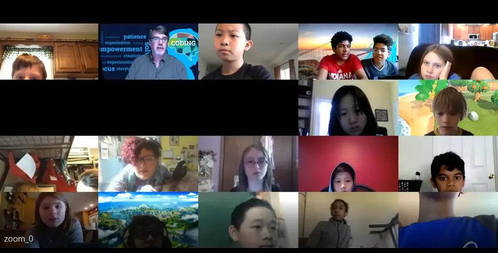
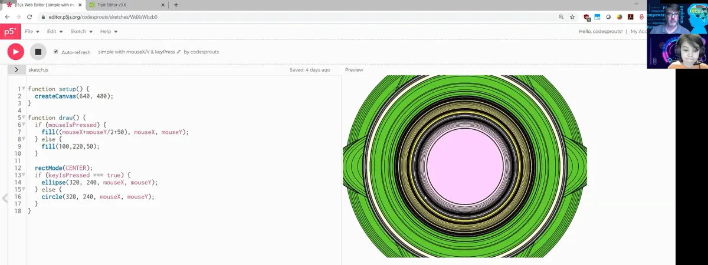
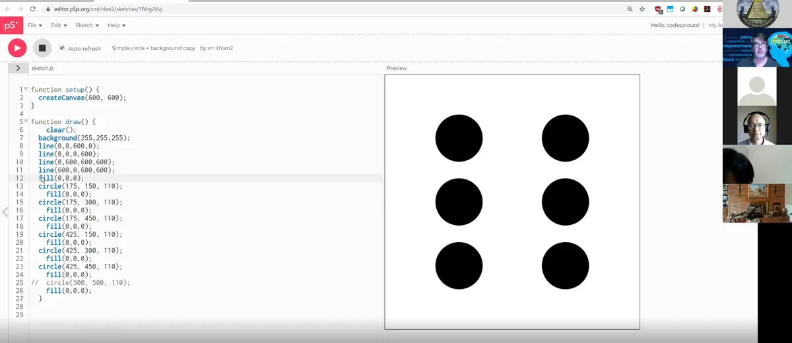
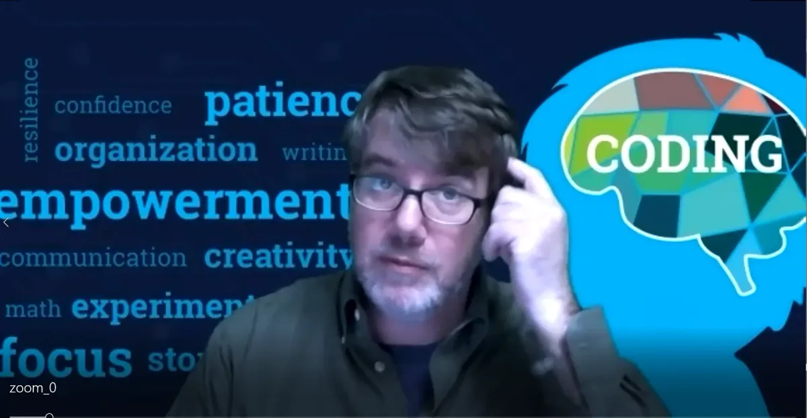

The 2020 Processing Foundation Fellowships sponsored six projects from around the world that expanded the p5.js and Processing softwares and nurtured their communities. In collaboration with NYU’s [Interactive Telecommunications Program](https://tisch.nyu.edu/itp), we also sponsored four Fellows to work on [ml5.js](https://ml5js.org/). Because of COVID-19, many of the Fellows had to reconfigure their projects, and this year’s cohort, both individually and as a whole, sought to address issues of accessibility and inclusion in their projects. Over the next couple months, we’ll be publishing our annual wrap-up articles on how the Fellowship projects went, some written by the Fellows in their own words, and some in conversation with Director of Advocacy Johanna Hedva. You can read about our past Fellows [here](https://medium.com/processing-foundation/https-medium-com-tag-pf-fellowships-la/home).

---

*Michael O’Connell hosts his weekly coding club online via Zoom with grade-school students. Michael O’Connell teaches coding and computational thinking to more than 100 students in grades 2–6 each semester via coding clubs and camps. Previously, Michael focused on helping millions of developers and IT professionals as founding Editorial Director of [IBM developerWorks](https://en.wikipedia.org/wiki/IBM_developerWorks) and founding Editor in Chief of IDG’s [JavaWorld](http://www.javaworld.com/). Michael was mentored by Layla Quinones, who was a Teaching Fellow in Processing Foundation’s 2019 Program.*

**Johanna Hedva: Hi Michael! Tell me about your Fellowship project. What were your intentions and goals, and what did you accomplish?**

**Michael O’Connell:** My project focused on taking advantage of the simplicity and creative power of p5.js as a tool to help engage and teach younger students, ages 8–12. While many older students and adults have been using and benefiting from p5.js, I saw an opportunity to bring it to younger learners.

This project started with my learning p5.js at Infosys Foundation USA’s Pathfinders Summer Institute last year as a way to better understand — and teach — coding and computational thinking. I’ve been teaching dozens of students each semester for several years now (after many years of helping professional and corporate developers and IT professionals, through my work as founding editor of IDG’s JavaWorld, and founding editorial director of IBM’s developerWorks).

Students already enjoy other free coding education resources, including Scratch, [code.org](http://code.org/), and tutorials at sites such as Khan Academy and w3Schools. They’re all helpful! But the other options often don’t have the same emphasis on creative coding that p5.js provides. And for students who may have not yet ventured into text-based coding, the transition can be daunting—so it’s terrific to be able to offer something that’s focused on visual and artistic creations.

I introduced p5.js to dozens of students in the spring and summer of 2020 who were participating in my coding clubs and lessons. I also had some additional one-on-one sessions to help students learn how to creatively code with p5.js.

**JH: How is your coding club structured? Who can attend?**

**MOC**: I focus primarily on coding clubs that I host at several local public primary grade schools after school, and invite all students in grades 3–6. Each club meets weekly for one hour, and each week I focus on introducing a few coding concepts (such as loops, variables, bugs, and conditionals). I then lead them in some related activities, and provide some less-structured time to work on coding projects of their choice. We primarily have used Scratch and [code.org](http://code.org/), along with HTML, JavaScript, and a bit of Python. I’ve also used some programmable robots, as well as some unplugged activities.

With COVID-19 leading to schools becoming remote, I had to adapt, and have been offering clubs and camps (as well as small group lessons) via Zoom videoconference.

*Michael used this p5.js sketch to visually demonstrate to students the power of system variables **mouseX**, **mouseY**, **mouseIsPressed**, and **keyIsPressed** combined with an **if-else** statement.*

**JH: Why do you think your project was important for your students. What issues did you help address?**

**MOC:** I tried to learn Mandarin as an adult, long after the period when learning languages goes easier. It was quite a challenge for me! I had a bit more success learning Spanish before college — but I’m sure I’d learn any language much more easily if I had done so when I was in grade school or even younger. Coding is another language, essentially — which is why I believe students in grades 3–6 are perfectly poised to learn coding and computational thinking. And while some such students may happily immerse themselves in Scratch projects and [code.org](http://code.org/) exercises, there are students who embrace the metaphor of a canvas and sketches for their coding creations, and really crave a next step, and/or something that’s more focused on art.

Many youngsters (unlike older students in high school and beyond) also have unbounded optimism to create whatever they imagine! The beginners I worked with indeed successfully created their own sketches — and many were using both a text-based programming environment and JavaScript for the very first time!

**JH: You surveyed your students. What did you find out?**

**MOC:** Two revelations stand out from my student surveys.

First, a substantial number (nearly a fourth) of my students actually *prefer* coding with p5.js over other popular child-friendly coding environments that we used in coding camp, such as Scratch, [code.org](http://code.org/) activities, and HTML. Scratch, with its block-based environment and option to easily remix and share projects, is a compelling and popular option among students in grades 3–6, but I was pleased that I was able to teach even younger students with p5.js. It proved to be not only an effective option, but the preferred choice for some!

Second, students shared a couple of specific reasons for preferring p5.js over these other coding experiences. We were specifically using the online editor at [p5js.org](http://p5js.org/), and they really liked the website-like preview. And they liked p5.js because it provides so many options to do many different things. As one student said, “I can do more, and p5.js gives me a website-like preview.” The visual nature of p5 (with its sketch and canvas metaphor), and the fact that it’s text-based rather than block-based, also resonated with some students.

*One of the introductory p5.js sketches students worked on in Michael’s summer coding clubs: this dice drawing requires that students employ lines, circles, and fills, and understand x and y coordinates.*

**JH: Many of our Fellows faced challenges this year because of COVID-19. Did this affect your project? What were some of the difficulties (COVID-related or not) that you encountered and how did you solve them?**

**MOC:** Yes, COVID-19 closed the schools where I was hosting the coding clubs since March, so we had to transition from in-person classrooms to online-only. This required some time and adjusting. Many of my young students (like many professionals) were starting to use online videoconferencing for classes and large group meetings, perhaps for the first time, so it took some time to get everyone participating effectively, remembering how to mute themselves, realizing it may not be appropriate to share another tidbit about their pet cat or dog every 30 seconds, etc. Many of them missed the social interaction with peers that happens in person, and the majority of students confirmed they prefer face-to-face coding clubs.

That said, some students viewed virtual coding clubs as equally good or even better than in-person coding clubs, and pointed out advantages of the online coding experience, such as being able to join “from the comfort of my home” and being able to “sit in bed and do it online.” Many noted that they appreciated the online option of sharing screens to easily show projects to one another and collaborate on coding and debugging. Recorded video sessions made available for replay helped students who missed a session or wanted to review and go through a lesson at their own pace.

**JH: What’s the future of your project? Will you continue working with the curriculum you developed?**

**MOC:** As I look to the fall semester and new coding clubs, I plan to incorporate p5.js into more of the curriculum I use. I’m also considering creating a group specifically dedicated to learning JavaScript with [p5js.org](http://p5js.org/). While I’m certain students in grades 3–6 will continue to enjoy coding with Scratch, my initial experience using p5.js with these students has been promising, particularly for students who are visually creative and those who are ready to learn what they view as a “real” coding language that does not involve dragging and dropping code blocks.

*Coding Club leader Michael O’Connell encourages students to think while explaining a concept during an online session.*
